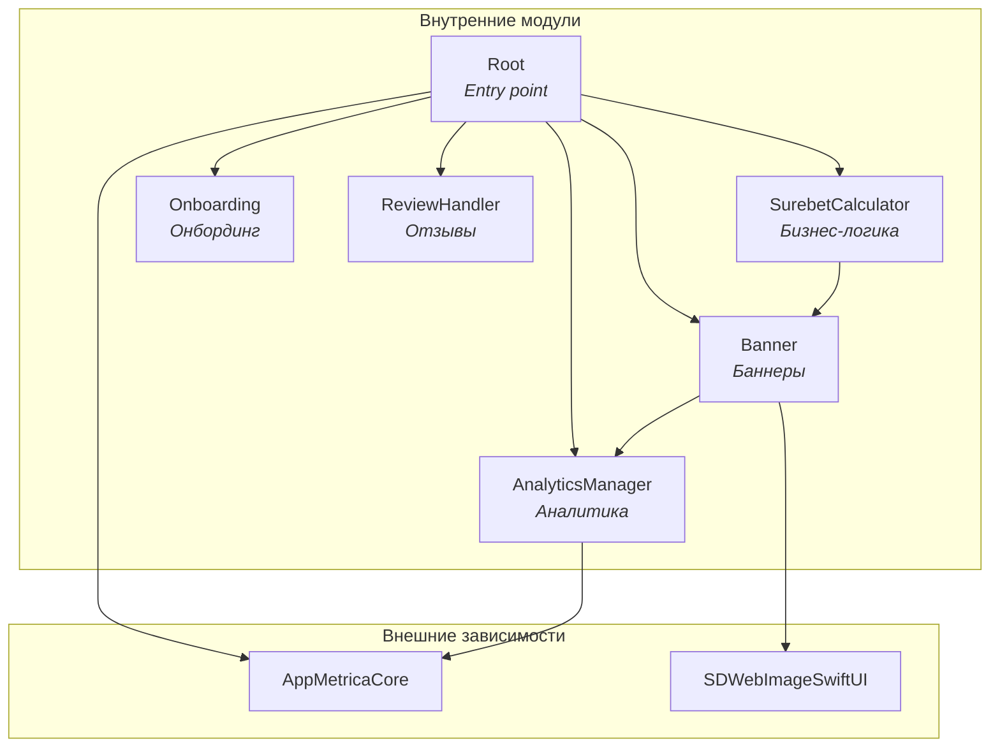

# 🧠 System Context для LLM-агентов

> **Цель:** Исчерпывающая база знаний для LLM-агентов, работающих с проектом SurebetCalculator.

---

## 1. Architecture (Архитектура)

### 1.1. Модульная структура (SPM)

Проект использует **Swift Package Manager** с монорепозиторием `SurebetCalculatorPackage/`.

#### Граф зависимостей модулей



#### Таблица модулей

| Модуль | Зависимости | Назначение |
|--------|-------------|------------|
| `Root` | `AnalyticsManager`, `Banner`, `Onboarding`, `ReviewHandler`, `SurebetCalculator`, `AppMetricaCore` | Entry point, координация модулей, инициализация AppMetrica |
| `SurebetCalculator` | `Banner` | Основная бизнес-логика калькулятора |
| `Banner` | `AnalyticsManager`, `SDWebImageSwiftUI` | Загрузка, кэширование и отображение баннеров |
| `Onboarding` | — | Онбординг новых пользователей |
| `ReviewHandler` | — | Запрос отзывов через SKStoreReviewController |
| `AnalyticsManager` | `AppMetricaCore` | Типобезопасная обёртка над AppMetrica |

#### Public API каждого модуля

**Root**
```swift
public enum Root {
    @MainActor
    public static func view() -> some View
}

// Реэкспорт AppMetrica для использования в App
public typealias AppMetrica = AppMetricaCore.AppMetrica
public typealias AppMetricaConfiguration = AppMetricaCore.AppMetricaConfiguration
```

**SurebetCalculator**
```swift
public enum SurebetCalculator {
    @MainActor
    public static func view() -> some View
}
```

**Banner**
```swift
public enum Banner {
    // Views
    public static var bannerView: some View
    @MainActor
    public static func fullscreenBannerView(isPresented: Binding<Bool>) -> some View
    @MainActor
    public static func fullscreenBannerView(isPresented: Binding<Bool>, service: BannerService) -> some View
    
    // Network
    public static func fetchBanner() async throws
    public static func fetchBanner(service: BannerService) async throws
    
    // Cache
    public static var isBannerFullyCached: Bool
    public static func isBannerFullyCached(service: BannerService) -> Bool
}

public protocol BannerService: Sendable {
    func fetchBannerAndImage() async throws
    func fetchBanner() async throws -> BannerModel
    func saveBannerToDefaults(_ banner: BannerModel)
    func getBannerFromDefaults() -> BannerModel?
    func clearBannerFromDefaults()
    func downloadImage(from url: URL) async throws
    func getStoredBannerImageData() -> Data?
    func getStoredBannerImageURL() -> URL?
    func isBannerFullyCached() -> Bool
}
```

**Onboarding**
```swift
public enum Onboarding {
    @MainActor
    public static func view(onboardingIsShown: Binding<Bool>) -> some View
}
```

**ReviewHandler**
```swift
@MainActor
public final class ReviewHandler: ReviewService {
    public init()
    public func requestReview() async
    public static func requestReview() async  // Статический метод для совместимости
}

@MainActor
public protocol ReviewService: Sendable {
    func requestReview() async
}
```

**AnalyticsManager**
```swift
public enum AnalyticsParameterValue: Sendable {
    case string(String)
    case int(Int)
    case double(Double)
    case bool(Bool)
}

public struct AnalyticsManager: AnalyticsService, Sendable {
    public init()
    public func log(name: String, parameters: [String: AnalyticsParameterValue]?)
    public static func log(name: String, parameters: [String: AnalyticsParameterValue]? = nil)
}

public protocol AnalyticsService: Sendable {
    func log(name: String, parameters: [String: AnalyticsParameterValue]?)
}
```

#### Правила работы с модулями

1. **Единственный экспортируемый продукт** — `Root`. Приложение импортирует только его.
2. **Паттерн public API** — каждый модуль экспортирует `enum` с `static func view()`.
3. **DI через параметры** — все методы с сервисами имеют два варианта: с дефолтной реализацией и с явной передачей `service`.
4. **Циклические зависимости запрещены** — граф направленный ациклический (DAG).

#### Как добавить новый модуль

```swift
// 1. В Package.swift добавить target
.target(
    name: "NewModule",
    dependencies: ["Banner"],  // при необходимости
    resources: [.process("Resources")],
    plugins: [.plugin(name: "SwiftLintBuildToolPlugin", package: "SwiftLint")]
),

// 2. Добавить зависимость в Root
.target(
    name: "Root",
    dependencies: [
        // ...existing...
        "NewModule",
    ],
    // ...
),

// 3. Создать Sources/NewModule/NewModule.swift
public enum NewModule {
    @MainActor
    public static func view() -> some View {
        NewModuleView()
    }
}
```

---
