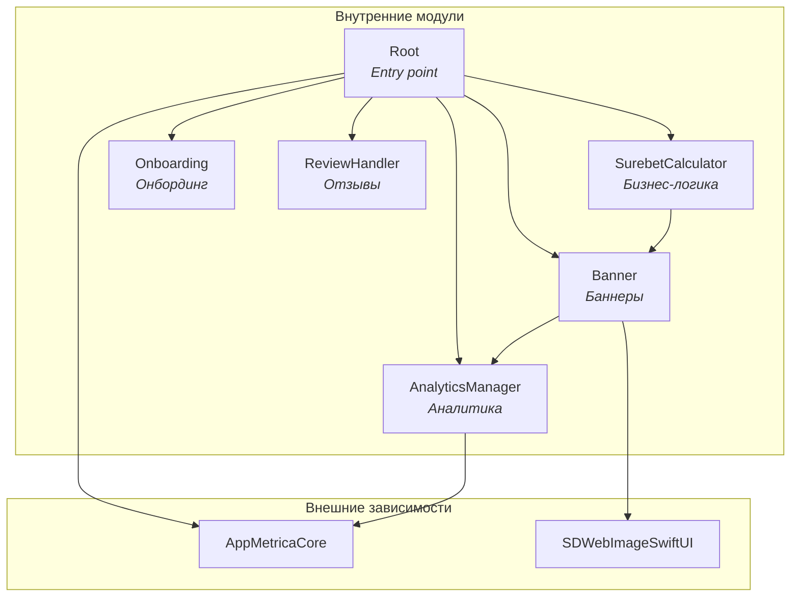
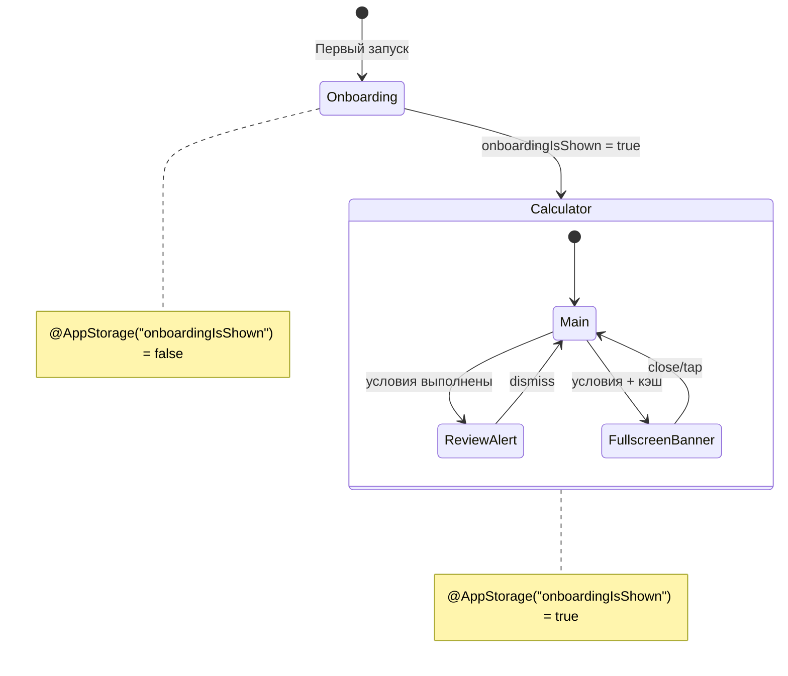
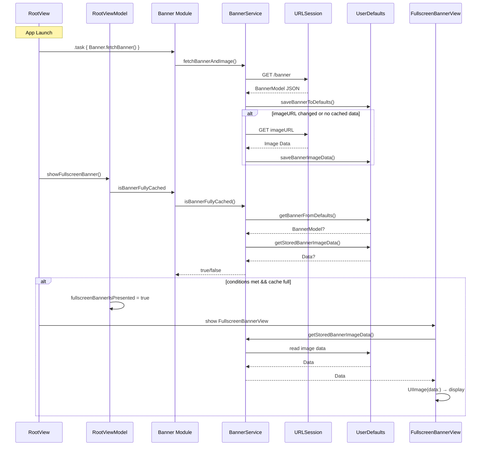

# 🧠 System Context для LLM-агентов

> **Цель:** Исчерпывающая база знаний для LLM-агентов, работающих с проектом SurebetCalculator.

---

## 1. Architecture (Архитектура)

### 1.1. Модульная структура (SPM)

Проект использует **Swift Package Manager** с монорепозиторием `SurebetCalculatorPackage/`.

#### Граф зависимостей модулей



#### Таблица модулей

| Модуль | Зависимости | Назначение |
|--------|-------------|------------|
| `Root` | `AnalyticsManager`, `Banner`, `Onboarding`, `ReviewHandler`, `SurebetCalculator`, `AppMetricaCore` | Entry point, координация модулей, инициализация AppMetrica |
| `SurebetCalculator` | `Banner` | Основная бизнес-логика калькулятора |
| `Banner` | `AnalyticsManager`, `SDWebImageSwiftUI` | Загрузка, кэширование и отображение баннеров |
| `Onboarding` | — | Онбординг новых пользователей |
| `ReviewHandler` | — | Запрос отзывов через SKStoreReviewController |
| `AnalyticsManager` | `AppMetricaCore` | Типобезопасная обёртка над AppMetrica |

#### Public API каждого модуля

**Root**
```swift
public enum Root {
    @MainActor
    public static func view() -> some View
}

// Реэкспорт AppMetrica для использования в App
public typealias AppMetrica = AppMetricaCore.AppMetrica
public typealias AppMetricaConfiguration = AppMetricaCore.AppMetricaConfiguration
```

**SurebetCalculator**
```swift
public enum SurebetCalculator {
    @MainActor
    public static func view() -> some View
}
```

**Banner**
```swift
public enum Banner {
    // Views
    public static var bannerView: some View
    @MainActor
    public static func fullscreenBannerView(isPresented: Binding<Bool>) -> some View
    @MainActor
    public static func fullscreenBannerView(isPresented: Binding<Bool>, service: BannerService) -> some View
    
    // Network
    public static func fetchBanner() async throws
    public static func fetchBanner(service: BannerService) async throws
    
    // Cache
    public static var isBannerFullyCached: Bool
    public static func isBannerFullyCached(service: BannerService) -> Bool
}

public protocol BannerService: Sendable {
    func fetchBannerAndImage() async throws
    func fetchBanner() async throws -> BannerModel
    func saveBannerToDefaults(_ banner: BannerModel)
    func getBannerFromDefaults() -> BannerModel?
    func clearBannerFromDefaults()
    func downloadImage(from url: URL) async throws
    func getStoredBannerImageData() -> Data?
    func getStoredBannerImageURL() -> URL?
    func isBannerFullyCached() -> Bool
}
```

**Onboarding**
```swift
public enum Onboarding {
    @MainActor
    public static func view(onboardingIsShown: Binding<Bool>) -> some View
}
```

**ReviewHandler**
```swift
@MainActor
public final class ReviewHandler: ReviewService {
    public init()
    public func requestReview() async
    public static func requestReview() async  // Статический метод для совместимости
}

@MainActor
public protocol ReviewService: Sendable {
    func requestReview() async
}
```

**AnalyticsManager**
```swift
public enum AnalyticsParameterValue: Sendable {
    case string(String)
    case int(Int)
    case double(Double)
    case bool(Bool)
}

public struct AnalyticsManager: AnalyticsService, Sendable {
    public init()
    public func log(name: String, parameters: [String: AnalyticsParameterValue]?)
    public static func log(name: String, parameters: [String: AnalyticsParameterValue]? = nil)
}

public protocol AnalyticsService: Sendable {
    func log(name: String, parameters: [String: AnalyticsParameterValue]?)
}
```

#### Правила работы с модулями

1. **Единственный экспортируемый продукт** — `Root`. Приложение импортирует только его.
2. **Паттерн public API** — каждый модуль экспортирует `enum` с `static func view()`.
3. **DI через параметры** — все методы с сервисами имеют два варианта: с дефолтной реализацией и с явной передачей `service`.
4. **Циклические зависимости запрещены** — граф направленный ациклический (DAG).

#### Как добавить новый модуль

```swift
// 1. В Package.swift добавить target
.target(
    name: "NewModule",
    dependencies: ["Banner"],  // при необходимости
    resources: [.process("Resources")],
    plugins: [.plugin(name: "SwiftLintBuildToolPlugin", package: "SwiftLint")]
),

// 2. Добавить зависимость в Root
.target(
    name: "Root",
    dependencies: [
        // ...existing...
        "NewModule",
    ],
    // ...
),

// 3. Создать Sources/NewModule/NewModule.swift
public enum NewModule {
    @MainActor
    public static func view() -> some View {
        NewModuleView()
    }
}
```

---

### 1.2. Паттерн MVVM

Проект использует **Model-View-ViewModel** с дополнительным слоем **Service** для бизнес-логики.

```
┌─────────────────────────────────────────────────────────────────┐
│                         SwiftUI View                             │
│  @StateObject viewModel = ViewModel()                           │
│  .environmentObject(viewModel)                                  │
│                              │                                   │
│                    viewModel.send(.action)                      │
│                              ▼                                   │
├─────────────────────────────────────────────────────────────────┤
│                        ViewModel                                 │
│  @MainActor final class: ObservableObject                       │
│  @Published private(set) var state                              │
│  private let service: ServiceProtocol                           │
│                              │                                   │
│                    service.calculate()                          │
│                              ▼                                   │
├─────────────────────────────────────────────────────────────────┤
│                         Service                                  │
│  protocol: Sendable                                             │
│  struct DefaultService: ServiceProtocol                         │
└─────────────────────────────────────────────────────────────────┘
```

#### Роли компонентов

| Слой | Ответственность | Паттерны |
|------|-----------------|----------|
| **View** | UI-рендеринг, передача действий в ViewModel | `@StateObject`, `@EnvironmentObject`, `.onChange` |
| **ViewModel** | Управление состоянием, обработка действий, вызов сервисов | `@MainActor`, `ObservableObject`, `@Published`, `ViewAction` enum |
| **Service** | Чистая бизнес-логика без состояния | Protocol + struct, `Sendable` |

#### View (SwiftUI)

View **владеет** ViewModel через `@StateObject` и передаёт его дочерним view через `.environmentObject()`.

```swift
// Корневой View — владеет ViewModel
struct SurebetCalculatorView: View {
    @StateObject private var viewModel = SurebetCalculatorViewModel()
    
    var body: some View {
        VStack {
            TotalRowView()
            // ...
        }
        .environmentObject(viewModel)  // Передача дочерним
    }
}

// Дочерний View — наблюдает ViewModel
struct TotalRowView: View {
    @EnvironmentObject private var viewModel: SurebetCalculatorViewModel
    
    var body: some View {
        TextField(...)
            .onChange(of: text) { newValue in
                viewModel.send(.setTextFieldText(.totalBet, newValue))
            }
    }
}
```

**Правила для View:**
1. Только корневой View использует `@StateObject`
2. Дочерние View используют `@EnvironmentObject`
3. View не содержит бизнес-логики — только вызов `viewModel.send()`
4. Анимации через `.animation()` модификатор

#### ViewModel (@MainActor, ObservableObject)

ViewModel управляет состоянием и обрабатывает действия через паттерн **ViewAction**.

```swift
@MainActor
final class SurebetCalculatorViewModel: ObservableObject {
    // MARK: - Properties
    
    // Состояние — readonly для внешнего доступа
    @Published private(set) var total: TotalRow
    @Published private(set) var rows: [Row]
    @Published private(set) var selectedRow: RowType?
    
    // Сервис — внедряется через init
    private let calculationService: CalculationService
    
    // MARK: - Initialization
    
    init(
        total: TotalRow = TotalRow(),
        rows: [Row] = Row.createRows(),
        calculationService: CalculationService = DefaultCalculationService()
    ) {
        self.total = total
        self.rows = rows
        self.calculationService = calculationService
    }
    
    // MARK: - Public Methods
    
    // Паттерн ViewAction — все действия в одном enum
    enum ViewAction {
        case selectRow(RowType)
        case addRow
        case removeRow
        case setTextFieldText(FocusableField, String)
        case clearAll
    }
    
    // Единая точка входа для всех действий от View
    func send(_ action: ViewAction) {
        switch action {
        case let .selectRow(row):
            select(row)
        case .addRow:
            addRow()
        case let .setTextFieldText(field, text):
            set(field, text: text)
            calculate()
        case .clearAll:
            clearAll()
        }
    }
}

// MARK: - Private Methods

private extension SurebetCalculatorViewModel {
    func calculate() {
        let result = calculationService.calculate(
            total: total,
            rows: rows,
            selectedRow: selectedRow,
            displayedRowIndexes: displayedRowIndexes
        )
        if let newTotal = result.total { total = newTotal }
        if let newRows = result.rows { rows = newRows }
    }
}
```

**Правила для ViewModel:**
1. Всегда `@MainActor final class: ObservableObject`
2. Состояние через `@Published private(set)` — View может читать, но не писать
3. Все действия через `send(_ action: ViewAction)`
4. Сервисы через `private let` + DI в `init`
5. `@AppStorage` для персистентного состояния (UserDefaults)

#### Service (Protocol + Struct)

Service содержит чистую бизнес-логику без состояния.

```swift
// Протокол — определяет контракт
protocol CalculationService: Sendable {
    func calculate(
        total: TotalRow,
        rows: [Row],
        selectedRow: RowType?,
        displayedRowIndexes: Range<Int>
    ) -> (total: TotalRow?, rows: [Row]?)
}

// Реализация — stateless struct
struct DefaultCalculationService: CalculationService, Sendable {
    func calculate(
        total: TotalRow,
        rows: [Row],
        selectedRow: RowType?,
        displayedRowIndexes: Range<Int>
    ) -> (total: TotalRow?, rows: [Row]?) {
        let calculator = Calculator(
            total: total,
            rows: rows,
            selectedRow: selectedRow,
            displayedRowIndexes: displayedRowIndexes
        )
        return calculator.calculate()
    }
}
```

**Правила для Service:**
1. Всегда протокол + struct реализация
2. `Sendable` конформность обязательна
3. Stateless — нет stored properties с состоянием
4. Может использовать вспомогательные структуры (Calculator, NetworkClient)

#### Правила взаимодействия между слоями

| Направление | Как | Пример |
|-------------|-----|--------|
| View → ViewModel | `viewModel.send(.action)` | `viewModel.send(.addRow)` |
| ViewModel → View | `@Published` | `@Published var rows: [Row]` |
| ViewModel → Service | Прямой вызов метода | `calculationService.calculate(...)` |
| Service → ViewModel | Return value | `return (total, rows)` |

**Запрещено:**
- View напрямую вызывает Service
- Service знает о ViewModel
- ViewModel напрямую меняет UI
- Циклические зависимости

---

### 1.3. Dependency Injection

Проект использует **Constructor Injection** с дефолтными значениями — простой и тестируемый паттерн без DI-контейнеров.

#### Паттерн DI через init

```swift
@MainActor
final class SomeViewModel: ObservableObject {
    // Зависимость хранится как private let
    private let analyticsService: AnalyticsService
    private let reviewService: ReviewService
    
    // Init с дефолтными значениями
    init(
        analyticsService: AnalyticsService = AnalyticsManager(),
        reviewService: ReviewService = ReviewHandler()
    ) {
        self.analyticsService = analyticsService
        self.reviewService = reviewService
    }
}
```

**Ключевые правила:**
1. Параметр = протокол, дефолтное значение = реализация
2. `private let` для хранения — immutable после init
3. Production код вызывает `SomeViewModel()` — дефолтные значения
4. Тесты вызывают `SomeViewModel(analyticsService: MockAnalyticsService())` — моки

#### Протоколы сервисов

В проекте 4 основных сервисных протокола:

**CalculationService** — вычисления калькулятора
```swift
protocol CalculationService: Sendable {
    func calculate(
        total: TotalRow,
        rows: [Row],
        selectedRow: RowType?,
        displayedRowIndexes: Range<Int>
    ) -> (total: TotalRow?, rows: [Row]?)
}

// Реализация
struct DefaultCalculationService: CalculationService, Sendable { ... }
```

**AnalyticsService** — аналитика событий
```swift
public protocol AnalyticsService: Sendable {
    func log(name: String, parameters: [String: AnalyticsParameterValue]?)
}

// Реализация
public struct AnalyticsManager: AnalyticsService, Sendable { ... }
```

**ReviewService** — запрос отзывов
```swift
@MainActor
public protocol ReviewService: Sendable {
    func requestReview() async
}

// Реализация
@MainActor
public final class ReviewHandler: ReviewService { ... }
```

**BannerService** — работа с баннерами
```swift
public protocol BannerService: Sendable {
    func fetchBannerAndImage() async throws
    func fetchBanner() async throws -> BannerModel
    func saveBannerToDefaults(_ banner: BannerModel)
    func getBannerFromDefaults() -> BannerModel?
    func clearBannerFromDefaults()
    func downloadImage(from url: URL) async throws
    func getStoredBannerImageData() -> Data?
    func getStoredBannerImageURL() -> URL?
    func isBannerFullyCached() -> Bool
}

// Реализация
struct Service: BannerService, @unchecked Sendable { ... }
```

#### Создание моков для тестов

Моки создаются вручную (hand-written mocks) без библиотек:

```swift
/// Мок для тестов — хранит историю вызовов
final class MockCalculationService: CalculationService, @unchecked Sendable {
    // Счётчик вызовов
    var calculateCallCount = 0
    
    // Контролируемый результат
    var calculateResult: (total: TotalRow?, rows: [Row]?)?
    
    // История входных данных
    var calculateInputs: [CalculateInput] = []
    
    func calculate(
        total: TotalRow,
        rows: [Row],
        selectedRow: RowType?,
        displayedRowIndexes: Range<Int>
    ) -> (total: TotalRow?, rows: [Row]?) {
        calculateCallCount += 1
        calculateInputs.append(CalculateInput(...))
        return calculateResult ?? (nil, nil)
    }
}
```

**Паттерн мока:**
1. `@unchecked Sendable` — для тестов допустимо
2. `*CallCount` — счётчик вызовов для проверки
3. `*Result` — контролируемый return value
4. `*Inputs` — история входных параметров

#### Примеры использования в тестах

```swift
@MainActor
@Suite(.serialized)
struct RootViewModelTests {
    
    /// Factory method для создания ViewModel с моками
    func createViewModel(
        analyticsService: AnalyticsService? = nil,
        reviewService: ReviewService? = nil
    ) -> RootViewModel {
        let analytics = analyticsService ?? MockAnalyticsService()
        let review = reviewService ?? MockReviewService()
        return RootViewModel(
            analyticsService: analytics,
            reviewService: review
        )
    }
    
    @Test
    func handleReviewYesCallsServiceAndLogsAnalytics() async {
        // Given — создаём моки для контроля
        let mockAnalytics = MockAnalyticsService()
        let mockReview = MockReviewService()
        let viewModel = createViewModel(
            analyticsService: mockAnalytics,
            reviewService: mockReview
        )
        
        // When — выполняем действие
        await viewModel.handleReviewYes()
        
        // Then — проверяем вызовы моков
        #expect(mockReview.requestReviewCallCount == 1)
        #expect(mockAnalytics.logCallCount == 1)
        #expect(mockAnalytics.lastEventName == "RequestReview")
    }
}
```

#### Расположение файлов

```
Sources/
└── ModuleName/
    ├── SomeService.swift          # Протокол
    └── DefaultSomeService.swift   # Реализация

Tests/
└── ModuleNameTests/
    ├── SomeViewModelTests.swift
    └── Mocks/
        └── MockSomeService.swift  # Мок для тестов
```

#### Правила DI в проекте

| Правило | Описание |
|---------|----------|
| Протокол в параметре | `service: ServiceProtocol` — не конкретный тип |
| Дефолт = реализация | `= DefaultService()` — production готов из коробки |
| Private let | Зависимости immutable после init |
| Sendable | Все протоколы сервисов `Sendable` |
| Hand-written mocks | Без библиотек (Mockolo, Cuckoo) — полный контроль |

---

### 1.4. Навигация

Проект использует **условный рендеринг** вместо NavigationStack/NavigationPath. Навигация управляется состоянием в ViewModel.

#### Навигационная структура

```
┌─────────────────────────────────────────────────────────────────┐
│                        RootView                                  │
│  @StateObject viewModel = RootViewModel()                        │
│                                                                  │
│  ┌─────────────────────────────────────────────────────────────┐│
│  │                    mainContent                               ││
│  │  ┌───────────────────┬─────────────────────────────────────┐││
│  │  │ isOnboardingShown │              Экран                  │││
│  │  ├───────────────────┼─────────────────────────────────────┤││
│  │  │      false        │ OnboardingView (fullscreen)         │││
│  │  │      true         │ NavigationView > SurebetCalculator  │││
│  │  └───────────────────┴─────────────────────────────────────┘││
│  └─────────────────────────────────────────────────────────────┘│
│                                                                  │
│  ┌─────────────────────────────────────────────────────────────┐│
│  │                    Overlays (поверх контента)               ││
│  │  • Alert (запрос отзыва)                                    ││
│  │  • FullscreenBannerView (.overlay)                          ││
│  └─────────────────────────────────────────────────────────────┘│
└─────────────────────────────────────────────────────────────────┘
```

#### Условный рендеринг экранов

`RootView` определяет какой экран показывать на основе `@AppStorage`:

```swift
// RootView.swift
@MainActor
struct RootView: View {
    @StateObject private var viewModel = RootViewModel()
    
    var body: some View {
        mainContent
            .modifier(LifecycleModifier(viewModel: viewModel))
            .modifier(ReviewAlertModifier(viewModel: viewModel))
            .modifier(FullscreenBannerOverlayModifier(viewModel: viewModel))
            .modifier(AnimationModifier(viewModel: viewModel))
    }
}

private extension RootView {
    var mainContent: some View {
        Group {
            if viewModel.isOnboardingShown {
                calculatorView  // Основной экран
            } else {
                onboardingView  // Первый запуск
            }
        }
    }
    
    var calculatorView: some View {
        NavigationView {
            SurebetCalculator.view()
        }
        .navigationViewStyle(.stack)  // Важно для iPad
    }
}

// RootViewModel.swift
@MainActor
final class RootViewModel: ObservableObject {
    // Персистентное состояние в UserDefaults
    @AppStorage("onboardingIsShown") private var onboardingIsShown = false
    
    var isOnboardingShown: Bool { onboardingIsShown }
    
    func updateOnboardingShown(_ value: Bool) {
        onboardingIsShown = value
    }
}
```

**Ключевые паттерны:**
1. `@AppStorage` — персистентное состояние между запусками
2. `Group { if ... else }` — условный рендеринг без NavigationPath
3. `NavigationView` с `.stack` — для iPad совместимости
4. Состояние передаётся через `Binding` (onboardingIsShown)

#### ViewModifier паттерн для разделения логики

Вместо одного большого `body`, логика разбита на отдельные ViewModifier:

```swift
// Разделение ответственности через ViewModifier

// 1. Lifecycle — обработка появления экрана
private struct LifecycleModifier: ViewModifier {
    let viewModel: RootViewModel
    
    func body(content: Content) -> some View {
        content
            .onAppear { viewModel.onAppear() }
            .onAppear(perform: viewModel.showOnboardingView)
            .onAppear(perform: viewModel.showRequestReview)
            .onAppear(perform: viewModel.showFullscreenBanner)
    }
}

// 2. Background task — фоновая загрузка данных
private struct BannerTaskModifier: ViewModifier {
    func body(content: Content) -> some View {
        content.task { try? await Banner.fetchBanner() }
    }
}

// 3. Alert — модальный диалог
private struct ReviewAlertModifier: ViewModifier {
    @ObservedObject var viewModel: RootViewModel
    
    func body(content: Content) -> some View {
        content.alert(viewModel.requestReviewTitle, isPresented: $viewModel.alertIsPresented) {
            Button(String(localized: "No")) { viewModel.handleReviewNo() }
            Button(String(localized: "Yes")) { Task { await viewModel.handleReviewYes() } }
        }
    }
}

// 4. Animation — анимации переходов
private struct AnimationModifier: ViewModifier {
    @ObservedObject var viewModel: RootViewModel
    
    func body(content: Content) -> some View {
        content
            .animation(.default, value: viewModel.isOnboardingShown)
            .animation(.easeInOut, value: viewModel.fullscreenBannerIsPresented)
    }
}
```

**Зачем ViewModifier:**
- Single Responsibility — каждый модификатор отвечает за одну задачу
- Тестируемость — модификаторы можно тестировать отдельно
- Читаемость — `body` остаётся компактным

#### Модальные Overlay

Fullscreen баннер показывается поверх контента через `.overlay`:

```swift
private struct FullscreenBannerOverlayModifier: ViewModifier {
    @ObservedObject var viewModel: RootViewModel
    
    func body(content: Content) -> some View {
        content.overlay {
            if viewModel.fullscreenBannerIsPresented {
                Banner.fullscreenBannerView(isPresented: $viewModel.fullscreenBannerIsPresented)
                    .transition(.move(edge: .bottom))
            }
        }
    }
}
```

**Условия показа баннера (`RootViewModel`):**
```swift
var fullscreenBannerIsAvailable: Bool {
    onboardingIsShown &&              // После онбординга
    requestReviewWasShown &&          // После показа review alert
    numberOfOpenings.isMultiple(of: 3) // Каждое 3-е открытие
}

func showFullscreenBanner() {
    if fullscreenBannerIsAvailable, Banner.isBannerFullyCached {
        fullscreenBannerIsPresented = true
    }
}
```

**FullscreenBannerView — структура:**
```swift
struct FullscreenBannerView: View {
    @Binding var isPresented: Bool
    private let service: BannerService
    
    var body: some View {
        ZStack {
            Color.black.opacity(0.75)  // Затемнение фона
            bannerImage                 // Изображение из кэша
        }
    }
    
    // Закрытие: isPresented = false
    // Клик: открывает URL и закрывает через delay
}
```

#### Transition анимации

Переходы между экранами анимируются через `.transition`:

```swift
// Onboarding — выезжает снизу
@ViewBuilder
var onboardingView: some View {
    if viewModel.shouldShowOnboardingWithAnimation {
        Onboarding.view(onboardingIsShown: onboardingBinding)
            .transition(.move(edge: .bottom))
    }
}

// Баннер — выезжает снизу
Banner.fullscreenBannerView(...)
    .transition(.move(edge: .bottom))

// Анимация привязана к изменению состояния
.animation(.default, value: viewModel.isOnboardingShown)
.animation(.easeInOut, value: viewModel.fullscreenBannerIsPresented)
```

**Паттерн двухфазной анимации Onboarding:**
```swift
// ViewModel
@Published private(set) var isAnimation = false

var shouldShowOnboardingWithAnimation: Bool {
    shouldShowOnboarding && isAnimation  // Оба условия
}

func showOnboardingView() {
    withAnimation { isAnimation = true }  // Триггер анимации
}
```

#### Диаграмма навигационных состояний



#### Правила навигации в проекте

| Правило | Описание |
|---------|----------|
| Условный рендеринг | `if/else` в `body` вместо NavigationPath |
| @AppStorage | Персистентное состояние навигации |
| ViewModifier | Разделение логики на отдельные модификаторы |
| .overlay | Модальные экраны поверх контента |
| .transition | Анимации появления/исчезновения |
| Binding | Передача состояния между модулями |

#### Как добавить новый overlay/modal

```swift
// 1. Добавить состояние в RootViewModel
@Published var newModalIsPresented = false

// 2. Создать ViewModifier
private struct NewModalOverlayModifier: ViewModifier {
    @ObservedObject var viewModel: RootViewModel
    
    func body(content: Content) -> some View {
        content.overlay {
            if viewModel.newModalIsPresented {
                NewModalView(isPresented: $viewModel.newModalIsPresented)
                    .transition(.move(edge: .bottom))
            }
        }
    }
}

// 3. Добавить в RootView.body
var body: some View {
    mainContent
        // ...existing modifiers...
        .modifier(NewModalOverlayModifier(viewModel: viewModel))
        .animation(.easeInOut, value: viewModel.newModalIsPresented)
}
```

---

## 2. Tech Stack (Технологический стек)

### 2.1. Версии и платформы

Проект использует **Swift 6** с полной поддержкой **Swift Concurrency** и strict concurrency checking.

#### Таблица версий

| Компонент | Версия | Где задаётся |
|-----------|--------|--------------|
| **Swift** | 6.0 | `Package.swift` (`swift-tools-version: 6.0`), `project.pbxproj` (`SWIFT_VERSION = 6.0`) |
| **iOS Deployment Target** | 16.0+ | `Package.swift` (`.iOS(.v16)`), `project.pbxproj` (`IPHONEOS_DEPLOYMENT_TARGET = 16.0`) |
| **Xcode** | 16.0+ | `project.pbxproj` (`LastUpgradeCheck = 1600`) |
| **App Marketing Version** | 1.7.0 | `project.pbxproj` (`MARKETING_VERSION`), `Info.plist` (`CFBundleShortVersionString`) |

#### Минимальные требования для разработки

```
┌─────────────────────────────────────────────────────────────────┐
│                    Требования для разработки                    │
├─────────────────────────────────────────────────────────────────┤
│  macOS          │ Sonoma 14.0+ (для Xcode 16)                   │
│  Xcode          │ 16.0+ (обязательно для Swift 6)               │
│  iOS Simulator  │ iOS 16.0+ (минимальная поддерживаемая версия) │
│  Device         │ iPhone/iPad с iOS 16.0+                       │
└─────────────────────────────────────────────────────────────────┘
```

**Почему iOS 16.0:**
- Стабильная база с широким охватом устройств
- Поддержка всех используемых API SwiftUI
- `NavigationView` с `.stack` стилем (до перехода на `NavigationStack`)

#### Поддерживаемые устройства

```swift
// project.pbxproj
TARGETED_DEVICE_FAMILY = "1,2"  // 1 = iPhone, 2 = iPad
SUPPORTS_MACCATALYST = NO
SUPPORTS_MAC_DESIGNED_FOR_IPHONE_IPAD = NO
```

| Устройство | Поддержка | Ориентация |
|------------|-----------|------------|
| **iPhone** | ✅ Да | Только Portrait |
| **iPad** | ✅ Да | Portrait + Landscape |
| **Mac Catalyst** | ❌ Нет | — |
| **Mac (Designed for iPad)** | ❌ Нет | — |

#### Симуляторы для тестов

Для запуска тестов используется симулятор с ID из `.cursor/rules/rules.mdc`:

```bash
# Команда сборки для тестов
xcodebuild -project surebet-calculator.xcodeproj \
    -scheme surebet-calculator \
    -destination 'id=F8F50881-5D0E-49DA-AA54-1312A752EED9' \
    build

# Получить список доступных симуляторов
xcrun simctl list devices available

# Найти ID конкретного симулятора
xcrun simctl list devices | grep "iPhone"
```

**Рекомендуемые симуляторы для тестирования:**

| Категория | Устройство | Обоснование |
|-----------|------------|-------------|
| **Основной** | iPhone 15 Pro | Актуальное устройство |
| **Маленький экран** | iPhone SE (3rd) | Проверка layout на минимальном экране |
| **Большой экран** | iPhone 15 Pro Max | Проверка на максимальном размере |
| **iPad** | iPad Pro 12.9" | Проверка iPad-специфичных layouts |

#### Test Plan конфигурация

Тесты запускаются через Test Plan (`surebet-calculator.xctestplan`):

```
Test Targets:
├── AnalyticsManagerTests
├── BannerTests
├── OnboardingTests
├── ReviewHandlerTests
├── RootTests
├── SurebetCalculatorTests
└── SurebetCalculatorUITests (UI Tests в основном проекте)
```

Environment Variables для тестов:
```json
{
  "AppMetrica_Key": "f7e1f335-475a-4b6c-ba4a-77988745bc7a"
}
```

#### Важные Build Settings

```swift
// Debug конфигурация
SWIFT_ACTIVE_COMPILATION_CONDITIONS = DEBUG
SWIFT_OPTIMIZATION_LEVEL = "-Onone"
ENABLE_TESTABILITY = YES

// Release конфигурация  
SWIFT_COMPILATION_MODE = wholemodule
SWIFT_OPTIMIZATION_LEVEL = "-O"
VALIDATE_PRODUCT = YES
```

#### Правила для AI-агента

1. **Всегда проверяй iOS availability** — минимум iOS 16.0
2. **Используй Swift 6 syntax** — `async/await`, `@MainActor`, строгие `Sendable`
3. **Не используй deprecated API** — проверяй в документации Apple
4. **Тестируй на минимальном iOS** — iOS 16.0 simulator
5. **Учитывай iPad** — проверяй layouts на `.regular` size class

---

### 2.2. Внешние зависимости

Проект использует **3 внешних зависимости** через Swift Package Manager.

#### Таблица зависимостей

| Библиотека | Версия | Используется в | Назначение |
|------------|--------|----------------|------------|
| **AppMetrica SDK** | 5.11.0+ | `AnalyticsManager`, `Root` | Аналитика событий |
| **SwiftLint** | 0.59.1+ | Все модули (Build Tool Plugin) | Статический анализ кода |
| **SDWebImageSwiftUI** | 3.1.3+ | `Banner` | Загрузка и кэширование изображений |

---

#### AppMetrica SDK (Аналитика)

**GitHub:** https://github.com/appmetrica/appmetrica-sdk-ios

**Инициализация в AppDelegate:**

```swift
// SurebetCalculatorApp.swift
final class AppDelegate: NSObject, UIApplicationDelegate {
    func application(
        _ application: UIApplication,
        didFinishLaunchingWithOptions launchOptions: [UIApplication.LaunchOptionsKey: Any]? = nil
    ) -> Bool {
        #if !DEBUG  // Только в Release
        let apiKey = "f7e1f335-475a-4b6c-ba4a-77988745bc7a"
        if let configuration = AppMetricaConfiguration(apiKey: apiKey) {
            AppMetrica.activate(with: configuration)
        }
        #endif
        return true
    }
}
```

**Типобезопасная обёртка (AnalyticsManager):**

```swift
import AppMetricaCore

// Типобезопасные параметры вместо [String: Any]
public enum AnalyticsParameterValue: Sendable {
    case string(String)
    case int(Int)
    case double(Double)
    case bool(Bool)
}

public struct AnalyticsManager: AnalyticsService, Sendable {
    public func log(name: String, parameters: [String: AnalyticsParameterValue]?) {
        #if !DEBUG
        let appMetricaParameters = parameters?.reduce(into: [AnyHashable: Any]()) { result, pair in
            result[pair.key] = pair.value.anyValue
        }
        AppMetrica.reportEvent(name: name, parameters: appMetricaParameters)
        #endif
    }
}
```

**Примеры логирования событий:**

```swift
// Простое событие
AnalyticsManager.log(name: "ClickingOnAnAdvertisement")

// Событие с параметрами
analyticsService.log(name: "RequestReview", parameters: ["accepted": .bool(true)])

// Событие с динамическим именем
analyticsService.log(name: "OpenedBanner(\(banner.id)", parameters: nil)
```

**Реэкспорт для App:**

```swift
// Root.swift — реэкспорт типов AppMetrica
public typealias AppMetrica = AppMetricaCore.AppMetrica
public typealias AppMetricaConfiguration = AppMetricaCore.AppMetricaConfiguration

// Использование в App (импортирует только Root)
import Root
AppMetrica.activate(with: configuration)
```

**Правила:**
1. Инициализация **только в Release** (`#if !DEBUG`)
2. Использовать обёртку `AnalyticsManager`, не `AppMetrica` напрямую
3. Типобезопасные параметры через `AnalyticsParameterValue`
4. Протокол `AnalyticsService` для тестируемости

---

#### SDWebImageSwiftUI (Загрузка изображений)

**GitHub:** https://github.com/SDWebImage/SDWebImageSwiftUI

**Основной компонент — WebImage:**

```swift
import SDWebImageSwiftUI

struct BannerView: View {
    var body: some View {
        WebImage(url: URL(string: imageURL))
            .resizable()           // Масштабируемое
            .scaledToFit()         // Сохранение пропорций
            .cornerRadius(10)      // Скругление углов
            .onTapGesture { ... }  // Обработка тапа
    }
}
```

**Функции WebImage:**
- Автоматическая загрузка из сети
- Встроенное кэширование (память + диск)
- Поддержка placeholder и error state
- Поддержка GIF-анимации
- SwiftUI-нативный API

**Когда использовать:**
- Загрузка изображений из сети в UI
- Отображение баннеров, аватаров, превью
- Когда нужен автоматический кэш

**Когда НЕ использовать:**
- Для фоновой загрузки без отображения (используй URLSession)
- Для статичных Asset изображений (используй `Image("name")`)

---

#### SwiftLint (Линтер)

**GitHub:** https://github.com/realm/SwiftLint

**Интеграция как Build Tool Plugin:**

```swift
// Package.swift
.target(
    name: "SurebetCalculator",
    dependencies: [...],
    plugins: [
        .plugin(
            name: "SwiftLintBuildToolPlugin",
            package: "SwiftLint"
        )
    ]
)
```

**Особенности:**
- Запускается **автоматически** при каждой сборке
- Подключен ко **всем модулям** (targets и testTargets)
- Нарушения отображаются как warnings/errors в Xcode
- Не требует отдельной команды запуска

**Проверка ворнингов линтера:**

```bash
# Через Cursor IDE
read_lints  # Показывает ворнинги линтера

# Через терминал (manual)
swift run --package-path SurebetCalculatorPackage swiftlint lint
```

**Основные проверяемые правила:**
- `trailing_whitespace` — пробелы в конце строк
- `line_length` — максимальная длина строки
- `nesting` — глубина вложенности
- `force_cast` — принудительное приведение типов (`as!`)
- `force_unwrapping` — принудительное разворачивание (`!`)

**Правила для AI-агента:**
1. **Перед коммитом** проверять `read_lints` на изменённых файлах
2. Исправлять все warnings перед коммитом
3. Не добавлять `// swiftlint:disable` без крайней необходимости

---

### 2.3. Swift 6 Concurrency

Проект использует **Swift 6** с **strict concurrency checking**. Это обеспечивает потокобезопасность на уровне компиляции.

#### @MainActor — изоляция UI-кода

`@MainActor` гарантирует выполнение кода на главном потоке. Используется для всего UI-связанного кода.

**Где применяется @MainActor:**

| Компонент | Пример | Обоснование |
|-----------|--------|-------------|
| **ViewModel** | `@MainActor final class RootViewModel` | Изменяет `@Published` свойства, связанные с UI |
| **View** | `@MainActor struct RootView` | SwiftUI View всегда на main thread |
| **Public API модулей** | `@MainActor public static func view()` | Возвращает SwiftUI View |
| **ReviewService** | `@MainActor public protocol ReviewService` | Использует UIApplication, SKStoreReviewController |
| **Тестовые классы** | `@MainActor struct RootViewModelTests` | Тестирует MainActor-изолированные ViewModel |

**Паттерн ViewModel:**

```swift
@MainActor
final class SurebetCalculatorViewModel: ObservableObject {
    // @Published требует MainActor
    @Published private(set) var rows: [Row]
    @Published private(set) var total: TotalRow
    
    // Все методы автоматически MainActor-изолированы
    func send(_ action: ViewAction) {
        switch action {
        case .addRow:
            addRow()  // Безопасно — тот же actor
        case let .setTextFieldText(field, text):
            set(field, text: text)
            calculate()
        }
    }
}
```

**Паттерн Public API модуля:**

```swift
public enum SurebetCalculator {
    @MainActor
    public static func view() -> some View {
        SurebetCalculatorView()  // Возвращает MainActor-изолированный View
    }
}
```

**Правила @MainActor:**
1. Все ViewModel — `@MainActor final class`
2. Все View — `@MainActor struct`
3. Public API с возвратом View — `@MainActor static func`
4. Протоколы для UI-сервисов — `@MainActor protocol`
5. Тесты для MainActor ViewModel — `@MainActor struct`

---

#### Sendable — потокобезопасные типы

`Sendable` подтверждает, что тип можно безопасно передавать между потоками/actors.

**Типы, требующие Sendable:**

| Категория | Пример | Как соответствовать |
|-----------|--------|---------------------|
| **Модели данных** | `struct Row: Sendable` | Автоматически для struct с Sendable полями |
| **Сервисные протоколы** | `protocol CalculationService: Sendable` | Явное указание в протоколе |
| **Реализации сервисов** | `struct DefaultCalculationService: Sendable` | Stateless struct |
| **Enum'ы** | `enum CalculationMethod: Sendable` | Автоматически для enum без associated values |
| **Ошибки** | `enum BannerError: Error, Sendable` | Явное указание |

**Примеры моделей:**

```swift
// Автоматически Sendable — все поля Sendable
struct Row: Equatable, Sendable {
    let id: Int
    var isON = false
    var coefficient = ""
    var betSize = ""
}

struct TotalRow: Equatable, Sendable {
    var isON = true
    var betSize = ""
    var profitInPercent = ""
    var profitInMoney = ""
}

enum RowType: Equatable, Sendable {
    case total
    case row(_ id: Int)
}
```

**Протоколы сервисов:**

```swift
// Все сервисные протоколы Sendable
protocol CalculationService: Sendable {
    func calculate(...) -> (total: TotalRow?, rows: [Row]?)
}

public protocol AnalyticsService: Sendable {
    func log(name: String, parameters: [String: AnalyticsParameterValue]?)
}

public protocol BannerService: Sendable {
    func fetchBannerAndImage() async throws
    func fetchBanner() async throws -> BannerModel
}
```

**@unchecked Sendable — для классов с mutable state:**

```swift
// URLSession и UserDefaults безопасны, но компилятор не знает
struct Service: BannerService, @unchecked Sendable {
    private let baseURL: URL
    private let session: URLSession      // Thread-safe
    private let defaults: UserDefaults   // Thread-safe
}

// Моки в тестах
@MainActor
final class MockReviewService: ReviewService, @unchecked Sendable {
    var requestReviewCallCount = 0  // Mutable, но @MainActor изолирует
}
```

**Правила Sendable:**
1. Все модели данных — `Sendable`
2. Все сервисные протоколы — `Sendable`
3. Stateless struct — автоматически `Sendable`
4. Struct с URLSession/UserDefaults — `@unchecked Sendable`
5. Моки с @MainActor — `@unchecked Sendable`

---

#### async/await — асинхронные операции

**Сетевые запросы:**

```swift
struct Service: BannerService, @unchecked Sendable {
    func fetchBannerAndImage() async throws {
        // Последовательные async операции
        let banner = try await fetchBanner()
        
        if storedImageURL != banner.imageURL {
            try await downloadImage(from: banner.imageURL)
        }
    }
    
    func fetchBanner() async throws -> BannerModel {
        // URLSession.data возвращает (Data, URLResponse)
        let (data, response) = try await session.data(for: request)
        
        guard let httpResponse = response as? HTTPURLResponse,
              (200..<300).contains(httpResponse.statusCode) else {
            throw URLError(.badServerResponse)
        }
        
        return try JSONDecoder().decode(BannerModel.self, from: data)
    }
}
```

**Task.sleep для задержек:**

```swift
@MainActor
public final class ReviewHandler: ReviewService {
    public func requestReview() async {
        // Задержка перед показом системного диалога
        try? await Task.sleep(nanoseconds: 1_000_000_000)  // 1 секунда
        
        if let scene = UIApplication.shared.connectedScenes.first(...) as? UIWindowScene {
            SKStoreReviewController.requestReview(in: scene)
        }
    }
}
```

**Вызов async из sync (Task):**

```swift
// В RootViewModel
func showRequestReview() {
    #if !DEBUG
    Task {
        try? await Task.sleep(nanoseconds: AppConstants.Delays.reviewRequest)
        // После await — обратно в MainActor контекст
        alertIsPresented = true
    }
    #endif
}
```

**async в тестах:**

```swift
@MainActor
struct RootViewModelTests {
    @Test
    func handleReviewYesClosesAlertAndCallsService() async {
        // Given
        let mockReview = MockReviewService()
        let viewModel = createViewModel(reviewService: mockReview)
        
        // When — await для async метода
        await viewModel.handleReviewYes()
        
        // Then
        #expect(mockReview.requestReviewCallCount == 1)
    }
    
    @Test
    func showRequestReviewAfterDelay() async {
        let viewModel = createViewModel()
        viewModel.showRequestReview()
        
        // Ждём завершения внутреннего Task
        try? await Task.sleep(nanoseconds: delay + 100_000_000)
        
        #expect(viewModel.alertIsPresented == true)
    }
}
```

**Правила async/await:**
1. Сетевые запросы — `async throws`
2. Задержки — `Task.sleep(nanoseconds:)`
3. Вызов async из sync — через `Task { }`
4. В тестах — `async` функции с `await`
5. Ожидание Task — дополнительный `Task.sleep` с запасом

---

#### UIDevice Workaround — nonisolated(unsafe)

`UIDevice.current` помечен как `@MainActor` в iOS SDK, но реально thread-safe для чтения. Проблема: нельзя использовать в computed properties View без @MainActor.

**Проблема:**

```swift
extension View {
    var isIPad: Bool {
        // ❌ Ошибка: Main actor-isolated property 'current' 
        // can not be referenced from a non-isolated context
        UIDevice.current.userInterfaceIdiom == .pad
    }
}
```

**Решение — двойной подход:**

```swift
/// Утилита для определения типа устройства
enum Device {
    /// Безопасная версия для @MainActor контекста
    @MainActor
    static var isIPad: Bool {
        UIDevice.current.userInterfaceIdiom == .pad
    }

    /// Nonisolated версия для использования из любого контекста
    /// UIDevice.current реально безопасен для чтения (read-only)
    nonisolated(unsafe) static var isIPadUnsafe: Bool {
        MainActor.assumeIsolated {
            UIDevice.current.userInterfaceIdiom == .pad
        }
    }
}

extension View {
    /// Определяет, является ли текущее устройство iPad
    var isIPad: Bool {
        Device.isIPadUnsafe
    }
}
```

**Использование:**

```swift
struct SurebetCalculatorView: View {
    var body: some View {
        VStack {
            // Использование в View — через extension
            if isIPad {
                iPadLayout
            } else {
                iPhoneLayout
            }
        }
    }
}

// В @MainActor контексте — безопасная версия
@MainActor
func configureForDevice() {
    if Device.isIPad {
        // ...
    }
}
```

**Почему это безопасно:**
1. `UIDevice.current` — singleton, создаётся один раз
2. `.userInterfaceIdiom` — read-only property, не меняется
3. SwiftUI View body вызывается на main thread
4. `MainActor.assumeIsolated` — утверждение, что мы на main thread

**Правила workaround:**
1. Использовать **только для read-only** системных свойств
2. `nonisolated(unsafe)` + `MainActor.assumeIsolated` — пара
3. Документировать причину в комментарии
4. Предоставлять обе версии: safe и unsafe

---

#### @Suite(.serialized) — тесты с shared state

Когда тесты используют `UserDefaults` или другой shared state, они могут конфликтовать при параллельном выполнении.

```swift
/// Тесты выполняются последовательно для изоляции UserDefaults
@MainActor
@Suite(.serialized)  // Запускать тесты один за другим
struct RootViewModelTests {
    /// Очищает UserDefaults перед каждым тестом
    func clearTestUserDefaults() {
        let defaults = UserDefaults.standard
        defaults.removeObject(forKey: "onboardingIsShown")
        defaults.removeObject(forKey: "numberOfOpenings")
    }
    
    @Test
    func shouldShowOnboardingWhenNotShown() {
        // Given
        clearTestUserDefaults()  // Изоляция теста
        let viewModel = createViewModel()
        
        // Then
        #expect(viewModel.shouldShowOnboarding == true)
    }
}
```

**Когда использовать `.serialized`:**
- Тесты с `@AppStorage` / `UserDefaults`
- Тесты с singleton'ами
- Тесты с файловой системой
- Тесты с shared in-memory cache

---

#### Таблица паттернов Swift 6 Concurrency

| Паттерн | Когда использовать | Пример |
|---------|-------------------|--------|
| `@MainActor class` | ViewModel с @Published | `@MainActor final class RootViewModel` |
| `@MainActor struct` | SwiftUI View | `@MainActor struct RootView: View` |
| `@MainActor protocol` | UI-зависимые сервисы | `@MainActor protocol ReviewService` |
| `Sendable struct` | Модели данных | `struct Row: Sendable` |
| `Sendable protocol` | Сервисные протоколы | `protocol CalculationService: Sendable` |
| `@unchecked Sendable` | Struct с thread-safe зависимостями | `struct Service: @unchecked Sendable` |
| `async throws` | Сетевые операции | `func fetchBanner() async throws` |
| `Task { }` | Запуск async из sync | `Task { await service.fetch() }` |
| `Task.sleep` | Задержки | `try? await Task.sleep(nanoseconds: 1_000_000_000)` |
| `nonisolated(unsafe)` | Read-only системные свойства | `nonisolated(unsafe) static var isIPad` |
| `@Suite(.serialized)` | Тесты с shared state | `@Suite(.serialized) struct Tests` |

---

#### Добавление новой зависимости

```swift
// 1. Добавить в Package.swift dependencies
dependencies: [
    // ...existing...
    .package(
        url: "https://github.com/organization/PackageName.git",
        .upToNextMinor(from: "1.0.0")
    ),
],

// 2. Добавить в нужный target
.target(
    name: "ModuleName",
    dependencies: [
        // ...existing...
        .product(name: "ProductName", package: "PackageName"),
    ],
    // ...
),

// 3. Импортировать в Swift файле
import ProductName
```

**Правила при добавлении зависимостей:**
1. Использовать `.upToNextMinor` для контролируемых обновлений
2. Добавлять только в модули, где зависимость реально используется
3. Если зависимость нужна в App — реэкспортировать через `Root`
4. Документировать назначение в этом разделе

---

## 3. Rules (Правила и стандарты)

### 3.1. Структура файлов

Проект использует **модульную структуру** SPM. Каждый модуль — отдельная папка в `Sources/` с чёткой организацией файлов.

#### Эталонная структура модуля

```
Sources/
└── ModuleName/
    ├── ModuleName.swift           # Public API (enum с static func view())
    ├── ModuleNameConstants.swift  # Константы модуля
    │
    ├── Models/                    # Модели данных
    │   ├── SomeModel.swift
    │   └── AccessibilityIdentifiers.swift
    │
    ├── ViewModels/                # ViewModel'ы
    │   └── ModuleNameViewModel.swift
    │
    ├── Views/                     # SwiftUI Views
    │   ├── ModuleNameView.swift   # Корневой View модуля
    │   ├── Buttons/               # Кнопки
    │   │   └── SomeButton.swift
    │   └── Components/            # Переиспользуемые компоненты
    │       └── SomeComponent.swift
    │
    ├── Calculator/                # Бизнес-логика (optional)
    │   ├── SomeService.swift      # Протокол
    │   └── DefaultSomeService.swift  # Реализация
    │
    ├── Extensions/                # Расширения (optional)
    │   ├── Double.swift
    │   └── View+Device.swift
    │
    ├── Styles/                    # ViewModifier стили (optional)
    │   └── SomeTextFieldStyle.swift
    │
    └── Resources/                 # Ресурсы
        ├── Assets.xcassets/       # Изображения, цвета
        └── Localizable.xcstrings  # Локализация
```

#### Назначение папок

| Папка | Назначение | Содержимое |
|-------|------------|------------|
| **Models/** | Модели данных и enum'ы | `struct`, `enum` с Sendable/Equatable |
| **ViewModels/** | Управление состоянием | `@MainActor final class: ObservableObject` |
| **Views/** | UI компоненты | SwiftUI View структуры |
| **Views/Buttons/** | Кнопки | Переиспользуемые Button компоненты |
| **Views/Components/** | Компоненты | Переиспользуемые View компоненты |
| **Calculator/** | Бизнес-логика | Protocol + struct реализация |
| **Extensions/** | Расширения | `extension Type { }` |
| **Styles/** | Стили | `TextFieldStyle`, `ButtonStyle` |
| **Resources/** | Ресурсы | Assets, локализация |

#### Public API модуля (ModuleName.swift)

Каждый модуль экспортирует **один enum** с static методами:

```swift
// SurebetCalculator.swift
import SwiftUI

public enum SurebetCalculator {
    // MARK: - Public Methods

    @MainActor
    public static func view() -> some View {
        SurebetCalculatorView()
    }
}
```

**Паттерн для модулей с сервисами:**

```swift
// Banner.swift
public enum Banner {
    // MARK: - Views
    
    public static var bannerView: some View {
        BannerView()
    }

    @MainActor
    public static func fullscreenBannerView(isPresented: Binding<Bool>) -> some View {
        FullscreenBannerView(isPresented: isPresented, service: Service())
    }
    
    // Версия с DI для тестов
    @MainActor
    public static func fullscreenBannerView(isPresented: Binding<Bool>, service: BannerService) -> some View {
        FullscreenBannerView(isPresented: isPresented, service: service)
    }

    // MARK: - Network
    
    public static func fetchBanner() async throws {
        try await Service().fetchBannerAndImage()
    }
    
    public static func fetchBanner(service: BannerService) async throws {
        try await service.fetchBannerAndImage()
    }

    // MARK: - Cache
    
    public static var isBannerFullyCached: Bool {
        Service().isBannerFullyCached()
    }
}
```

**Паттерн для Root (реэкспорт зависимостей):**

```swift
// Root.swift
import AppMetricaCore
import SwiftUI

public enum Root {
    @MainActor
    public static func view() -> some View {
        RootView()
    }
}

// Реэкспорт для App
public typealias AppMetrica = AppMetricaCore.AppMetrica
public typealias AppMetricaConfiguration = AppMetricaCore.AppMetricaConfiguration
```

#### Constants файл (AppConstants.swift)

Константы группируются во вложенные enum'ы:

```swift
/// Константы приложения, сгруппированные по категориям
enum AppConstants {
    // MARK: - Layout

    /// Константы для отступов (padding)
    enum Padding {
        static let small: CGFloat = 8
        static let medium: CGFloat = 12
        static let large: CGFloat = 16
        static let extraLarge: CGFloat = 24
    }

    /// Константы для высот элементов
    enum Heights {
        static let compact: CGFloat = 40
        static let regular: CGFloat = 60
    }

    /// Константы для радиусов скругления углов
    enum CornerRadius {
        static let small: CGFloat = 10
        static let medium: CGFloat = 12
        static let large: CGFloat = 15
    }

    // MARK: - Delays

    enum Delays {
        /// Задержка перед запросом отзыва (1 секунда)
        static let reviewRequest: UInt64 = NSEC_PER_SEC * 1
    }

    // MARK: - Other

    enum Other {
        static let minimumTextScaleFactor: CGFloat = 0.5
        static let firstPageIndex = 0
    }
}
```

**Использование:**

```swift
.padding(AppConstants.Padding.large)
.cornerRadius(AppConstants.CornerRadius.medium)
```

#### Модели (Models/)

```swift
// Row.swift
import Foundation

struct Row: Equatable, Sendable {
    let id: Int
    var isON = false
    var betSize = ""
    var coefficient = ""
    var income = "0"

    static func createRows(_ number: Int = 10) -> [Row] {
        (0..<number).map { Row(id: $0) }
    }
}
```

**Правила:**
1. `struct` по умолчанию
2. `Equatable, Sendable` для безопасности
3. Factory method как `static func` внутри типа
4. Дефолтные значения для удобства инициализации

#### Структура тестов

```
Tests/
└── ModuleNameTests/
    ├── ModuleNameViewModelTests.swift
    ├── SomeServiceTests.swift
    └── Mocks/
        ├── MockSomeService.swift
        └── MockAnotherService.swift
```

| Файл | Содержимое |
|------|------------|
| `*ViewModelTests.swift` | Тесты ViewModel |
| `*ServiceTests.swift` | Тесты сервисов |
| `*ExtensionTests.swift` | Тесты расширений |
| `Mocks/Mock*.swift` | Hand-written моки |

---

### 3.2. Нейминг и код-стайл

Проект следует строгим конвенциям нейминга и форматирования для обеспечения консистентности кодовой базы.

#### Правила нейминга файлов

| Категория | Паттерн | Пример |
|-----------|---------|--------|
| **Public API модуля** | `ModuleName.swift` | `Banner.swift`, `Root.swift` |
| **ViewModel** | `ModuleNameViewModel.swift` | `RootViewModel.swift`, `SurebetCalculatorViewModel.swift` |
| **View (корневой)** | `ModuleNameView.swift` | `SurebetCalculatorView.swift`, `RootView.swift` |
| **View (компонент)** | `ComponentNameView.swift` | `RowView.swift`, `TotalRowView.swift` |
| **View (кнопка)** | `ActionButton.swift` | `ToggleButton.swift`, `KeyboardClearButton.swift` |
| **Service (протокол)** | `ServiceName.swift` | `CalculationService.swift`, `BannerService.swift` |
| **Service (реализация)** | `DefaultServiceName.swift` или `Service.swift` | `DefaultCalculationService.swift` |
| **Constants** | `AppConstants.swift` или `ModuleNameConstants.swift` | `AppConstants.swift`, `BannerConstants.swift` |
| **Extension** | `ExtendedType.swift` или `Type+Feature.swift` | `Double.swift`, `View+Device.swift` |
| **Model** | `ModelName.swift` | `Row.swift`, `TotalRow.swift`, `BannerModel.swift` |
| **Mock (тесты)** | `MockServiceName.swift` | `MockCalculationService.swift`, `MockAnalyticsService.swift` |

#### Правила нейминга типов

**Классы и структуры:**

```swift
// ViewModel — @MainActor final class с суффиксом ViewModel
@MainActor
final class SurebetCalculatorViewModel: ObservableObject { }

// View — struct с суффиксом View
struct SurebetCalculatorView: View { }

// Model — struct, существительное, без суффиксов
struct Row: Equatable, Sendable { }
struct TotalRow: Equatable, Sendable { }

// Service реализация — struct с префиксом Default
struct DefaultCalculationService: CalculationService, Sendable { }

// Service внутренняя реализация — просто Service
struct Service: BannerService, @unchecked Sendable { }
```

**Протоколы:**

```swift
// Сервисный протокол — существительное с суффиксом Service
protocol CalculationService: Sendable { }
public protocol BannerService: Sendable { }

// UI-сервисный протокол — с @MainActor
@MainActor
public protocol ReviewService: Sendable { }
```

**Enum'ы:**

```swift
// Обычный enum — существительное, CamelCase
enum RowType: Equatable, Sendable {
    case total
    case row(_ id: Int)
}

// Enum для констант — CamelCase
enum AppConstants {
    enum Padding { }
    enum Heights { }
}

// Enum с public API модуля — имя модуля
public enum Banner { }
public enum SurebetCalculator { }

// ViewAction — вложенный enum в ViewModel
enum ViewAction {
    case selectRow(RowType)
    case addRow
    case setTextFieldText(FocusableField, String)
}
```

#### Правила нейминга свойств и методов

**Свойства:**

```swift
// Boolean — начинается с is/has/should/can
var isON: Bool
var isFieldDisabled: Bool
var shouldShowOnboarding: Bool
var isBannerFullyCached: Bool

// Коллекции — множественное число
var rows: [Row]
var displayedRowIndexes: Range<Int>

// Optional — без суффикса, контекст понятен из типа
var selectedRow: RowType?
var focus: FocusableField?

// @Published — private(set) для readonly из View
@Published private(set) var total: TotalRow
@Published private(set) var rows: [Row]

// @AppStorage — приватные, ключ = имя переменной или версия
@AppStorage("onboardingIsShown") private var onboardingIsShown = false
@AppStorage("1.7.0") private var requestReviewWasShown = false
```

**Методы:**

```swift
// Действия — глагол в начале
func send(_ action: ViewAction)
func select(_ row: RowType)
func calculate()
func clearAll()

// Getters — существительное или is-префикс
func getBannerFromDefaults() -> BannerModel?
func isFieldDisabled(_ field: FocusableField) -> Bool

// Асинхронные — без async в названии (это уже в сигнатуре)
func fetchBanner() async throws -> BannerModel
func requestReview() async

// Factory — create/make префикс
static func createRows(_ number: Int = 10) -> [Row]

// Обработчики событий — handle/on префикс
func handleReviewYes() async
func handleReviewNo()
func onAppear()
```

#### MARK секции

Используй `// MARK: - Section Name` для визуального разделения кода в Xcode:

**Порядок MARK секций в ViewModel:**

```swift
@MainActor
final class SurebetCalculatorViewModel: ObservableObject {
    // MARK: - Properties
    
    @Published private(set) var total: TotalRow
    @Published private(set) var rows: [Row]
    private let calculationService: CalculationService
    
    // MARK: - Initialization
    
    init(
        total: TotalRow = TotalRow(),
        calculationService: CalculationService = DefaultCalculationService()
    ) {
        self.total = total
        self.calculationService = calculationService
    }
    
    // MARK: - Public Methods
    
    enum ViewAction { ... }
    
    func send(_ action: ViewAction) { ... }
}

// MARK: - Public Extensions

extension SurebetCalculatorViewModel {
    var displayedRowIndexes: Range<Int> { ... }
    func isFieldDisabled(_ field: FocusableField) -> Bool { ... }
}

// MARK: - Private Methods

private extension SurebetCalculatorViewModel {
    func select(_ row: RowType) { ... }
    func calculate() { ... }
}
```

**Порядок MARK секций в View:**

```swift
struct SurebetCalculatorView: View {
    // MARK: - Properties
    
    @StateObject private var viewModel = SurebetCalculatorViewModel()
    @FocusState private var isFocused
    
    // MARK: - Body
    
    var body: some View {
        scrollableContent
            .navigationTitle(navigationTitle)
    }
}

// MARK: - Private Methods

private extension SurebetCalculatorView {
    var scrollableContent: some View { ... }
    func scrollToEnd(proxy: ScrollViewProxy) { ... }
}

// MARK: - Private Computed Properties

private extension SurebetCalculatorView {
    var navigationTitle: String { String(localized: "Surebet calculator") }
    var spacing: CGFloat { isIPad ? 24 : 16 }
}
```

**MARK в Constants:**

```swift
enum AppConstants {
    // MARK: - Layout
    
    enum Padding { ... }
    enum Heights { ... }
    enum CornerRadius { ... }
    
    // MARK: - Delays
    
    enum Delays { ... }
    
    // MARK: - Other
    
    enum Other { ... }
}
```

**MARK в тестах:**

```swift
@MainActor
struct SurebetCalculatorViewModelTests {
    @Test
    func selectRow() { ... }
    
    // MARK: - Tests with Mocks
    
    @Test
    func calculationServiceIsCalledOnSelectRow() { ... }
    
    // MARK: - addRow Tests
    
    @Test
    func addRowWhenNumberOfRowsIsLessThanTen() { ... }
    
    // MARK: - Concurrency Tests
    
    @Test
    func mainActorIsolation() async { ... }
}
```

**MARK для AccessibilityIdentifiers:**

```swift
public enum AccessibilityIdentifiers: Sendable {
    // MARK: - Calculator
    
    public enum Calculator: Sendable { ... }
    
    // MARK: - Total Row
    
    public enum TotalRow: Sendable { ... }
    
    // MARK: - Row
    
    public enum Row: Sendable { ... }
    
    // MARK: - Keyboard
    
    public enum Keyboard: Sendable { ... }
}
```

#### Порядок элементов в файле

**ViewModel:**
1. `// MARK: - Properties` — `@Published`, `@AppStorage`, `private let`
2. `// MARK: - Initialization` — `init`
3. `// MARK: - Public Methods` — `ViewAction` enum, `send()`, публичные методы
4. `// MARK: - Public Extensions` — computed properties, вспомогательные публичные методы
5. `// MARK: - Private Methods` — через `private extension`

**View:**
1. `// MARK: - Properties` — `@StateObject`, `@EnvironmentObject`, `@FocusState`, `let`
2. `// MARK: - Body` — `var body: some View`
3. `// MARK: - Private Methods` — через `private extension`
4. `// MARK: - Private Computed Properties` — через отдельный `private extension`
5. `#Preview` — в конце файла

**Порядок свойств:**
```swift
// 1. Property wrappers (в порядке важности)
@StateObject private var viewModel
@EnvironmentObject private var parentViewModel
@Environment(\.dismiss) private var dismiss
@FocusState private var isFocused
@State private var localState
@Binding var externalBinding

// 2. Обычные свойства
let id: Int
private let service: SomeService
```

#### Правила форматирования

**Private extension вместо private методов:**

```swift
// ❌ Плохо — private в основном типе
struct SomeView: View {
    var body: some View { ... }
    
    private func helper() { }
    private var computed: Int { }
}

// ✅ Хорошо — через private extension
struct SomeView: View {
    var body: some View { ... }
}

private extension SomeView {
    func helper() { }
    var computed: Int { }
}
```

**Enum для констант:**

```swift
// ❌ Плохо — плоские константы
let smallPadding: CGFloat = 8
let mediumPadding: CGFloat = 12

// ✅ Хорошо — вложенные enum
enum AppConstants {
    enum Padding {
        static let small: CGFloat = 8
        static let medium: CGFloat = 12
    }
}
```

**Init с параметрами на отдельных строках:**

```swift
// ❌ Плохо — всё в одну строку
init(total: TotalRow = TotalRow(), rows: [Row] = Row.createRows(), service: CalculationService = DefaultCalculationService()) { }

// ✅ Хорошо — каждый параметр на новой строке
init(
    total: TotalRow = TotalRow(),
    rows: [Row] = Row.createRows(),
    calculationService: CalculationService = DefaultCalculationService()
) {
    self.total = total
    self.rows = rows
    self.calculationService = calculationService
}
```

**WORKAROUND комментарии:**

```swift
// WORKAROUND: ToolbarItemGroup(placement: .keyboard) вызывает runtime warning
// "Invalid frame dimension (negative or non-finite)" - это известный баг SwiftUI.
// Warning безвреден и не влияет на работу приложения.
// https://developer.apple.com/forums/thread/709656
ToolbarItemGroup(placement: .keyboard) { ... }

// swiftlint:disable:next legacy_objc_type
let formattedValue = formatter.string(from: self as NSNumber) ?? "0.00"
```

#### Swift Doc документация

**Язык:** Русский.

**Формат:** `///` для публичных API.

**Протоколы — документируй каждый метод:**

```swift
/// Протокол для сервиса работы с баннерами.
/// Обеспечивает инверсию зависимостей и позволяет легко тестировать компоненты.
public protocol BannerService: Sendable {
    /// Загружает баннер и изображение с сервера.
    func fetchBannerAndImage() async throws

    /// Загружает баннер с сервера.
    /// - Returns: Модель баннера.
    func fetchBanner() async throws -> BannerModel

    /// Сохраняет баннер в UserDefaults.
    /// - Parameter banner: Модель баннера для сохранения.
    func saveBannerToDefaults(_ banner: BannerModel)
}
```

**Методы с параметрами:**

```swift
/// Выполняет вычисления на основе текущего состояния калькулятора.
/// - Parameters:
///   - total: Текущая строка с итоговыми данными.
///   - rows: Массив строк с данными о ставках.
///   - selectedRow: Выбранная строка для вычислений.
///   - displayedRowIndexes: Диапазон индексов отображаемых строк.
/// - Returns: Кортеж с обновленными данными (total и rows), или nil если вычисления не требуются.
func calculate(
    total: TotalRow,
    rows: [Row],
    selectedRow: RowType?,
    displayedRowIndexes: Range<Int>
) -> (total: TotalRow?, rows: [Row]?)
```

**Enum'ы и константы:**

```swift
/// Константы приложения, сгруппированные по категориям
enum AppConstants {
    /// Константы для отступов (padding)
    enum Padding {
        /// Маленький отступ (8pt)
        static let small: CGFloat = 8
        
        /// Средний отступ (12pt)
        static let medium: CGFloat = 12
    }
}

/// Идентификаторы доступности для UI элементов калькулятора.
/// Используются для UI тестов.
public enum AccessibilityIdentifiers: Sendable {
    /// Идентификаторы для основного экрана калькулятора
    public enum Calculator: Sendable { ... }
}
```

**ViewModel — документируй публичные свойства и методы:**

```swift
/// ViewModel для управления состоянием и бизнес-логикой RootView
@MainActor
final class RootViewModel: ObservableObject {
    /// Проверяет, нужно ли показать onboarding
    var shouldShowOnboarding: Bool { !onboardingIsShown }
    
    /// Заголовок для запроса отзыва
    var requestReviewTitle: String { String(localized: "Do you like the app?") }
    
    /// Обработка появления экрана
    func onAppear() { numberOfOpenings += 1 }
    
    /// Обработка ответа "Да" на запрос отзыва
    func handleReviewYes() async { ... }
}
```

**Правила документирования:**
1. Описывай **почему** сделано так, а не **что** делает код
2. Обязательно документируй публичные API модулей
3. Документируй протоколы полностью (каждый метод)
4. Константы — кратко, с указанием значения в скобках
5. WORKAROUND — с ссылкой на issue/форум

---

#### Примеры организации по модулям

**SurebetCalculator (полная структура):**
```
SurebetCalculator/
├── SurebetCalculator.swift
├── AppConstants.swift
├── Calculator/
│   ├── CalculationService.swift
│   ├── Calculator.swift
│   └── DefaultCalculationService.swift
├── Extensions/
│   ├── Double.swift
│   ├── String.swift
│   └── View+Device.swift
├── Models/
│   ├── AccessibilityIdentifiers.swift
│   ├── CalculationMethod.swift
│   ├── FocusableField.swift
│   ├── NumberOfRows.swift
│   ├── Row.swift
│   ├── RowType.swift
│   └── TotalRow.swift
├── Resources/
│   └── Localizable.xcstrings
├── Styles/
│   └── CalculatorTextFieldStyle.swift
├── ViewModels/
│   └── SurebetCalculatorViewModel.swift
└── Views/
    ├── SurebetCalculatorView.swift
    ├── Buttons/
    │   ├── KeyboardClearButton.swift
    │   ├── KeyboardDoneButton.swift
    │   ├── NavigationClearButton.swift
    │   └── ToggleButton.swift
    └── Components/
        ├── RowView.swift
        ├── TextFieldView.swift
        ├── TextView.swift
        └── TotalRowView.swift
```

**Banner (простой модуль с сетью):**
```
Banner/
├── Banner.swift
├── BannerConstants.swift
├── BannerLogger.swift
├── BannerService.swift           # Протокол
├── BannerView.swift
├── FullscreenBannerView.swift
├── Service.swift                 # Реализация BannerService
├── View+Device.swift
├── Models/
│   ├── BannerModel.swift
│   └── UserDefaultsKeys.swift
└── Resources/
    └── Assets.xcassets/
```

**Root (минимальный модуль):**
```
Root/
├── Root.swift
├── RootView.swift
├── RootViewModel.swift
└── Resources/
    └── Localizable.xcstrings
```

**AnalyticsManager (модуль без UI):**
```
AnalyticsManager/
├── AnalyticsManager.swift        # Реализация
└── AnalyticsService.swift        # Протокол
```

#### Правила создания нового модуля

1. **Создать папку** в `Sources/ModuleName/`
2. **Создать Public API** — `ModuleName.swift` с enum
3. **Добавить в Package.swift**:
```swift
.target(
    name: "ModuleName",
    dependencies: [],
    resources: [.process("Resources")],
    plugins: [.plugin(name: "SwiftLintBuildToolPlugin", package: "SwiftLint")]
),
```
4. **Создать папки по необходимости** — Models/, Views/, ViewModels/
5. **Добавить зависимость в Root** (если модуль экспортирует View)
6. **Создать тесты** в `Tests/ModuleNameTests/`

#### Правила именования файлов

| Категория | Паттерн | Пример |
|-----------|---------|--------|
| Public API | `ModuleName.swift` | `Banner.swift` |
| Константы | `ModuleNameConstants.swift` или `AppConstants.swift` | `BannerConstants.swift` |
| ViewModel | `ModuleNameViewModel.swift` | `RootViewModel.swift` |
| Корневой View | `ModuleNameView.swift` | `SurebetCalculatorView.swift` |
| Компонент View | `ComponentNameView.swift` | `RowView.swift` |
| Кнопка | `ActionButton.swift` | `ToggleButton.swift` |
| Протокол сервиса | `ServiceName.swift` | `CalculationService.swift` |
| Реализация | `DefaultServiceName.swift` или `Service.swift` | `DefaultCalculationService.swift` |
| Расширение | `ExtendedType.swift` или `Type+Feature.swift` | `Double.swift`, `View+Device.swift` |
| Модель | `ModelName.swift` | `Row.swift` |
| Мок | `MockServiceName.swift` | `MockCalculationService.swift` |

---

### 3.3. Git Conventions

Проект использует **строгие конвенции Git** для веток и коммитов, обеспечивающие единообразие истории и автоматизацию.

#### Формат веток

**Паттерн:** `<тип>/<краткое-описание-через-дефисы>`

**Типы веток:**

| Тип | Назначение | Пример |
|-----|------------|--------|
| `feature/` | Новая функциональность | `feature/add-user-settings-screen` |
| `fix/` | Исправление бага | `fix/calculator-total-calculation` |
| `refactor/` | Рефакторинг без изменения функциональности | `refactor/extract-banner-service` |
| `docs/` | Изменения в документации | `docs/architecture-roadmap` |
| `style/` | Форматирование кода | `style/fix-swiftlint-warnings` |
| `test/` | Добавление или изменение тестов | `test/add-viewmodel-coverage` |

**Правила:**
1. **Только строчные буквы** — `feature/add-settings`, не `Feature/Add-Settings`
2. **Разделитель — дефис** (`-`) — `add-user-settings`, не `add_user_settings`
3. **Без пробелов** — `add-user-settings`, не `add user settings`
4. **Краткое описание** — 2-4 слова, суть изменения
5. **Без артиклей и предлогов** — `add-settings-screen`, не `add-the-settings-screen`

**Примеры:**

```
✅ Правильно:
feature/add-user-settings-screen
fix/calculator-total-calculation
refactor/extract-banner-service
docs/update-readme-installation
test/add-root-viewmodel-tests

❌ Неправильно:
feature/AddUserSettingsScreen      # Заглавные буквы
feature/add user settings          # Пробелы
feature/add_user_settings          # Подчёркивания
Feature/add-settings               # Заглавный тип
fix/bugfix                         # Слишком неинформативно
```

---

#### Формат коммитов (Conventional Commits)

**Паттерн:** `<тип>: <краткое-описание-на-русском>`

**Типы коммитов:**

| Тип | Назначение | Пример |
|-----|------------|--------|
| `feat:` | Новая функциональность | `feat: добавить экран настроек пользователя` |
| `fix:` | Исправление бага | `fix: исправить расчёт итоговой суммы в калькуляторе` |
| `refactor:` | Рефакторинг без изменения функциональности | `refactor: вынести логику баннера в отдельный сервис` |
| `docs:` | Изменения в документации | `docs: обновить README с инструкциями по установке` |
| `style:` | Форматирование кода (без логических изменений) | `style: исправить форматирование в SurebetCalculatorView` |
| `test:` | Добавление или изменение тестов | `test: добавить тесты для RootViewModel` |
| `chore:` | Обновление зависимостей, конфигурации | `chore: обновить AppMetrica SDK до 5.12.0` |

**Правила:**
1. **Тип и описание разделяются** `: ` (двоеточие + пробел)
2. **Описание на русском языке**
3. **С маленькой буквы** — `добавить`, не `Добавить`
4. **До 50 символов** — краткость важна для `git log`
5. **Без точки в конце**
6. **Повелительное наклонение** — `добавить`, `исправить`, `вынести` (не `добавил`, `исправлено`)

**Примеры:**

```
✅ Правильно:
feat: добавить экран настроек пользователя
fix: исправить расчёт итоговой суммы в калькуляторе
refactor: вынести логику баннера в отдельный сервис
docs: обновить README с инструкциями по установке
style: исправить форматирование в SurebetCalculatorView
test: добавить тесты для RootViewModel
chore: обновить AppMetrica SDK до 5.12.0

❌ Неправильно:
feat: Добавить экран настроек              # Заглавная буква
feat: добавить экран настроек.             # Точка в конце
feat:добавить экран настроек               # Нет пробела после двоеточия
feat: добавил экран настроек               # Прошедшее время
feat: added settings screen                # Не на русском
Feat: добавить экран настроек              # Заглавный тип
feat добавить экран настроек               # Нет двоеточия
```

---

#### Команды Git в проекте

**Создание ветки:**
```bash
git checkout -b feature/add-new-screen
```

**Коммит:**
```bash
git add .
git commit -m "feat: добавить новый экран"
```

**Коммит с body (для сложных изменений):**
```bash
git commit -m "feat: добавить систему кэширования баннеров

- Реализовать BannerService с методами кэширования
- Добавить сохранение в UserDefaults
- Добавить загрузку изображений в FileManager"
```

**Слияние:**
```bash
git checkout main
git merge feature/add-new-screen
```

---

#### Практические паттерны

**Коммит для документации:**
```bash
git commit -m "docs: update System Context - Git Conventions"
```

**Коммит для исправления линтера:**
```bash
git commit -m "style: исправить trailing whitespace в RootView"
```

**Коммит для обновления зависимостей:**
```bash
git commit -m "chore: обновить SDWebImageSwiftUI до 3.2.0"
```

**Коммит для рефакторинга:**
```bash
git commit -m "refactor: извлечь CalculationService из ViewModel"
```

---

#### Таблица соответствия тип ветки → тип коммита

| Ветка | Основной тип коммита |
|-------|---------------------|
| `feature/*` | `feat:` |
| `fix/*` | `fix:` |
| `refactor/*` | `refactor:` |
| `docs/*` | `docs:` |
| `style/*` | `style:` |
| `test/*` | `test:` |

**Примечание:** В одной ветке могут быть коммиты разных типов. Например, в `feature/add-settings` могут быть:
- `feat: добавить экран настроек`
- `test: добавить тесты для SettingsViewModel`
- `style: исправить форматирование`

---

#### Правила для AI-агента

1. **При создании веток** — использовать формат `<тип>/<описание-через-дефисы>`
2. **При создании коммитов** — использовать Conventional Commits на русском
3. **Перед коммитом** — убедиться в успешной сборке и отсутствии линтер-ошибок
4. **Описание коммита** — повелительное наклонение, без точки, до 50 символов
5. **Ветка должна соответствовать типу изменений**

---

### 3.4. Локализация

Проект использует **String Catalogs** (`.xcstrings`) — современный формат локализации Apple, представленный в Xcode 15.

#### Поддерживаемые языки

| Язык | Код | Роль |
|------|-----|------|
| **English** | `en` | Source language (язык-источник) |
| **Russian** | `ru` | Перевод |

#### Структура файлов локализации

Каждый модуль с UI имеет свой файл локализации:

```
Sources/
├── Root/
│   └── Resources/
│       └── Localizable.xcstrings      # "Do you like the app?", "Yes", "No"
├── SurebetCalculator/
│   └── Resources/
│       └── Localizable.xcstrings      # "Surebet calculator", "Bet size", "Clear"
└── Onboarding/
    └── Resources/
        └── Localizable.xcstrings      # "Next", "Close", "More details"
```

**Подключение в Package.swift:**

```swift
.target(
    name: "ModuleName",
    dependencies: [...],
    resources: [.process("Resources")],  // Включает .xcstrings
    plugins: [...]
),
```

SPM автоматически обрабатывает `.xcstrings` файлы и делает строки доступными через `String(localized:)`.

---

#### Формат String Catalog (.xcstrings)

String Catalog — JSON-файл с метаданными и переводами:

```json
{
  "sourceLanguage" : "en",
  "strings" : {
    "Do you like the app?" : {
      "extractionState" : "manual",
      "localizations" : {
        "en" : {
          "stringUnit" : {
            "state" : "translated",
            "value" : "Do you like the app?"
          }
        },
        "ru" : {
          "stringUnit" : {
            "state" : "translated",
            "value" : "Вам нравится приложение?"
          }
        }
      }
    }
  },
  "version" : "1.0"
}
```

**Поля:**
- `sourceLanguage` — язык-источник (всегда `en`)
- `extractionState` — `manual` (добавлено вручную) или `stale` (устарело)
- `state` — `translated` (переведено), `new` (новая строка), `needs_review`

---

#### Использование String(localized:)

**Базовый синтаксис:**

```swift
// Простая строка
let title = String(localized: "Surebet calculator")

// В SwiftUI
Text(String(localized: "Done"))
Button(String(localized: "Clear")) { ... }
```

**Bundle определяется автоматически** — SPM генерирует `Bundle.module` для каждого модуля, и `String(localized:)` автоматически использует правильный bundle.

---

#### Паттерны использования в проекте

**1. Computed property для строк (рекомендуемый):**

```swift
struct KeyboardDoneButton: View {
    var body: some View {
        Button(text) { ... }
    }
}

private extension KeyboardDoneButton {
    var text: String { String(localized: "Done") }
}
```

**Преимущества:**
- Строка вычисляется один раз
- Чистый `body`
- Легко найти все строки в файле

**2. Static computed property для моделей:**

```swift
struct OnboardingPage: Identifiable, Sendable {
    let description: String

    static func createPages() -> [OnboardingPage] {
        [
            .init(image: image1, description: description1),
            .init(image: image2, description: description2),
        ]
    }
}

private extension OnboardingPage {
    static var description1: String {
        String(localized: "Calculate by inputting the total bet amount and coefficients for all outcomes.")
    }
    static var description2: String {
        String(localized: "Input the bet size for a single outcome and coefficients for all outcomes to calculate.")
    }
}
```

**3. Inline для простых случаев:**

```swift
// В alerts
Button(String(localized: "Yes")) { ... }
Button(String(localized: "No")) { ... }

// В accessibilityLabel
.accessibilityLabel(String(localized: "Clear all"))
.accessibilityLabel(String(localized: "Close onboarding"))
```

**4. Условная логика:**

```swift
var text: String {
    let firstPage = OnboardingConstants.firstPageIndex
    let lastPage = viewModel.pages.index(before: viewModel.pages.endIndex)
    
    if viewModel.currentPage == firstPage {
        return String(localized: "More details")
    }
    if viewModel.currentPage == lastPage {
        return String(localized: "Close")
    }
    return String(localized: "Next")
}
```

---

#### Правила добавления новых строк

**1. Добавить строку в код:**

```swift
// В View или ViewModel
let newLabel = String(localized: "New feature label")
```

**2. Добавить в Localizable.xcstrings модуля:**

```json
{
  "strings" : {
    "New feature label" : {
      "extractionState" : "manual",
      "localizations" : {
        "en" : {
          "stringUnit" : {
            "state" : "translated",
            "value" : "New feature label"
          }
        },
        "ru" : {
          "stringUnit" : {
            "state" : "translated",
            "value" : "Новая метка функции"
          }
        }
      }
    }
  }
}
```

**Или через Xcode:**
1. Открыть `.xcstrings` файл в Xcode
2. Нажать `+` для добавления новой строки
3. Ввести ключ (английский текст)
4. Добавить переводы для всех языков

---

#### Что локализовать

| Категория | Локализовать | Пример |
|-----------|--------------|--------|
| **Тексты UI** | ✅ Да | Labels, кнопки, заголовки |
| **Accessibility labels** | ✅ Да | VoiceOver описания |
| **Alert messages** | ✅ Да | Заголовки и кнопки алертов |
| **Placeholder** | ✅ Да | Подсказки в TextField |
| **Числа** | ❌ Нет | Используй NumberFormatter |
| **Даты** | ❌ Нет | Используй DateFormatter |
| **Имена файлов** | ❌ Нет | Assets, изображения |
| **Идентификаторы** | ❌ Нет | AccessibilityIdentifiers |

---

#### Чего избегать

**❌ Хардкод строк:**

```swift
// Плохо
Text("Surebet calculator")
Button("Clear") { ... }

// Хорошо
Text(String(localized: "Surebet calculator"))
Button(String(localized: "Clear")) { ... }
```

**❌ Конкатенация строк:**

```swift
// Плохо — нарушает порядок слов в разных языках
let message = String(localized: "Hello") + ", " + userName + "!"

// Хорошо — интерполяция (если нужна)
let message = String(localized: "Hello, \(userName)!")
```

**❌ Числа в строках без форматирования:**

```swift
// Плохо
let text = "Total: \(amount)"

// Хорошо — используй Double.formattedBetValue()
let text = "Total: \(amount.formattedBetValue())"
```

---

#### Таблица строк по модулям

**Root (3 строки):**
| Ключ | EN | RU |
|------|----|----|
| `Do you like the app?` | Do you like the app? | Вам нравится приложение? |
| `Yes` | Yes | Да |
| `No` | No | Нет |

**SurebetCalculator (9 строк):**
| Ключ | EN | RU |
|------|----|----|
| `Surebet calculator` | Surebet calculator | Калькулятор вилок |
| `Total bet size` | Total bet size | Общий размер ставки |
| `Profit percentage` | Profit percentage | Процент прибыли |
| `Bet size` | Bet size | Размер ставки |
| `Coefficient` | Coefficient | Коэффициент |
| `Income` | Income | Доход |
| `Clear` | Clear | Очистить |
| `Clear all` | Clear all | Очистить всё |
| `Done` | Done | Готово |

**Onboarding (8 строк):**
| Ключ | EN | RU |
|------|----|----|
| `Next` | Next | Далее |
| `Close` | Close | Закрыть |
| `More details` | More details | Подробнее |
| `Close onboarding` | Close onboarding | Закрыть онбординг |
| `Image` | Image | Изображение |
| + 3 длинных описания страниц | ... | ... |

---

#### Правила для AI-агента

1. **Никогда не хардкодить** строки в UI — всегда `String(localized:)`
2. **Добавлять переводы сразу** — en + ru в `.xcstrings`
3. **Использовать computed properties** для строк в View
4. **Accessibility labels** тоже локализовать
5. **Числа форматировать** через `NumberFormatter` или extension
6. **Проверять существующие строки** — возможно, нужная уже есть

---

## 4. Data Flow (Поток данных)

### 4.1. UI → ViewModel → Service

Проект использует **однонаправленный поток данных** с паттерном **ViewAction** для всех взаимодействий пользователя с UI.

#### Общая схема потока

```
┌─────────────────────────────────────────────────────────────────────────────┐
│                              SwiftUI View                                    │
│  TextField → .onChange / Binding → viewModel.send(.action)                  │
│  Button → .onTapGesture → viewModel.send(.action)                           │
│                                      │                                       │
│                                      ▼                                       │
├─────────────────────────────────────────────────────────────────────────────┤
│                              ViewModel                                       │
│  func send(_ action: ViewAction)                                            │
│      switch action {                                                         │
│          case let .setTextFieldText(field, text):                           │
│              set(field, text: text)  // Обновить состояние                  │
│              calculate()              // → Service                           │
│      }                                                                       │
│                                      │                                       │
│                                      ▼                                       │
├─────────────────────────────────────────────────────────────────────────────┤
│                              Service                                         │
│  let result = calculationService.calculate(total, rows, ...)                │
│                                      │                                       │
│                                      ▼                                       │
├─────────────────────────────────────────────────────────────────────────────┤
│                         @Published обновляется                               │
│  total = result.total                                                        │
│  rows = result.rows                                                          │
│                                      │                                       │
│                                      ▼                                       │
├─────────────────────────────────────────────────────────────────────────────┤
│                          View перерисовывается                               │
│  SwiftUI автоматически обновляет UI при изменении @Published                │
└─────────────────────────────────────────────────────────────────────────────┘
```

---

#### Паттерн ViewAction

`ViewAction` — вложенный enum в ViewModel, содержащий **все возможные действия пользователя**.

**Пример из SurebetCalculatorViewModel:**

```swift
@MainActor
final class SurebetCalculatorViewModel: ObservableObject {
    // MARK: - Properties
    
    @Published private(set) var total: TotalRow
    @Published private(set) var rows: [Row]
    @Published private(set) var selectedRow: RowType?
    @Published private(set) var focus: FocusableField?
    
    private let calculationService: CalculationService
    
    // MARK: - Public Methods
    
    /// Все возможные действия от View
    enum ViewAction {
        case selectRow(RowType)              // Выбор строки (toggle)
        case addRow                          // Добавить строку
        case removeRow                       // Удалить строку
        case setTextFieldText(FocusableField, String)  // Ввод текста
        case setFocus(FocusableField?)       // Установить фокус
        case clearFocusableField             // Очистить активное поле
        case clearAll                        // Очистить всё
        case hideKeyboard                    // Скрыть клавиатуру
    }
    
    /// Единая точка входа для всех действий от View
    func send(_ action: ViewAction) {
        switch action {
        case let .selectRow(row):
            select(row)
        case .addRow:
            addRow()
        case .removeRow:
            removeRow()
        case let .setTextFieldText(field, text):
            set(field, text: text)
        case let .setFocus(focus):
            set(focus)
        case .clearFocusableField:
            clearFocusableField()
        case .clearAll:
            clearAll()
        case .hideKeyboard:
            hideKeyboard()
        }
    }
}
```

**Пример из OnboardingViewModel (минимальный):**

```swift
@MainActor
final class OnboardingViewModel: ObservableObject {
    @Published private(set) var currentPage: Int
    @Published private(set) var onboardingIsShown: Bool
    
    enum ViewAction {
        case setCurrentPage(Int)
        case dismiss
    }
    
    func send(_ action: ViewAction) {
        switch action {
        case let .setCurrentPage(index):
            setCurrentPage(index)
        case .dismiss:
            dismiss()
        }
    }
}
```

**Преимущества паттерна ViewAction:**
1. **Единая точка входа** — все действия проходят через `send()`
2. **Типобезопасность** — enum гарантирует корректные параметры
3. **Тестируемость** — легко вызывать действия в тестах
4. **Traceable** — можно логировать все действия
5. **Расширяемость** — добавление нового действия = новый case

---

#### Flow обработки пользовательского ввода

**1. TextField ввод через Binding:**

```swift
// TextFieldView.swift
struct TextFieldView: View {
    @EnvironmentObject private var viewModel: SurebetCalculatorViewModel
    
    let focusableField: FocusableField
    
    var body: some View {
        TextField(placeholder, text: bindingText)
            .focused($isFocused, equals: focusableField)
            .onTapGesture {
                viewModel.send(.setFocus(focusableField))
            }
    }
}

private extension TextFieldView {
    /// Binding создаёт двустороннюю связь:
    /// - get: читает из ViewModel
    /// - set: вызывает viewModel.send() при изменении
    var bindingText: Binding<String> {
        Binding(
            get: { text },  // Чтение из @Published
            set: { viewModel.send(.setTextFieldText(focusableField, $0)) }  // Запись через action
        )
    }
    
    var text: String {
        switch focusableField {
        case .totalBetSize:
            return viewModel.total.betSize
        case let .rowBetSize(id):
            return viewModel.rows[id].betSize
        case let .rowCoefficient(id):
            return viewModel.rows[id].coefficient
        }
    }
}
```

**2. Button tap:**

```swift
// SurebetCalculatorView.swift
var addButton: some View {
    Image(systemName: "plus.circle")
        .onTapGesture {
            viewModel.send(.addRow)
            UIImpactFeedbackGenerator(style: .heavy).impactOccurred()
        }
}

// ToggleButton.swift
struct ToggleButton: View {
    @EnvironmentObject private var viewModel: SurebetCalculatorViewModel
    let row: RowType
    
    var body: some View {
        Button(action: actionWithImpactFeedback, label: label)
    }
    
    func actionWithImpactFeedback() {
        viewModel.send(.selectRow(row))
        UIImpactFeedbackGenerator(style: .heavy).impactOccurred()
    }
}
```

**3. Background tap (dismiss keyboard):**

```swift
var backgroundTapGesture: some View {
    Color.clear
        .contentShape(.rect)
        .onTapGesture {
            viewModel.send(.hideKeyboard)
        }
}
```

---

#### Обработка в ViewModel → Service

После получения action, ViewModel обрабатывает его и вызывает Service при необходимости:

```swift
// SurebetCalculatorViewModel.swift
private extension SurebetCalculatorViewModel {
    /// Обработка ввода текста в поле
    func set(_ textField: FocusableField, text: String) {
        switch textField {
        case .totalBetSize:
            setTotalBetSize(text: text)
        case let .rowBetSize(id):
            setRowBetSize(id: id, text: text)
        case let .rowCoefficient(id):
            setRowCoefficient(id: id, text: text)
        }
        calculate()  // → Service
    }
    
    /// Выбор строки (toggle)
    func select(_ row: RowType) {
        if selectedRow == row {
            deselectCurrentRow()
            selectedRow = nil
        } else {
            deselectCurrentRow()
            switch row {
            case .total:
                total.isON = true
            case let .row(id):
                rows[id].isON = true
            }
            selectedRow = row
        }
        calculate()  // → Service
    }
    
    /// Вызов Service для вычислений
    func calculate() {
        let (updatedTotal, updatedRows) = calculationService.calculate(
            total: total,
            rows: rows,
            selectedRow: selectedRow,
            displayedRowIndexes: displayedRowIndexes
        )
        // Обновление @Published → View перерисуется
        total = updatedTotal ?? total
        rows = updatedRows ?? rows
    }
}
```

---

#### Service — чистая бизнес-логика

Service — stateless struct, выполняющий вычисления без побочных эффектов:

```swift
// CalculationService.swift — протокол
protocol CalculationService: Sendable {
    func calculate(
        total: TotalRow,
        rows: [Row],
        selectedRow: RowType?,
        displayedRowIndexes: Range<Int>
    ) -> (total: TotalRow?, rows: [Row]?)
}

// DefaultCalculationService.swift — реализация
struct DefaultCalculationService: CalculationService, Sendable {
    func calculate(
        total: TotalRow,
        rows: [Row],
        selectedRow: RowType?,
        displayedRowIndexes: Range<Int>
    ) -> (total: TotalRow?, rows: [Row]?) {
        // Делегирование в Calculator для сложных вычислений
        let calculator = Calculator(
            total: total,
            rows: rows,
            selectedRow: selectedRow,
            displayedRowIndexes: displayedRowIndexes
        )
        return calculator.calculate()
    }
}
```

**Характеристики Service:**
- `Sendable` — потокобезопасен
- Stateless — нет stored state
- Pure functions — результат зависит только от входных данных
- Тестируемый — легко мокать

---

#### Полный пример flow: ввод коэффициента

```
1. Пользователь вводит "1.5" в TextField коэффициента строки 0
                              │
                              ▼
2. TextFieldView.bindingText.set вызывается
   viewModel.send(.setTextFieldText(.rowCoefficient(0), "1.5"))
                              │
                              ▼
3. ViewModel.send() → switch case .setTextFieldText
   → set(.rowCoefficient(0), text: "1.5")
                              │
                              ▼
4. set() → setRowCoefficient(id: 0, text: "1.5")
   rows[0].coefficient = "1.5"
   → calculate()
                              │
                              ▼
5. calculate() → calculationService.calculate(...)
   Calculator вычисляет betSize и income для строк
   → return (updatedTotal, updatedRows)
                              │
                              ▼
6. ViewModel обновляет @Published:
   total = updatedTotal
   rows = updatedRows
                              │
                              ▼
7. SwiftUI видит изменение @Published
   → View перерисовывается с новыми значениями
```

---

#### Диаграмма зависимостей компонентов

```mermaid
graph TD
    subgraph View["SwiftUI Views"]
        TV[TextFieldView]
        TB[ToggleButton]
        SCV[SurebetCalculatorView]
    end
    
    subgraph ViewModel["ViewModel Layer"]
        VM[SurebetCalculatorViewModel]
        VA[ViewAction enum]
    end
    
    subgraph Service["Service Layer"]
        CS[CalculationService]
        DCS[DefaultCalculationService]
        CALC[Calculator]
    end
    
    subgraph State["@Published State"]
        TOTAL[@Published total]
        ROWS[@Published rows]
        FOCUS[@Published focus]
    end
    
    TV -->|"send(.setTextFieldText)"| VM
    TB -->|"send(.selectRow)"| VM
    SCV -->|"send(.addRow)"| VM
    
    VM --> VA
    VM -->|"calculate()"| CS
    CS --> DCS
    DCS --> CALC
    
    CALC -->|"return (total, rows)"| VM
    VM --> TOTAL
    VM --> ROWS
    VM --> FOCUS
    
    TOTAL -->|"triggers update"| TV
    ROWS -->|"triggers update"| SCV
```

---

#### Правила для AI-агента

| Правило | Описание |
|---------|----------|
| **Все действия через ViewAction** | Не вызывать приватные методы ViewModel из View |
| **Один send() на действие** | Одно пользовательское действие = один вызов send() |
| **calculate() после изменений** | Если данные изменились — вызвать calculate() |
| **Service = pure functions** | Service не хранит состояние, не знает о ViewModel |
| **@Published private(set)** | View читает, но не пишет напрямую |
| **Binding через send()** | set: в Binding должен вызывать viewModel.send() |

---

#### Как добавить новое действие

**1. Добавить case в ViewAction:**

```swift
enum ViewAction {
    // ... existing cases ...
    case newAction(SomeParameter)
}
```

**2. Обработать в send():**

```swift
func send(_ action: ViewAction) {
    switch action {
    // ... existing cases ...
    case let .newAction(param):
        handleNewAction(param)
    }
}
```

**3. Реализовать приватный метод:**

```swift
private extension SurebetCalculatorViewModel {
    func handleNewAction(_ param: SomeParameter) {
        // Обновить состояние
        // Вызвать Service при необходимости
        // @Published обновится автоматически
    }
}
```

**4. Вызвать из View:**

```swift
Button("New Action") {
    viewModel.send(.newAction(parameter))
}
```

---

### 4.2. Network → Cache → UI (Banner)

Модуль `Banner` реализует **паттерн "загрузка в фоне → кэширование → отображение из кэша"** для минимизации сетевых запросов и мгновенного отображения баннеров.

#### Общая схема потока

```
┌─────────────────────────────────────────────────────────────────────────────┐
│                           1. BACKGROUND FETCH                                │
│  RootView.onAppear → .task { try? await Banner.fetchBanner() }              │
│                                      │                                       │
│                                      ▼                                       │
├─────────────────────────────────────────────────────────────────────────────┤
│                           2. NETWORK (Service)                               │
│  fetchBannerAndImage()                                                       │
│      │                                                                       │
│      ├─► fetchBanner() → GET http://api.surebet-calculator.ru/banner        │
│      │       → decode JSON → BannerModel                                     │
│      │       → saveBannerToDefaults()                                        │
│      │                                                                       │
│      └─► downloadImage(from: imageURL) → GET image                          │
│              → saveBannerImageData()                                         │
│                                      │                                       │
│                                      ▼                                       │
├─────────────────────────────────────────────────────────────────────────────┤
│                           3. CACHE (UserDefaults)                            │
│  ┌─────────────────────────────────────────────────────────────────────────┐│
│  │ stored_banner              │ BannerModel (JSON encoded)                 ││
│  │ stored_banner_image_data   │ Data (raw image bytes)                     ││
│  │ stored_banner_image_url_string │ String (URL для invalidation)          ││
│  └─────────────────────────────────────────────────────────────────────────┘│
│                                      │                                       │
│                                      ▼                                       │
├─────────────────────────────────────────────────────────────────────────────┤
│                           4. DISPLAY CHECK                                   │
│  RootViewModel.showFullscreenBanner()                                        │
│      if fullscreenBannerIsAvailable && Banner.isBannerFullyCached            │
│          → fullscreenBannerIsPresented = true                                │
│                                      │                                       │
│                                      ▼                                       │
├─────────────────────────────────────────────────────────────────────────────┤
│                           5. UI (FullscreenBannerView)                       │
│  service.getStoredBannerImageData() → UIImage(data:) → Image(uiImage:)      │
│  service.getBannerFromDefaults() → actionURL, id для аналитики              │
└─────────────────────────────────────────────────────────────────────────────┘
```

---

#### Модель данных

```swift
// BannerModel.swift
public struct BannerModel: Codable, Sendable {
    let id: String           // Уникальный ID для аналитики
    let title: String        // Заголовок (не используется в UI)
    let body: String         // Описание (не используется в UI)
    let partnerCode: String? // Партнёрский код (опционально)
    let imageURL: URL        // URL изображения для загрузки
    let actionURL: URL       // URL для открытия по тапу
}

// Пример JSON ответа API:
{
    "id": "promo-2024-01",
    "title": "Новогодняя акция",
    "body": "Получите бонус",
    "partnerCode": "NEWYEAR",
    "imageURL": "https://cdn.example.com/banner.png",
    "actionURL": "https://partner.example.com/promo"
}
```

---

#### Стратегия кэширования

**Ключи UserDefaults:**

```swift
// UserDefaultsKeys.swift
enum UserDefaultsKeys {
    static let banner = "stored_banner"                      // BannerModel JSON
    static let bannerImageData = "stored_banner_image_data"  // Raw Data
    static let bannerImageURLString = "stored_banner_image_url_string"  // URL для invalidation
}
```

**Стратегия инвалидации кэша:**

| Событие | Действие |
|---------|----------|
| Новый `imageURL` в ответе API | Скачать новое изображение |
| `imageURL` не изменился | Использовать кэшированное изображение |
| Пустой ответ API | Очистить весь кэш (баннер + изображение) |
| Ошибка сети | Очистить весь кэш |
| Пустой `imageURL` | Очистить весь кэш |

```swift
// Service.swift — логика инвалидации
func fetchBannerAndImage() async throws {
    let banner = try await fetchBanner()
    
    // Проверка валидности imageURL
    guard !banner.imageURL.absoluteString.isEmpty else {
        clearAllBannerData()
        throw BannerError.invalidImageURL
    }
    
    // Сравнение URL — ключевая оптимизация
    let storedImageURL = getStoredBannerImageURL()
    if storedImageURL != banner.imageURL || getStoredBannerImageData() == nil {
        // URL изменился или нет данных → скачиваем
        try await downloadImage(from: banner.imageURL)
    }
    // Если URL совпадает и данные есть → пропускаем загрузку
}
```

**Проверка полноты кэша:**

```swift
func isBannerFullyCached() -> Bool {
    guard getBannerFromDefaults() != nil else { return false }  // Есть модель?
    guard getStoredBannerImageData() != nil else { return false }  // Есть картинка?
    return true  // Кэш полный
}
```

---

#### BannerService — протокол

```swift
// BannerService.swift
public protocol BannerService: Sendable {
    // MARK: - Network
    
    /// Загружает баннер и изображение с сервера
    func fetchBannerAndImage() async throws
    
    /// Загружает только модель баннера
    func fetchBanner() async throws -> BannerModel
    
    /// Скачивает изображение по URL
    func downloadImage(from url: URL) async throws
    
    // MARK: - Cache (Banner)
    
    /// Сохраняет модель баннера в UserDefaults
    func saveBannerToDefaults(_ banner: BannerModel)
    
    /// Читает модель баннера из UserDefaults
    func getBannerFromDefaults() -> BannerModel?
    
    /// Удаляет модель баннера из UserDefaults
    func clearBannerFromDefaults()
    
    // MARK: - Cache (Image)
    
    /// Читает данные изображения из UserDefaults
    func getStoredBannerImageData() -> Data?
    
    /// Читает URL изображения из UserDefaults (для invalidation)
    func getStoredBannerImageURL() -> URL?
    
    // MARK: - Status
    
    /// Проверяет полноту кэша (баннер + изображение)
    func isBannerFullyCached() -> Bool
}
```

---

#### Service — реализация

```swift
// Service.swift
struct Service: BannerService, @unchecked Sendable {
    // MARK: - Properties
    
    private let baseURL: URL          // http://api.surebet-calculator.ru
    private let session: URLSession   // .shared по умолчанию
    private let defaults: UserDefaults // .standard по умолчанию
    
    // MARK: - Initialization
    
    init(
        baseURL: URL? = nil,          // DI для тестов
        session: URLSession = .shared,
        defaults: UserDefaults = .standard
    ) {
        self.baseURL = baseURL ?? URL(string: BannerConstants.apiBaseURL)!
        self.session = session
        self.defaults = defaults
    }
    
    // MARK: - Network
    
    func fetchBanner() async throws -> BannerModel {
        let url = baseURL.appendingPathComponent("banner")
        var request = URLRequest(url: url)
        request.httpMethod = "GET"
        request.timeoutInterval = BannerConstants.requestTimeout  // 10 сек
        
        let (data, response) = try await session.data(for: request)
        
        guard let httpResponse = response as? HTTPURLResponse,
              (200..<300).contains(httpResponse.statusCode) else {
            throw URLError(.badServerResponse)
        }
        
        guard !data.isEmpty else {
            clearAllBannerData()
            throw BannerError.bannerNotFound
        }
        
        let banner = try JSONDecoder().decode(BannerModel.self, from: data)
        saveBannerToDefaults(banner)
        return banner
    }
    
    func downloadImage(from url: URL) async throws {
        var request = URLRequest(url: url)
        request.httpMethod = "GET"
        request.timeoutInterval = BannerConstants.requestTimeout
        
        let (data, response) = try await session.data(for: request)
        
        guard let httpResponse = response as? HTTPURLResponse,
              (200..<300).contains(httpResponse.statusCode),
              !data.isEmpty else {
            clearAllBannerData()
            throw URLError(.cannotDecodeContentData)
        }
        
        saveBannerImageData(data, imageURL: url)
    }
    
    // MARK: - Cache
    
    func saveBannerToDefaults(_ banner: BannerModel) {
        if let data = try? JSONEncoder().encode(banner) {
            defaults.set(data, forKey: UserDefaultsKeys.banner)
        }
    }
    
    func saveBannerImageData(_ data: Data, imageURL: URL) {
        defaults.set(data, forKey: UserDefaultsKeys.bannerImageData)
        defaults.set(imageURL.absoluteString, forKey: UserDefaultsKeys.bannerImageURLString)
    }
    
    private func clearAllBannerData() {
        defaults.removeObject(forKey: UserDefaultsKeys.banner)
        defaults.removeObject(forKey: UserDefaultsKeys.bannerImageData)
        defaults.removeObject(forKey: UserDefaultsKeys.bannerImageURLString)
    }
}
```

---

#### Banner Public API

```swift
// Banner.swift — точка входа модуля
public enum Banner {
    // MARK: - Views
    
    /// Inline баннер с WebImage (SDWebImageSwiftUI)
    public static var bannerView: some View {
        BannerView()
    }
    
    /// Fullscreen баннер с кэшированным изображением
    @MainActor
    public static func fullscreenBannerView(isPresented: Binding<Bool>) -> some View {
        FullscreenBannerView(isPresented: isPresented, service: Service())
    }
    
    /// Fullscreen баннер с DI для тестов
    @MainActor
    public static func fullscreenBannerView(isPresented: Binding<Bool>, service: BannerService) -> some View {
        FullscreenBannerView(isPresented: isPresented, service: service)
    }
    
    // MARK: - Network
    
    /// Фоновая загрузка баннера и изображения
    public static func fetchBanner() async throws {
        try await Service().fetchBannerAndImage()
    }
    
    /// Загрузка с DI для тестов
    public static func fetchBanner(service: BannerService) async throws {
        try await service.fetchBannerAndImage()
    }
    
    // MARK: - Cache Status
    
    /// Проверка готовности кэша для отображения
    public static var isBannerFullyCached: Bool {
        Service().isBannerFullyCached()
    }
}
```

---

#### Интеграция в RootView

**1. Фоновая загрузка при запуске:**

```swift
// RootView.swift
private struct BannerTaskModifier: ViewModifier {
    func body(content: Content) -> some View {
        content.task {
            // Фоновая загрузка — ошибки игнорируются
            try? await Banner.fetchBanner()
        }
    }
}
```

**2. Проверка условий показа:**

```swift
// RootViewModel.swift
func showFullscreenBanner() {
    // Условия показа:
    // 1. Онбординг пройден
    // 2. Review alert уже показан
    // 3. Каждое 3-е открытие приложения
    // 4. Кэш полный (баннер + изображение)
    if fullscreenBannerIsAvailable, Banner.isBannerFullyCached {
        fullscreenBannerIsPresented = true
    }
}

var fullscreenBannerIsAvailable: Bool {
    onboardingIsShown &&
    requestReviewWasShown &&
    numberOfOpenings.isMultiple(of: 3)
}
```

**3. Overlay для показа:**

```swift
// RootView.swift
private struct FullscreenBannerOverlayModifier: ViewModifier {
    @ObservedObject var viewModel: RootViewModel
    
    func body(content: Content) -> some View {
        content.overlay {
            if viewModel.fullscreenBannerIsPresented {
                Banner.fullscreenBannerView(isPresented: $viewModel.fullscreenBannerIsPresented)
                    .transition(.move(edge: .bottom))
            }
        }
    }
}
```

---

#### FullscreenBannerView — отображение из кэша

```swift
// FullscreenBannerView.swift
struct FullscreenBannerView: View {
    @Binding var isPresented: Bool
    
    private let service: BannerService
    private let analyticsService: AnalyticsService
    
    var body: some View {
        ZStack {
            Color.black.opacity(0.75)  // Затемнение фона
            bannerImage
        }
    }
}

private extension FullscreenBannerView {
    @ViewBuilder
    var bannerImage: some View {
        // Читаем из кэша — НЕ сетевой запрос
        if let imageData = service.getStoredBannerImageData(),
           let uiImage = UIImage(data: imageData) {
            Image(uiImage: uiImage)
                .resizable()
                .scaledToFit()
                .cornerRadius(cornerRadius)
                .overlay(alignment: .topTrailing) { closeButton }
                .onTapGesture { handleBannerTap() }
        }
    }
    
    func handleBannerTap() {
        if let banner = service.getBannerFromDefaults() {
            // Аналитика с ID баннера
            analyticsService.log(name: "OpenedBanner(\(banner.id)", parameters: nil)
            // Открытие URL партнёра
            UIApplication.shared.open(banner.actionURL)
        }
        // Закрытие с задержкой
        Task {
            try await Task.sleep(nanoseconds: BannerConstants.bannerCloseDelay)
            isPresented = false
        }
    }
    
    func handleCloseTap() {
        if let banner = service.getBannerFromDefaults() {
            analyticsService.log(name: "ClosedBanner(\(banner.id)", parameters: nil)
        }
        isPresented = false
    }
}
```

---

#### Диаграмма последовательности



---

#### Два типа баннеров в проекте

| Тип | View | Источник изображения | Когда показывается |
|-----|------|---------------------|-------------------|
| **Inline** | `BannerView` | `WebImage(url:)` — SDWebImageSwiftUI | В калькуляторе (hardcoded URL) |
| **Fullscreen** | `FullscreenBannerView` | `UIImage(data:)` — из UserDefaults | Overlay каждое 3-е открытие |

**Inline баннер** использует `SDWebImageSwiftUI` для загрузки "на лету":

```swift
// BannerView.swift — использует WebImage
WebImage(url: .init(string: url))
    .resizable()
    .scaledToFit()
```

**Fullscreen баннер** использует **предзагруженные данные** из кэша:

```swift
// FullscreenBannerView.swift — использует кэш
if let imageData = service.getStoredBannerImageData(),
   let uiImage = UIImage(data: imageData) {
    Image(uiImage: uiImage)
}
```

---

#### Логирование (OSLog)

Модуль использует `BannerLogger` для отладки:

```swift
// Уровни логов:
BannerLogger.service.debug("Запрос баннера и картинки начат")
BannerLogger.service.info("Баннер успешно декодирован")
BannerLogger.service.warning("Ответ пустой — баннер отсутствует")
BannerLogger.service.error("Ошибка загрузки: \(error.localizedDescription)")
```

Просмотр логов в Console.app: фильтр по `subsystem: Banner`.

---

#### Обработка ошибок

```swift
enum BannerError: Error, Sendable {
    case bannerNotFound    // Пустой ответ от API
    case invalidImageURL   // Пустой imageURL в модели
}

// Стратегия: при ошибке — очистить кэш и throw
func fetchBannerAndImage() async throws {
    do {
        let banner = try await fetchBanner()
        // ...
    } catch {
        clearAllBannerData()  // Очистка при любой ошибке
        throw error           // Пробрасываем наверх
    }
}

// Вызывающий код игнорирует ошибки — баннер опционален
.task { try? await Banner.fetchBanner() }
```

---

#### Правила для AI-агента

| Правило | Описание |
|---------|----------|
| **Кэш перед показом** | Всегда проверять `isBannerFullyCached` перед показом |
| **Фоновая загрузка** | Использовать `.task { }` для фоновой загрузки |
| **Игнорировать ошибки** | `try?` — баннер не критичен для UX |
| **Инвалидация по URL** | Сравнивать `imageURL` для определения необходимости загрузки |
| **Очистка при ошибках** | При любой ошибке сети — очищать весь кэш |
| **DI для тестов** | Использовать версии методов с `service:` параметром |

---

### 4.3. State Management

Проект использует стандартные SwiftUI property wrappers для управления состоянием. Правильный выбор wrapper критичен для производительности и корректной работы UI.

---

#### Таблица выбора Property Wrapper

| Wrapper | Где | Когда использовать | Пример из проекта |
|---------|-----|-------------------|-------------------|
| `@Published` | ViewModel | Состояние, обновляющее UI | `@Published private(set) var rows: [Row]` |
| `@StateObject` | View (корень) | Создание и владение ViewModel | `@StateObject private var viewModel = RootViewModel()` |
| `@ObservedObject` | ViewModifier | Наблюдение без владения | `@ObservedObject var viewModel: RootViewModel` |
| `@EnvironmentObject` | Child View | Доступ к ViewModel из иерархии | `@EnvironmentObject private var viewModel` |
| `@AppStorage` | ViewModel | Персистентное состояние (UserDefaults) | `@AppStorage("onboardingIsShown") var flag` |
| `@Binding` | Child View | Двусторонняя связь с родителем | `@Binding var isPresented: Bool` |
| `@FocusState` | View | Управление фокусом клавиатуры | `@FocusState private var isFocused` |

---

#### @Published — состояние ViewModel

`@Published` используется для свойств ViewModel, изменение которых должно вызывать перерисовку UI.

```swift
// SurebetCalculatorViewModel.swift
@MainActor
final class SurebetCalculatorViewModel: ObservableObject {
    // ВСЕГДА private(set) — View читает, но не пишет напрямую
    @Published private(set) var total: TotalRow
    @Published private(set) var rows: [Row]
    @Published private(set) var selectedNumberOfRows: NumberOfRows
    @Published private(set) var selectedRow: RowType?
    @Published private(set) var focus: FocusableField?
    
    // Даже для Binding — private(set)
    @Published private(set) var alertIsPresented = false
    
    // Изменение через action
    func send(_ action: ViewAction) {
        switch action {
        case .showAlert:
            alertIsPresented = true
        case .hideAlert:
            alertIsPresented = false
        }
    }
}
```

**Правила:**
1. **ВСЕГДА** `private(set)` — View никогда не пишет напрямую
2. Изменение только через `send(_ action:)` или явный метод
3. Binding создаётся вручную через `Binding(get:set:)` с action
4. Всегда в паре с `ObservableObject` и `@MainActor`

---

#### @StateObject — владение ViewModel

`@StateObject` создаёт и владеет экземпляром ViewModel. Использовать **только в корневом View** для данного ViewModel.

```swift
// SurebetCalculatorView.swift — корень для SurebetCalculatorViewModel
struct SurebetCalculatorView: View {
    @StateObject private var viewModel = SurebetCalculatorViewModel()
    
    var body: some View {
        scrollableContent
            .environmentObject(viewModel)  // Передача вниз
    }
}

// RootView.swift — корень для RootViewModel
struct RootView: View {
    @StateObject private var viewModel = RootViewModel()
    
    var body: some View {
        mainContent
            .modifier(ReviewAlertModifier(viewModel: viewModel))
    }
}

// OnboardingView.swift — корень для OnboardingViewModel
struct OnboardingView: View {
    @StateObject private var viewModel = OnboardingViewModel()
    
    var body: some View {
        pageView
            .environmentObject(viewModel)
    }
}
```

**Правила:**
1. `@StateObject` создаётся **один раз** при первом появлении View
2. Не пересоздаётся при перерисовке родителя (в отличие от `@ObservedObject`)
3. Только для View, которое **владеет** ViewModel
4. Всегда `private`

---

#### @ObservedObject — наблюдение без владения

`@ObservedObject` используется когда ViewModel передаётся извне (через init). View **не владеет** экземпляром.

```swift
// RootView.swift — ViewModifier получает ViewModel через init
private struct ReviewAlertModifier: ViewModifier {
    @ObservedObject var viewModel: RootViewModel  // Не private!
    
    func body(content: Content) -> some View {
        content
            .alert(viewModel.requestReviewTitle, isPresented: $viewModel.alertIsPresented) {
                Button("No") { viewModel.handleReviewNo() }
                Button("Yes") { Task { await viewModel.handleReviewYes() } }
            }
    }
}

private struct FullscreenBannerOverlayModifier: ViewModifier {
    @ObservedObject var viewModel: RootViewModel
    
    func body(content: Content) -> some View {
        content.overlay {
            if viewModel.fullscreenBannerIsPresented {
                Banner.fullscreenBannerView(isPresented: $viewModel.fullscreenBannerIsPresented)
            }
        }
    }
}

private struct AnimationModifier: ViewModifier {
    @ObservedObject var viewModel: RootViewModel
    
    func body(content: Content) -> some View {
        content
            .animation(.default, value: viewModel.isOnboardingShown)
            .animation(.easeInOut, value: viewModel.fullscreenBannerIsPresented)
    }
}
```

**Использование:**
```swift
// RootView.swift — передача в модификаторы
var body: some View {
    mainContent
        .modifier(ReviewAlertModifier(viewModel: viewModel))
        .modifier(FullscreenBannerOverlayModifier(viewModel: viewModel))
        .modifier(AnimationModifier(viewModel: viewModel))
}
```

**Правила:**
1. Не `private` — передаётся через init
2. Не создаёт экземпляр — только наблюдает
3. Если родитель пересоздаст ViewModel — `@ObservedObject` получит новый экземпляр

---

#### @EnvironmentObject — через view hierarchy

`@EnvironmentObject` позволяет передавать ViewModel через `.environmentObject()` без явного проброса через все промежуточные View.

**Провайдер (корневой View):**
```swift
// SurebetCalculatorView.swift
struct SurebetCalculatorView: View {
    @StateObject private var viewModel = SurebetCalculatorViewModel()
    
    var body: some View {
        VStack {
            TotalRowView()      // Получит через @EnvironmentObject
            RowView(id: 0)      // Получит через @EnvironmentObject
            ToggleButton(row: .total)
        }
        .environmentObject(viewModel)  // Внедрение в иерархию
    }
}
```

**Потребители (дочерние View):**
```swift
// TotalRowView.swift
struct TotalRowView: View {
    @EnvironmentObject private var viewModel: SurebetCalculatorViewModel
    
    var body: some View {
        Text(viewModel.total.profitPercentage)
    }
}

// RowView.swift
struct RowView: View {
    @EnvironmentObject private var viewModel: SurebetCalculatorViewModel
    let id: Int
    
    var body: some View {
        HStack {
            TextFieldView(focusableField: .rowCoefficient(id))
        }
    }
}

// ToggleButton.swift
struct ToggleButton: View {
    @EnvironmentObject private var viewModel: SurebetCalculatorViewModel
    let row: RowType
    
    var body: some View {
        Button {
            viewModel.send(.selectRow(row))
        } label: {
            toggleImage
        }
    }
}
```

**Preview с EnvironmentObject:**
```swift
#Preview {
    TotalRowView()
        .environmentObject(SurebetCalculatorViewModel())
}

#Preview {
    ToggleButton(row: .total)
        .environmentObject(SurebetCalculatorViewModel())
}
```

**Правила:**
1. Всегда `private` — не передаётся через init
2. Crash если `.environmentObject()` не вызван выше по иерархии
3. Использовать когда много уровней вложенности
4. В Preview обязательно добавлять `.environmentObject()`

---

#### @AppStorage — персистентное состояние

`@AppStorage` — обёртка над `UserDefaults` с автоматической синхронизацией.

```swift
// RootViewModel.swift
@MainActor
final class RootViewModel: ObservableObject {
    // Персистентные флаги — сохраняются между запусками
    @AppStorage("onboardingIsShown") private var onboardingIsShown = false
    @AppStorage("1.7.0") private var requestReviewWasShown = false
    @AppStorage("numberOfOpenings") private var numberOfOpenings = 0
    
    // Публичный доступ через computed property
    var isOnboardingShown: Bool { onboardingIsShown }
    
    // Изменение через метод
    func updateOnboardingShown(_ value: Bool) {
        onboardingIsShown = value
    }
    
    func onAppear() {
        numberOfOpenings += 1  // Автоматически сохраняется в UserDefaults
    }
}
```

**Ключевые правила:**
1. Ключ — строка (`"onboardingIsShown"`)
2. Дефолтное значение задаётся при объявлении
3. Изменения **автоматически** синхронизируются с `UserDefaults`
4. Поддерживает: `Bool`, `Int`, `Double`, `String`, `Data`, `URL`
5. Для версионных флагов использовать версию как ключ (`"1.7.0"`)

**Тестирование:**
```swift
// В тестах — очистка UserDefaults перед каждым тестом
@Suite(.serialized)  // Последовательное выполнение — shared state
struct RootViewModelTests {
    init() {
        UserDefaults.standard.removeObject(forKey: "onboardingIsShown")
        UserDefaults.standard.removeObject(forKey: "numberOfOpenings")
    }
}
```

---

#### @Binding — двусторонняя связь

`@Binding` создаёт двустороннюю связь с состоянием родителя.

```swift
// FullscreenBannerView.swift
struct FullscreenBannerView: View {
    @Binding var isPresented: Bool  // Изменение закроет overlay в родителе
    
    var body: some View {
        ZStack {
            bannerImage
            closeButton
        }
    }
    
    private var closeButton: some View {
        Button {
            isPresented = false  // Меняем состояние родителя
        } label: {
            Image(systemName: "xmark.circle.fill")
        }
    }
}

// OnboardingView.swift
struct OnboardingView: View {
    @Binding var onboardingIsShown: Bool
    
    var body: some View {
        pageView
            .onChange(of: viewModel.onboardingIsShown) { newValue in
                onboardingIsShown = newValue  // Синхронизация с родителем
            }
    }
}
```

**Создание Binding из ViewModel:**
```swift
// RootView.swift
private var onboardingBinding: Binding<Bool> {
    Binding(
        get: { viewModel.isOnboardingShown },
        set: { viewModel.updateOnboardingShown($0) }
    )
}

var body: some View {
    Onboarding.view(onboardingIsShown: onboardingBinding)
}
```

**Binding для @Published private(set) — через Binding(get:set:):**
```swift
// ViewModel — ВСЕГДА private(set)
@Published private(set) var alertIsPresented = false

func setAlertPresented(_ value: Bool) {
    alertIsPresented = value
}

// View — создаём Binding вручную
var alertBinding: Binding<Bool> {
    Binding(
        get: { viewModel.alertIsPresented },
        set: { viewModel.setAlertPresented($0) }  // Через метод ViewModel
    )
}

// Использование
.alert("Title", isPresented: alertBinding) { ... }
```

**Правила:**
1. Не `private` — передаётся через init
2. Используется для `isPresented`, `selection`, `text` и т.д.
3. **Всегда** создаётся вручную через `Binding(get:set:)` с вызовом метода/action ViewModel
4. **Никогда** не использовать `$viewModel.property` — это нарушает инкапсуляцию

---

#### @FocusState — управление фокусом

`@FocusState` управляет фокусом клавиатуры в SwiftUI.

```swift
// SurebetCalculatorView.swift
struct SurebetCalculatorView: View {
    @StateObject private var viewModel = SurebetCalculatorViewModel()
    @FocusState private var isFocused  // Bool или Optional<Enum>
    
    var body: some View {
        scrollableContent
            .focused($isFocused)  // Связь с view hierarchy
            .onTapGesture {
                isFocused = false  // Dismiss keyboard
            }
    }
}

// TextFieldView.swift — с типизированным FocusState
struct TextFieldView: View {
    @EnvironmentObject private var viewModel: SurebetCalculatorViewModel
    @FocusState private var isFocused: FocusableField?  // Enum?
    
    let focusableField: FocusableField
    
    var body: some View {
        TextField(placeholder, text: bindingText)
            .focused($isFocused, equals: focusableField)  // Фокус на конкретное поле
            .onTapGesture {
                viewModel.send(.setFocus(focusableField))
            }
    }
}

// FocusableField.swift — enum для типизации фокуса
enum FocusableField: Hashable {
    case totalBetSize
    case rowBetSize(Int)
    case rowCoefficient(Int)
}
```

**Правила:**
1. Всегда `private`
2. Тип `Bool` или `Optional<Hashable>`
3. Связывается через `.focused($state)` или `.focused($state, equals: value)`

---

#### Диаграмма потока состояния

```
┌─────────────────────────────────────────────────────────────────┐
│                         RootView                                 │
│  @StateObject viewModel = RootViewModel()                       │
│  @AppStorage в ViewModel → UserDefaults                         │
│                                                                  │
│  ┌─────────────────────────────────────────────────────────┐    │
│  │              ViewModifier                                │    │
│  │  @ObservedObject viewModel ← передан через init         │    │
│  │  $viewModel.alertIsPresented → .alert(isPresented:)     │    │
│  └─────────────────────────────────────────────────────────┘    │
│                                                                  │
│  ┌─────────────────────────────────────────────────────────┐    │
│  │         SurebetCalculatorView                            │    │
│  │  @StateObject viewModel = SurebetCalculatorViewModel()  │    │
│  │  .environmentObject(viewModel) ──────────────────────┐   │    │
│  │                                                       │   │    │
│  │  ┌───────────────────────────────────────────────┐   │   │    │
│  │  │              Child Views                       │◄──┘   │    │
│  │  │  @EnvironmentObject viewModel                 │        │    │
│  │  │  viewModel.send(.action) → @Published update  │        │    │
│  │  └───────────────────────────────────────────────┘        │    │
│  └─────────────────────────────────────────────────────────┘    │
│                                                                  │
│  ┌─────────────────────────────────────────────────────────┐    │
│  │         FullscreenBannerView                             │    │
│  │  @Binding isPresented ← связь с RootViewModel           │    │
│  │  isPresented = false → закрывает overlay                │    │
│  └─────────────────────────────────────────────────────────┘    │
└─────────────────────────────────────────────────────────────────┘
```

---

#### Правила для AI-агента

| Сценарий | Используй | НЕ используй |
|----------|-----------|--------------|
| Корневой View создаёт ViewModel | `@StateObject` | `@ObservedObject` |
| ViewModifier получает ViewModel | `@ObservedObject` | `@StateObject` |
| Child View в глубокой иерархии | `@EnvironmentObject` | `@ObservedObject` |
| Персистентный флаг | `@AppStorage` | `UserDefaults` напрямую |
| isPresented для sheet/alert | `Binding(get:set:)` + action | `$viewModel.property` |
| Управление фокусом клавиатуры | `@FocusState` | `@State` |
| Локальное состояние View (animation) | `@State` | `@Published` |
| Любое @Published свойство | `private(set)` | без `private(set)` |

**Частые ошибки:**
1. ❌ `@ObservedObject` в корневом View → ViewModel пересоздаётся
2. ❌ `@StateObject` в ViewModifier → экземпляр не тот же
3. ❌ `@EnvironmentObject` без `.environmentObject()` → crash
4. ❌ `@Published` без `private(set)` → нарушение инкапсуляции
5. ❌ `$viewModel.property` для Binding → View напрямую меняет состояние

---

### 4.4. Analytics Flow

Проект использует типобезопасную систему аналитики на базе AppMetrica SDK. Все события отправляются только в Release-сборках.

---

#### Архитектура аналитики

```
┌─────────────────────────────────────────────────────────────────┐
│                      AnalyticsService                            │
│                       (Protocol)                                 │
│  func log(name: String, parameters: [String: Value]?)           │
└─────────────────────────────────────────────────────────────────┘
                              ▲
                              │ implements
                              │
┌─────────────────────────────────────────────────────────────────┐
│                      AnalyticsManager                            │
│                    (struct, Sendable)                            │
│                                                                  │
│  #if !DEBUG                                                      │
│      AppMetrica.reportEvent(name: name, parameters: params)      │
│  #endif                                                          │
└─────────────────────────────────────────────────────────────────┘
                              ▲
                              │ DI через init
                              │
┌─────────────────────────────────────────────────────────────────┐
│                   ViewModel / View                               │
│                                                                  │
│  private let analyticsService: AnalyticsService                  │
│                                                                  │
│  init(analyticsService: AnalyticsService = AnalyticsManager())   │
│                                                                  │
│  analyticsService.log(name: "Event", parameters: [...])          │
└─────────────────────────────────────────────────────────────────┘
```

---

#### Протокол AnalyticsService

```swift
// AnalyticsService.swift
public protocol AnalyticsService: Sendable {
    func log(name: String, parameters: [String: AnalyticsParameterValue]?)
}
```

**Ключевые правила:**
1. `Sendable` — безопасно передавать между actor'ами
2. Параметры опциональны — событие может быть без параметров
3. Протокол позволяет легко создавать Mock для тестов

---

#### Типобезопасные параметры

```swift
// AnalyticsManager.swift
public enum AnalyticsParameterValue: Sendable {
    case string(String)
    case int(Int)
    case double(Double)
    case bool(Bool)
    
    var anyValue: Any {
        switch self {
        case .string(let value): return value
        case .int(let value): return value
        case .double(let value): return value
        case .bool(let value): return value
        }
    }
}
```

**Зачем enum вместо Any:**
1. Type-safety на этапе компиляции
2. `Sendable` конформность — безопасность в Swift 6
3. Explicit конвертация в `Any` только для AppMetrica API

**Примеры использования:**
```swift
// Bool параметр
analyticsService.log(name: "RequestReview", parameters: ["enjoying_calculator": .bool(true)])

// String параметр
analyticsService.log(name: "ButtonTapped", parameters: ["button_id": .string("submit")])

// Int параметр
analyticsService.log(name: "ItemSelected", parameters: ["index": .int(2)])

// Без параметров
analyticsService.log(name: "AppLaunched", parameters: nil)
```

---

#### AnalyticsManager — реализация

```swift
// AnalyticsManager.swift
public struct AnalyticsManager: AnalyticsService, Sendable {
    public init() {}
    
    public func log(name: String, parameters: [String: AnalyticsParameterValue]?) {
    #if !DEBUG
        // Конвертация в формат AppMetrica
        let appMetricaParameters = parameters?.reduce(into: [AnyHashable: Any]()) { result, pair in
            result[pair.key] = pair.value.anyValue
        }
        // Отправка в AppMetrica
        AppMetrica.reportEvent(name: name, parameters: appMetricaParameters)
    #endif
    }
    
    // Static метод для обратной совместимости (не использовать в новом коде)
    public static func log(name: String, parameters: [String: AnalyticsParameterValue]? = nil) {
        let manager = AnalyticsManager()
        manager.log(name: name, parameters: parameters)
    }
}
```

**Ключевые особенности:**
1. `struct` + `Sendable` — потокобезопасность
2. `#if !DEBUG` — события НЕ отправляются в Debug-сборках
3. `reduce(into:)` — эффективная конвертация словаря
4. Статический метод — **deprecated**, использовать DI

---

#### Dependency Injection для аналитики

**В ViewModel:**
```swift
// RootViewModel.swift
@MainActor
final class RootViewModel: ObservableObject {
    private let analyticsService: AnalyticsService
    
    init(
        analyticsService: AnalyticsService = AnalyticsManager(),
        reviewService: ReviewService = ReviewHandler()
    ) {
        self.analyticsService = analyticsService
        // ...
    }
    
    func handleReviewYes() async {
        alertIsPresented = false
        await reviewService.requestReview()
        analyticsService.log(name: "RequestReview", parameters: ["enjoying_calculator": .bool(true)])
    }
}
```

**В View (когда нет ViewModel):**
```swift
// FullscreenBannerView.swift
struct FullscreenBannerView: View {
    @Binding var isPresented: Bool
    
    private let analyticsService: AnalyticsService
    
    @MainActor
    init(
        isPresented: Binding<Bool>,
        analyticsService: AnalyticsService = AnalyticsManager()
    ) {
        self._isPresented = isPresented
        self.analyticsService = analyticsService
    }
    
    // Использование
    func handleBannerTap() {
        if let banner = service.getBannerFromDefaults() {
            analyticsService.log(name: "OpenedBanner(\(banner.id)", parameters: nil)
            // ...
        }
    }
}
```

---

#### Каталог событий приложения

| Событие | Где триггерится | Параметры | Описание |
|---------|-----------------|-----------|----------|
| `RequestReview` | `RootViewModel.handleReviewNo()` | `enjoying_calculator: Bool` | Пользователь ответил "Нет" на запрос отзыва |
| `RequestReview` | `RootViewModel.handleReviewYes()` | `enjoying_calculator: Bool` | Пользователь ответил "Да" на запрос отзыва |
| `OpenedBanner(\(id))` | `FullscreenBannerView.handleBannerTap()` | `nil` | Клик по fullscreen баннеру |
| `ClosedBanner(\(id))` | `FullscreenBannerView.handleCloseTap()` | `nil` | Закрытие fullscreen баннера |

**Формат имени события:**
- Простые: `EventName` (CamelCase)
- С ID: `EventName(\(id))` — динамическое имя с идентификатором

---

#### Примеры из кодовой базы

**Событие с Bool параметром:**
```swift
// RootViewModel.swift
func handleReviewNo() {
    alertIsPresented = false
    analyticsService.log(name: "RequestReview", parameters: ["enjoying_calculator": .bool(false)])
}

func handleReviewYes() async {
    alertIsPresented = false
    await reviewService.requestReview()
    analyticsService.log(name: "RequestReview", parameters: ["enjoying_calculator": .bool(true)])
}
```

**Событие с динамическим именем (ID баннера):**
```swift
// FullscreenBannerView.swift
func handleCloseTap() {
    if let banner = service.getBannerFromDefaults() {
        analyticsService.log(name: "ClosedBanner(\(banner.id)", parameters: nil)
    }
    isPresented = false
}

func handleBannerTap() {
    if let banner = service.getBannerFromDefaults() {
        analyticsService.log(name: "OpenedBanner(\(banner.id)", parameters: nil)
        openURL(banner.actionURL)
    }
}
```

---

#### Mock для тестирования

```swift
// MockAnalyticsService.swift
final class MockAnalyticsService: AnalyticsService, @unchecked Sendable {
    var loggedEvents: [(name: String, parameters: [String: AnalyticsParameterValue]?)] = []
    
    func log(name: String, parameters: [String: AnalyticsParameterValue]?) {
        loggedEvents.append((name, parameters))
    }
    
    // Хелперы для ассертов
    var lastEventName: String? { loggedEvents.last?.name }
    var lastEventParameters: [String: AnalyticsParameterValue]? { loggedEvents.last?.parameters }
    
    func reset() {
        loggedEvents.removeAll()
    }
}
```

**Использование в тестах:**
```swift
// RootViewModelTests.swift
@MainActor
@Suite
struct RootViewModelTests {
    private let mockAnalytics = MockAnalyticsService()
    
    @Test
    func handleReviewNo_logsEventWithFalse() {
        // Given
        let viewModel = RootViewModel(analyticsService: mockAnalytics)
        
        // When
        viewModel.handleReviewNo()
        
        // Then
        #expect(mockAnalytics.lastEventName == "RequestReview")
        #expect(mockAnalytics.lastEventParameters?["enjoying_calculator"] == .bool(false))
    }
    
    @Test
    func handleReviewYes_logsEventWithTrue() async {
        // Given
        let viewModel = RootViewModel(analyticsService: mockAnalytics)
        
        // When
        await viewModel.handleReviewYes()
        
        // Then
        #expect(mockAnalytics.lastEventName == "RequestReview")
        #expect(mockAnalytics.lastEventParameters?["enjoying_calculator"] == .bool(true))
    }
}
```

---

#### Правила для AI-агента

**При добавлении нового события:**
1. Использовать DI — внедрять `AnalyticsService` через init
2. Использовать типобезопасные параметры — `AnalyticsParameterValue` enum
3. Имя события — CamelCase, описательное
4. Добавить событие в таблицу каталога (в этом файле)
5. Написать тест с `MockAnalyticsService`

**НЕ делать:**
1. ❌ `AnalyticsManager.log(...)` — статический метод deprecated
2. ❌ Отправлять события в `viewDidLoad`/`onAppear` без бизнес-смысла
3. ❌ Хардкодить параметры как `Any` — использовать enum
4. ❌ Логировать sensitive данные (email, телефон, и т.д.)

**Шаблон для нового события:**
```swift
// 1. В ViewModel/View — использовать существующий analyticsService
analyticsService.log(name: "NewEventName", parameters: ["param_key": .string("value")])

// 2. В тесте — проверить с MockAnalyticsService
#expect(mockAnalytics.lastEventName == "NewEventName")
#expect(mockAnalytics.lastEventParameters?["param_key"] == .string("value"))
```

---

## 5. Testing (Тестирование)

### 5.1. Структура тестов

#### Зачем AI-агенту

Понимание структуры тестов позволяет агенту:
- Писать тесты в правильном месте (папке)
- Использовать существующие паттерны создания моков
- Следовать принятому стилю тестирования (Given-When-Then)

---

#### Структура папки Tests

```
Tests/
├── ModuleNameTests/           # Тесты для модуля ModuleName
│   ├── ModuleNameTests.swift  # Основные тесты
│   ├── FeatureTests.swift     # Тесты отдельных фич
│   └── Mocks/                 # Моки для данного модуля
│       └── MockService.swift
├── surebet-calculator.xctestplan  # Конфигурация тестового плана
```

**Текущие тестовые модули:**

| Модуль | Файлы | Моки |
|--------|-------|------|
| `AnalyticsManagerTests` | `AnalyticsManagerTests.swift` | `MockAnalyticsService` |
| `BannerTests` | `BannerServiceTests.swift`, `BannerServiceFetchBannerAndImageTests.swift` | `MockURLProtocol` |
| `OnboardingTests` | `OnboardingViewModelTests.swift` | — |
| `ReviewHandlerTests` | `ReviewHandlerTests.swift` | `MockReviewService` |
| `RootTests` | `RootViewModelTests.swift`, `IntegrationTests.swift` | `MockAnalyticsService`, `MockReviewService` |
| `SurebetCalculatorTests` | `SurebetCalculatorViewModelTests.swift`, `DefaultCalculationServiceTests.swift`, `DoubleExtensionTests.swift`, `StringExtensionTests.swift`, `BetCalculatorTests.swift` | `MockCalculationService` |

---

#### Паттерн создания моков

**Принципы:**
- Hand-written Mocks (без библиотек типа Mockolo/Sourcery)
- Мок реализует тот же протокол, что и реальный сервис
- Мок хранит историю вызовов для проверки в тестах
- `@unchecked Sendable` для поддержки Swift 6 Concurrency

---

**Шаблон мока для сервиса:**

```swift
import Foundation
@testable import ModuleName

/// Мок для ServiceProtocol для использования в тестах
/// Хранит историю вызовов для проверки в тестах
final class MockService: ServiceProtocol, @unchecked Sendable {
    // MARK: - Properties
    
    /// Количество вызовов метода
    var methodCallCount = 0
    
    /// Последние переданные параметры
    var lastParameter: String?
    
    /// Все вызовы метода (для проверки истории)
    var methodCalls: [(param: String, time: Date)] = []
    
    /// Результат, который вернёт мок (настраивается в тесте)
    var methodResult: ReturnType?
    
    // MARK: - ServiceProtocol
    
    func method(param: String) -> ReturnType? {
        methodCallCount += 1
        lastParameter = param
        methodCalls.append((param: param, time: Date()))
        return methodResult
    }
}
```

---

**Пример: MockAnalyticsService**

```swift
@testable import AnalyticsManager

final class MockAnalyticsService: AnalyticsService, @unchecked Sendable {
    // MARK: - Properties
    
    var logCallCount = 0
    var lastEventName: String?
    var lastParameters: [String: AnalyticsParameterValue]?
    var logCalls: [(name: String, parameters: [String: AnalyticsParameterValue]?)] = []
    
    // MARK: - AnalyticsService
    
    func log(name: String, parameters: [String: AnalyticsParameterValue]?) {
        logCallCount += 1
        lastEventName = name
        lastParameters = parameters
        logCalls.append((name: name, parameters: parameters))
    }
}
```

---

**Пример: MockCalculationService (с configurable result)**

```swift
@testable import SurebetCalculator

/// Структура для хранения входных данных вызова
struct CalculateInput: @unchecked Sendable {
    let total: TotalRow
    let rows: [Row]
    let selectedRow: RowType?
    let displayedRowIndexes: Range<Int>
}

final class MockCalculationService: CalculationService, @unchecked Sendable {
    var calculateCallCount = 0
    var calculateResult: (total: TotalRow?, rows: [Row]?)?  // Настраивается в тесте
    var calculateInputs: [CalculateInput] = []
    
    func calculate(
        total: TotalRow,
        rows: [Row],
        selectedRow: RowType?,
        displayedRowIndexes: Range<Int>
    ) -> (total: TotalRow?, rows: [Row]?) {
        calculateCallCount += 1
        calculateInputs.append(CalculateInput(
            total: total,
            rows: rows,
            selectedRow: selectedRow,
            displayedRowIndexes: displayedRowIndexes
        ))
        return calculateResult ?? (nil, nil)
    }
}
```

---

**Пример: MockURLProtocol (для сетевых запросов)**

```swift
import Foundation

/// Моковый URLProtocol для перехвата сетевых запросов в тестах
final class MockURLProtocol: URLProtocol {
    typealias RequestHandler = (URLRequest) throws -> (HTTPURLResponse, Data)
    
    private nonisolated(unsafe) static var handlers: [String: RequestHandler] = [:]
    private static let lock = NSLock()
    
    /// Регистрирует обработчик для URL
    static func register(url: URL, handler: @escaping RequestHandler) {
        lock.lock()
        defer { lock.unlock() }
        handlers[url.absoluteString] = handler
    }
    
    /// Удаляет обработчик для URL
    static func unregister(url: URL) {
        lock.lock()
        defer { lock.unlock() }
        handlers.removeValue(forKey: url.absoluteString)
    }
    
    override static func canInit(with request: URLRequest) -> Bool { true }
    override static func canonicalRequest(for request: URLRequest) -> URLRequest { request }
    
    override func startLoading() {
        guard let requestURL = request.url,
              let handler = MockURLProtocol.handler(for: requestURL) else {
            client?.urlProtocol(self, didFailWithError: URLError(.badServerResponse))
            return
        }
        do {
            let (response, data) = try handler(request)
            client?.urlProtocol(self, didReceive: response, cacheStoragePolicy: .notAllowed)
            client?.urlProtocol(self, didLoad: data)
            client?.urlProtocolDidFinishLoading(self)
        } catch {
            client?.urlProtocol(self, didFailWithError: error)
        }
    }
    
    override func stopLoading() {}
}
```

**Использование MockURLProtocol в тесте:**

```swift
@Test
func fetchBannerWhenRequestSucceeds() async throws {
    // Given
    let uniqueBaseURL = URL(string: "https://test-\(UUID().uuidString).com")!
    defer { MockURLProtocol.unregister(url: uniqueBaseURL) }
    
    let bannerURL = uniqueBaseURL.appendingPathComponent("banner")
    MockURLProtocol.register(url: bannerURL) { request in
        let response = HTTPURLResponse(url: request.url!, statusCode: 200, httpVersion: nil, headerFields: nil)!
        return (response, bannerData)
    }
    defer { MockURLProtocol.unregister(url: bannerURL) }
    
    let config = URLSessionConfiguration.ephemeral
    config.protocolClasses = [MockURLProtocol.self]
    let session = URLSession(configuration: config)
    let service = Service(baseURL: uniqueBaseURL, session: session, defaults: testDefaults)
    
    // When
    let banner = try await service.fetchBanner()
    
    // Then
    #expect(banner.id == testBanner.id)
}
```

---

#### Примеры тестов

**ViewModel тест с Given-When-Then:**

```swift
import Testing
@testable import SurebetCalculator

@MainActor
struct SurebetCalculatorViewModelTests {
    @Test
    func selectRow() {
        // Given
        let viewModel = SurebetCalculatorViewModel()
        let id = 0
        let row: RowType = .row(id)
        
        // When
        viewModel.send(.selectRow(row))
        
        // Then
        #expect(!viewModel.total.isON)
        #expect(viewModel.rows[id].isON)
        #expect(viewModel.selectedRow == row)
    }
    
    @Test
    func calculationServiceIsCalledOnSelectRow() {
        // Given
        let mockService = MockCalculationService()
        let viewModel = SurebetCalculatorViewModel(calculationService: mockService)
        
        // When
        viewModel.send(.selectRow(.row(0)))
        
        // Then
        #expect(mockService.calculateCallCount == 1)
        #expect(mockService.calculateInputs.first != nil)
    }
    
    @Test
    func calculationServiceResultIsApplied() {
        // Given
        let mockService = MockCalculationService()
        let expectedTotal = TotalRow(betSize: "999", profitPercentage: "99%")
        let expectedRows = [Row(id: 0, betSize: "500", coefficient: "2", income: "100")]
        mockService.calculateResult = (expectedTotal, expectedRows)
        let viewModel = SurebetCalculatorViewModel(calculationService: mockService)
        
        // When
        viewModel.send(.selectRow(.row(0)))
        
        // Then
        #expect(viewModel.total.betSize == expectedTotal.betSize)
        #expect(viewModel.rows[0].betSize == expectedRows[0].betSize)
    }
}
```

---

**Тест с @Suite(.serialized) для shared state:**

```swift
import Testing
@testable import Root

/// Тесты выполняются последовательно для изоляции UserDefaults
@MainActor
@Suite(.serialized)
struct RootViewModelTests {
    func clearTestUserDefaults() {
        let defaults = UserDefaults.standard
        defaults.removeObject(forKey: "onboardingIsShown")
        defaults.removeObject(forKey: "1.7.0")
        defaults.removeObject(forKey: "numberOfOpenings")
    }
    
    func createViewModel(
        analyticsService: AnalyticsService? = nil,
        reviewService: ReviewService? = nil
    ) -> RootViewModel {
        let analytics = analyticsService ?? MockAnalyticsService()
        let review = reviewService ?? MockReviewService()
        return RootViewModel(analyticsService: analytics, reviewService: review)
    }
    
    @Test
    func shouldShowOnboardingWhenNotShown() {
        // Given
        clearTestUserDefaults()
        let viewModel = createViewModel()
        
        // Then
        #expect(viewModel.shouldShowOnboarding == true)
    }
    
    @Test
    func handleReviewNoClosesAlertAndLogsAnalytics() {
        // Given
        clearTestUserDefaults()
        let mockAnalytics = MockAnalyticsService()
        let viewModel = createViewModel(analyticsService: mockAnalytics)
        viewModel.alertIsPresented = true
        
        // When
        viewModel.handleReviewNo()
        
        // Then
        #expect(viewModel.alertIsPresented == false)
        #expect(mockAnalytics.logCallCount == 1)
        #expect(mockAnalytics.lastEventName == "RequestReview")
        if let params = mockAnalytics.lastParameters,
           case .bool(let value) = params["enjoying_calculator"] {
            #expect(value == false)
        } else {
            Issue.record("enjoying_calculator should be bool(false)")
        }
    }
}
```

---

**Async тест:**

```swift
@Test
func handleReviewYesClosesAlertCallsServiceAndLogsAnalytics() async {
    // Given
    clearTestUserDefaults()
    let mockAnalytics = MockAnalyticsService()
    let mockReview = MockReviewService()
    let viewModel = createViewModel(
        analyticsService: mockAnalytics,
        reviewService: mockReview
    )
    viewModel.alertIsPresented = true
    
    // When
    await viewModel.handleReviewYes()
    
    // Then
    #expect(viewModel.alertIsPresented == false)
    #expect(mockReview.requestReviewCallCount == 1)
    #expect(mockAnalytics.logCallCount == 1)
}
```

---

**Concurrency тест:**

```swift
@Test
func concurrentSendCalls() async {
    // Given
    let viewModel = SurebetCalculatorViewModel()
    let iterations = 100
    
    // When
    await withTaskGroup(of: Void.self) { group in
        for index in 0..<iterations {
            group.addTask {
                await MainActor.run {
                    viewModel.send(.setTextFieldText(.rowCoefficient(index % 4), "\(index)"))
                }
            }
        }
    }
    
    // Then
    await MainActor.run {
        for index in 0..<4 {
            let coefficient = viewModel.rows[index].coefficient
            #expect(coefficient.isEmpty || Double(coefficient.replacingOccurrences(of: ",", with: ".")) != nil)
        }
    }
}
```

---

#### Правила для AI-агента

**При создании нового теста:**
1. Создать файл в `Tests/ModuleNameTests/` 
2. Использовать `@testable import ModuleName`
3. Использовать Swift Testing (`import Testing`, `@Test`, `#expect`)
4. Структура Given-When-Then
5. `@MainActor` для тестов ViewModel с `@MainActor`
6. `@Suite(.serialized)` для тестов с shared state (UserDefaults)
7. Helper-методы для создания ViewModel с моками

**При создании нового мока:**
1. Создать файл в `Tests/ModuleNameTests/Mocks/`
2. Реализовать тот же протокол, что и реальный сервис
3. Добавить `@unchecked Sendable` для Swift 6
4. Хранить `callCount`, `lastParameter`, `calls` array
5. Добавить configurable `result` property для управления возвратом

**Шаблон нового тестового файла:**

```swift
import Testing
@testable import ModuleName

@MainActor
struct FeatureTests {
    // MARK: - Helper Methods
    
    private func createViewModel() -> FeatureViewModel {
        FeatureViewModel()
    }
    
    // MARK: - Tests
    
    @Test
    func featureWorksCorrectly() {
        // Given
        let viewModel = createViewModel()
        
        // When
        viewModel.performAction()
        
        // Then
        #expect(viewModel.state == .expected)
    }
}
```

---
