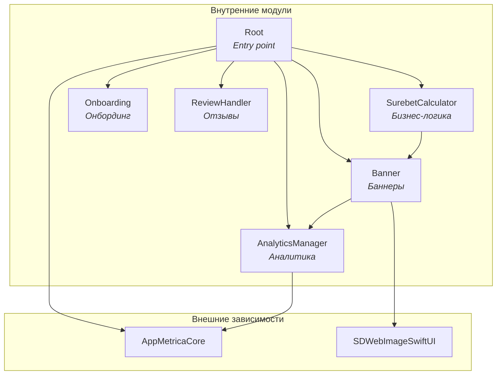

# 🧠 System Context для LLM-агентов

> **Цель:** Исчерпывающая база знаний для LLM-агентов, работающих с проектом SurebetCalculator.

---

## 1. Architecture (Архитектура)

### 1.1. Модульная структура (SPM)

Проект использует **Swift Package Manager** с монорепозиторием `SurebetCalculatorPackage/`.

#### Граф зависимостей модулей



#### Таблица модулей

| Модуль | Зависимости | Назначение |
|--------|-------------|------------|
| `Root` | `AnalyticsManager`, `Banner`, `Onboarding`, `ReviewHandler`, `SurebetCalculator`, `AppMetricaCore` | Entry point, координация модулей, инициализация AppMetrica |
| `SurebetCalculator` | `Banner` | Основная бизнес-логика калькулятора |
| `Banner` | `AnalyticsManager`, `SDWebImageSwiftUI` | Загрузка, кэширование и отображение баннеров |
| `Onboarding` | — | Онбординг новых пользователей |
| `ReviewHandler` | — | Запрос отзывов через SKStoreReviewController |
| `AnalyticsManager` | `AppMetricaCore` | Типобезопасная обёртка над AppMetrica |

#### Public API каждого модуля

**Root**
```swift
public enum Root {
    @MainActor
    public static func view() -> some View
}

// Реэкспорт AppMetrica для использования в App
public typealias AppMetrica = AppMetricaCore.AppMetrica
public typealias AppMetricaConfiguration = AppMetricaCore.AppMetricaConfiguration
```

**SurebetCalculator**
```swift
public enum SurebetCalculator {
    @MainActor
    public static func view() -> some View
}
```

**Banner**
```swift
public enum Banner {
    // Views
    public static var bannerView: some View
    @MainActor
    public static func fullscreenBannerView(isPresented: Binding<Bool>) -> some View
    @MainActor
    public static func fullscreenBannerView(isPresented: Binding<Bool>, service: BannerService) -> some View
    
    // Network
    public static func fetchBanner() async throws
    public static func fetchBanner(service: BannerService) async throws
    
    // Cache
    public static var isBannerFullyCached: Bool
    public static func isBannerFullyCached(service: BannerService) -> Bool
}

public protocol BannerService: Sendable {
    func fetchBannerAndImage() async throws
    func fetchBanner() async throws -> BannerModel
    func saveBannerToDefaults(_ banner: BannerModel)
    func getBannerFromDefaults() -> BannerModel?
    func clearBannerFromDefaults()
    func downloadImage(from url: URL) async throws
    func getStoredBannerImageData() -> Data?
    func getStoredBannerImageURL() -> URL?
    func isBannerFullyCached() -> Bool
}
```

**Onboarding**
```swift
public enum Onboarding {
    @MainActor
    public static func view(onboardingIsShown: Binding<Bool>) -> some View
}
```

**ReviewHandler**
```swift
@MainActor
public final class ReviewHandler: ReviewService {
    public init()
    public func requestReview() async
    public static func requestReview() async  // Статический метод для совместимости
}

@MainActor
public protocol ReviewService: Sendable {
    func requestReview() async
}
```

**AnalyticsManager**
```swift
public enum AnalyticsParameterValue: Sendable {
    case string(String)
    case int(Int)
    case double(Double)
    case bool(Bool)
}

public struct AnalyticsManager: AnalyticsService, Sendable {
    public init()
    public func log(name: String, parameters: [String: AnalyticsParameterValue]?)
    public static func log(name: String, parameters: [String: AnalyticsParameterValue]? = nil)
}

public protocol AnalyticsService: Sendable {
    func log(name: String, parameters: [String: AnalyticsParameterValue]?)
}
```

#### Правила работы с модулями

1. **Единственный экспортируемый продукт** — `Root`. Приложение импортирует только его.
2. **Паттерн public API** — каждый модуль экспортирует `enum` с `static func view()`.
3. **DI через параметры** — все методы с сервисами имеют два варианта: с дефолтной реализацией и с явной передачей `service`.
4. **Циклические зависимости запрещены** — граф направленный ациклический (DAG).

#### Как добавить новый модуль

```swift
// 1. В Package.swift добавить target
.target(
    name: "NewModule",
    dependencies: ["Banner"],  // при необходимости
    resources: [.process("Resources")],
    plugins: [.plugin(name: "SwiftLintBuildToolPlugin", package: "SwiftLint")]
),

// 2. Добавить зависимость в Root
.target(
    name: "Root",
    dependencies: [
        // ...existing...
        "NewModule",
    ],
    // ...
),

// 3. Создать Sources/NewModule/NewModule.swift
public enum NewModule {
    @MainActor
    public static func view() -> some View {
        NewModuleView()
    }
}
```

---

### 1.2. Паттерн MVVM

Проект использует **Model-View-ViewModel** с дополнительным слоем **Service** для бизнес-логики.

```
┌─────────────────────────────────────────────────────────────────┐
│                         SwiftUI View                             │
│  @StateObject viewModel = ViewModel()                           │
│  .environmentObject(viewModel)                                  │
│                              │                                   │
│                    viewModel.send(.action)                      │
│                              ▼                                   │
├─────────────────────────────────────────────────────────────────┤
│                        ViewModel                                 │
│  @MainActor final class: ObservableObject                       │
│  @Published private(set) var state                              │
│  private let service: ServiceProtocol                           │
│                              │                                   │
│                    service.calculate()                          │
│                              ▼                                   │
├─────────────────────────────────────────────────────────────────┤
│                         Service                                  │
│  protocol: Sendable                                             │
│  struct DefaultService: ServiceProtocol                         │
└─────────────────────────────────────────────────────────────────┘
```

#### Роли компонентов

| Слой | Ответственность | Паттерны |
|------|-----------------|----------|
| **View** | UI-рендеринг, передача действий в ViewModel | `@StateObject`, `@EnvironmentObject`, `.onChange` |
| **ViewModel** | Управление состоянием, обработка действий, вызов сервисов | `@MainActor`, `ObservableObject`, `@Published`, `ViewAction` enum |
| **Service** | Чистая бизнес-логика без состояния | Protocol + struct, `Sendable` |

#### View (SwiftUI)

View **владеет** ViewModel через `@StateObject` и передаёт его дочерним view через `.environmentObject()`.

```swift
// Корневой View — владеет ViewModel
struct SurebetCalculatorView: View {
    @StateObject private var viewModel = SurebetCalculatorViewModel()
    
    var body: some View {
        VStack {
            TotalRowView()
            // ...
        }
        .environmentObject(viewModel)  // Передача дочерним
    }
}

// Дочерний View — наблюдает ViewModel
struct TotalRowView: View {
    @EnvironmentObject private var viewModel: SurebetCalculatorViewModel
    
    var body: some View {
        TextField(...)
            .onChange(of: text) { newValue in
                viewModel.send(.setTextFieldText(.totalBet, newValue))
            }
    }
}
```

**Правила для View:**
1. Только корневой View использует `@StateObject`
2. Дочерние View используют `@EnvironmentObject`
3. View не содержит бизнес-логики — только вызов `viewModel.send()`
4. Анимации через `.animation()` модификатор

#### ViewModel (@MainActor, ObservableObject)

ViewModel управляет состоянием и обрабатывает действия через паттерн **ViewAction**.

```swift
@MainActor
final class SurebetCalculatorViewModel: ObservableObject {
    // MARK: - Properties
    
    // Состояние — readonly для внешнего доступа
    @Published private(set) var total: TotalRow
    @Published private(set) var rows: [Row]
    @Published private(set) var selectedRow: RowType?
    
    // Сервис — внедряется через init
    private let calculationService: CalculationService
    
    // MARK: - Initialization
    
    init(
        total: TotalRow = TotalRow(),
        rows: [Row] = Row.createRows(),
        calculationService: CalculationService = DefaultCalculationService()
    ) {
        self.total = total
        self.rows = rows
        self.calculationService = calculationService
    }
    
    // MARK: - Public Methods
    
    // Паттерн ViewAction — все действия в одном enum
    enum ViewAction {
        case selectRow(RowType)
        case addRow
        case removeRow
        case setTextFieldText(FocusableField, String)
        case clearAll
    }
    
    // Единая точка входа для всех действий от View
    func send(_ action: ViewAction) {
        switch action {
        case let .selectRow(row):
            select(row)
        case .addRow:
            addRow()
        case let .setTextFieldText(field, text):
            set(field, text: text)
            calculate()
        case .clearAll:
            clearAll()
        }
    }
}

// MARK: - Private Methods

private extension SurebetCalculatorViewModel {
    func calculate() {
        let result = calculationService.calculate(
            total: total,
            rows: rows,
            selectedRow: selectedRow,
            displayedRowIndexes: displayedRowIndexes
        )
        if let newTotal = result.total { total = newTotal }
        if let newRows = result.rows { rows = newRows }
    }
}
```

**Правила для ViewModel:**
1. Всегда `@MainActor final class: ObservableObject`
2. Состояние через `@Published private(set)` — View может читать, но не писать
3. Все действия через `send(_ action: ViewAction)`
4. Сервисы через `private let` + DI в `init`
5. `@AppStorage` для персистентного состояния (UserDefaults)

#### Service (Protocol + Struct)

Service содержит чистую бизнес-логику без состояния.

```swift
// Протокол — определяет контракт
protocol CalculationService: Sendable {
    func calculate(
        total: TotalRow,
        rows: [Row],
        selectedRow: RowType?,
        displayedRowIndexes: Range<Int>
    ) -> (total: TotalRow?, rows: [Row]?)
}

// Реализация — stateless struct
struct DefaultCalculationService: CalculationService, Sendable {
    func calculate(
        total: TotalRow,
        rows: [Row],
        selectedRow: RowType?,
        displayedRowIndexes: Range<Int>
    ) -> (total: TotalRow?, rows: [Row]?) {
        let calculator = Calculator(
            total: total,
            rows: rows,
            selectedRow: selectedRow,
            displayedRowIndexes: displayedRowIndexes
        )
        return calculator.calculate()
    }
}
```

**Правила для Service:**
1. Всегда протокол + struct реализация
2. `Sendable` конформность обязательна
3. Stateless — нет stored properties с состоянием
4. Может использовать вспомогательные структуры (Calculator, NetworkClient)

#### Правила взаимодействия между слоями

| Направление | Как | Пример |
|-------------|-----|--------|
| View → ViewModel | `viewModel.send(.action)` | `viewModel.send(.addRow)` |
| ViewModel → View | `@Published` | `@Published var rows: [Row]` |
| ViewModel → Service | Прямой вызов метода | `calculationService.calculate(...)` |
| Service → ViewModel | Return value | `return (total, rows)` |

**Запрещено:**
- View напрямую вызывает Service
- Service знает о ViewModel
- ViewModel напрямую меняет UI
- Циклические зависимости

#### Dependency Injection

DI реализуется через параметры `init` с дефолтными значениями:

```swift
// Production использует дефолтные значения
let viewModel = SurebetCalculatorViewModel()

// Тесты передают моки
let viewModel = SurebetCalculatorViewModel(
    calculationService: MockCalculationService()
)
```

---
