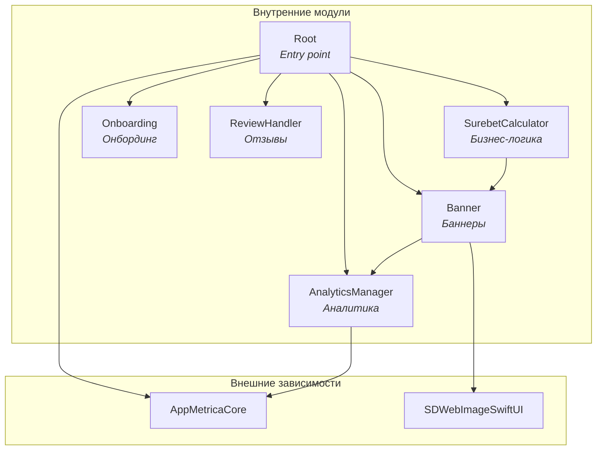
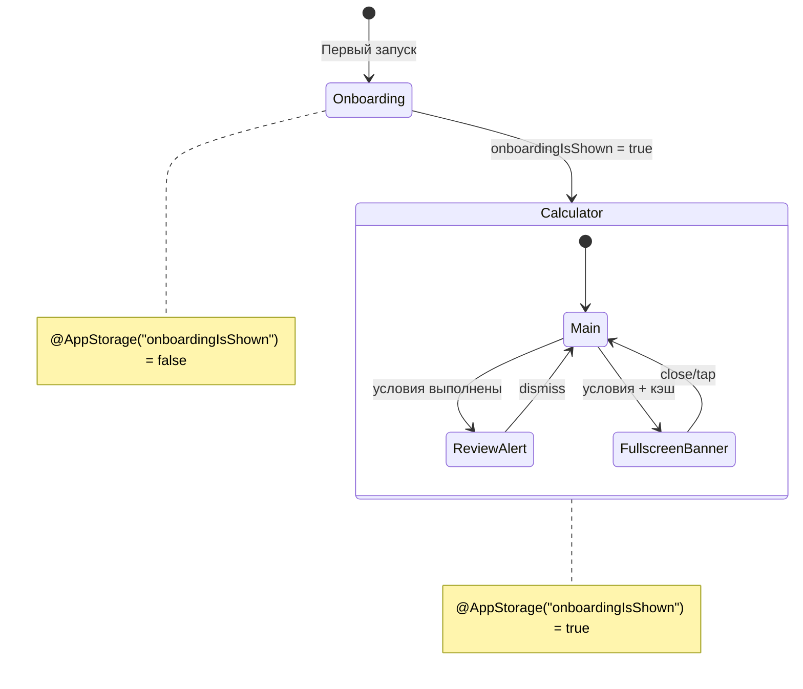

# 🧠 System Context для LLM-агентов

> **Цель:** Исчерпывающая база знаний для LLM-агентов, работающих с проектом SurebetCalculator.

---

## 1. Architecture (Архитектура)

### 1.1. Модульная структура (SPM)

Проект использует **Swift Package Manager** с монорепозиторием `SurebetCalculatorPackage/`.

#### Граф зависимостей модулей



#### Таблица модулей

| Модуль | Зависимости | Назначение |
|--------|-------------|------------|
| `Root` | `AnalyticsManager`, `Banner`, `Onboarding`, `ReviewHandler`, `SurebetCalculator`, `AppMetricaCore` | Entry point, координация модулей, инициализация AppMetrica |
| `SurebetCalculator` | `Banner` | Основная бизнес-логика калькулятора |
| `Banner` | `AnalyticsManager`, `SDWebImageSwiftUI` | Загрузка, кэширование и отображение баннеров |
| `Onboarding` | — | Онбординг новых пользователей |
| `ReviewHandler` | — | Запрос отзывов через SKStoreReviewController |
| `AnalyticsManager` | `AppMetricaCore` | Типобезопасная обёртка над AppMetrica |

#### Public API каждого модуля

**Root**
```swift
public enum Root {
    @MainActor
    public static func view() -> some View
}

// Реэкспорт AppMetrica для использования в App
public typealias AppMetrica = AppMetricaCore.AppMetrica
public typealias AppMetricaConfiguration = AppMetricaCore.AppMetricaConfiguration
```

**SurebetCalculator**
```swift
public enum SurebetCalculator {
    @MainActor
    public static func view() -> some View
}
```

**Banner**
```swift
public enum Banner {
    // Views
    public static var bannerView: some View
    @MainActor
    public static func fullscreenBannerView(isPresented: Binding<Bool>) -> some View
    @MainActor
    public static func fullscreenBannerView(isPresented: Binding<Bool>, service: BannerService) -> some View
    
    // Network
    public static func fetchBanner() async throws
    public static func fetchBanner(service: BannerService) async throws
    
    // Cache
    public static var isBannerFullyCached: Bool
    public static func isBannerFullyCached(service: BannerService) -> Bool
}

public protocol BannerService: Sendable {
    func fetchBannerAndImage() async throws
    func fetchBanner() async throws -> BannerModel
    func saveBannerToDefaults(_ banner: BannerModel)
    func getBannerFromDefaults() -> BannerModel?
    func clearBannerFromDefaults()
    func downloadImage(from url: URL) async throws
    func getStoredBannerImageData() -> Data?
    func getStoredBannerImageURL() -> URL?
    func isBannerFullyCached() -> Bool
}
```

**Onboarding**
```swift
public enum Onboarding {
    @MainActor
    public static func view(onboardingIsShown: Binding<Bool>) -> some View
}
```

**ReviewHandler**
```swift
@MainActor
public final class ReviewHandler: ReviewService {
    public init()
    public func requestReview() async
    public static func requestReview() async  // Статический метод для совместимости
}

@MainActor
public protocol ReviewService: Sendable {
    func requestReview() async
}
```

**AnalyticsManager**
```swift
public enum AnalyticsParameterValue: Sendable {
    case string(String)
    case int(Int)
    case double(Double)
    case bool(Bool)
}

public struct AnalyticsManager: AnalyticsService, Sendable {
    public init()
    public func log(name: String, parameters: [String: AnalyticsParameterValue]?)
    public static func log(name: String, parameters: [String: AnalyticsParameterValue]? = nil)
}

public protocol AnalyticsService: Sendable {
    func log(name: String, parameters: [String: AnalyticsParameterValue]?)
}
```

#### Правила работы с модулями

1. **Единственный экспортируемый продукт** — `Root`. Приложение импортирует только его.
2. **Паттерн public API** — каждый модуль экспортирует `enum` с `static func view()`.
3. **DI через параметры** — все методы с сервисами имеют два варианта: с дефолтной реализацией и с явной передачей `service`.
4. **Циклические зависимости запрещены** — граф направленный ациклический (DAG).

#### Как добавить новый модуль

```swift
// 1. В Package.swift добавить target
.target(
    name: "NewModule",
    dependencies: ["Banner"],  // при необходимости
    resources: [.process("Resources")],
    plugins: [.plugin(name: "SwiftLintBuildToolPlugin", package: "SwiftLint")]
),

// 2. Добавить зависимость в Root
.target(
    name: "Root",
    dependencies: [
        // ...existing...
        "NewModule",
    ],
    // ...
),

// 3. Создать Sources/NewModule/NewModule.swift
public enum NewModule {
    @MainActor
    public static func view() -> some View {
        NewModuleView()
    }
}
```

---

### 1.2. Паттерн MVVM

Проект использует **Model-View-ViewModel** с дополнительным слоем **Service** для бизнес-логики.

```
┌─────────────────────────────────────────────────────────────────┐
│                         SwiftUI View                             │
│  @StateObject viewModel = ViewModel()                           │
│  .environmentObject(viewModel)                                  │
│                              │                                   │
│                    viewModel.send(.action)                      │
│                              ▼                                   │
├─────────────────────────────────────────────────────────────────┤
│                        ViewModel                                 │
│  @MainActor final class: ObservableObject                       │
│  @Published private(set) var state                              │
│  private let service: ServiceProtocol                           │
│                              │                                   │
│                    service.calculate()                          │
│                              ▼                                   │
├─────────────────────────────────────────────────────────────────┤
│                         Service                                  │
│  protocol: Sendable                                             │
│  struct DefaultService: ServiceProtocol                         │
└─────────────────────────────────────────────────────────────────┘
```

#### Роли компонентов

| Слой | Ответственность | Паттерны |
|------|-----------------|----------|
| **View** | UI-рендеринг, передача действий в ViewModel | `@StateObject`, `@EnvironmentObject`, `.onChange` |
| **ViewModel** | Управление состоянием, обработка действий, вызов сервисов | `@MainActor`, `ObservableObject`, `@Published`, `ViewAction` enum |
| **Service** | Чистая бизнес-логика без состояния | Protocol + struct, `Sendable` |

#### View (SwiftUI)

View **владеет** ViewModel через `@StateObject` и передаёт его дочерним view через `.environmentObject()`.

```swift
// Корневой View — владеет ViewModel
struct SurebetCalculatorView: View {
    @StateObject private var viewModel = SurebetCalculatorViewModel()
    
    var body: some View {
        VStack {
            TotalRowView()
            // ...
        }
        .environmentObject(viewModel)  // Передача дочерним
    }
}

// Дочерний View — наблюдает ViewModel
struct TotalRowView: View {
    @EnvironmentObject private var viewModel: SurebetCalculatorViewModel
    
    var body: some View {
        TextField(...)
            .onChange(of: text) { newValue in
                viewModel.send(.setTextFieldText(.totalBet, newValue))
            }
    }
}
```

**Правила для View:**
1. Только корневой View использует `@StateObject`
2. Дочерние View используют `@EnvironmentObject`
3. View не содержит бизнес-логики — только вызов `viewModel.send()`
4. Анимации через `.animation()` модификатор

#### ViewModel (@MainActor, ObservableObject)

ViewModel управляет состоянием и обрабатывает действия через паттерн **ViewAction**.

```swift
@MainActor
final class SurebetCalculatorViewModel: ObservableObject {
    // MARK: - Properties
    
    // Состояние — readonly для внешнего доступа
    @Published private(set) var total: TotalRow
    @Published private(set) var rows: [Row]
    @Published private(set) var selectedRow: RowType?
    
    // Сервис — внедряется через init
    private let calculationService: CalculationService
    
    // MARK: - Initialization
    
    init(
        total: TotalRow = TotalRow(),
        rows: [Row] = Row.createRows(),
        calculationService: CalculationService = DefaultCalculationService()
    ) {
        self.total = total
        self.rows = rows
        self.calculationService = calculationService
    }
    
    // MARK: - Public Methods
    
    // Паттерн ViewAction — все действия в одном enum
    enum ViewAction {
        case selectRow(RowType)
        case addRow
        case removeRow
        case setTextFieldText(FocusableField, String)
        case clearAll
    }
    
    // Единая точка входа для всех действий от View
    func send(_ action: ViewAction) {
        switch action {
        case let .selectRow(row):
            select(row)
        case .addRow:
            addRow()
        case let .setTextFieldText(field, text):
            set(field, text: text)
            calculate()
        case .clearAll:
            clearAll()
        }
    }
}

// MARK: - Private Methods

private extension SurebetCalculatorViewModel {
    func calculate() {
        let result = calculationService.calculate(
            total: total,
            rows: rows,
            selectedRow: selectedRow,
            displayedRowIndexes: displayedRowIndexes
        )
        if let newTotal = result.total { total = newTotal }
        if let newRows = result.rows { rows = newRows }
    }
}
```

**Правила для ViewModel:**
1. Всегда `@MainActor final class: ObservableObject`
2. Состояние через `@Published private(set)` — View может читать, но не писать
3. Все действия через `send(_ action: ViewAction)`
4. Сервисы через `private let` + DI в `init`
5. `@AppStorage` для персистентного состояния (UserDefaults)

#### Service (Protocol + Struct)

Service содержит чистую бизнес-логику без состояния.

```swift
// Протокол — определяет контракт
protocol CalculationService: Sendable {
    func calculate(
        total: TotalRow,
        rows: [Row],
        selectedRow: RowType?,
        displayedRowIndexes: Range<Int>
    ) -> (total: TotalRow?, rows: [Row]?)
}

// Реализация — stateless struct
struct DefaultCalculationService: CalculationService, Sendable {
    func calculate(
        total: TotalRow,
        rows: [Row],
        selectedRow: RowType?,
        displayedRowIndexes: Range<Int>
    ) -> (total: TotalRow?, rows: [Row]?) {
        let calculator = Calculator(
            total: total,
            rows: rows,
            selectedRow: selectedRow,
            displayedRowIndexes: displayedRowIndexes
        )
        return calculator.calculate()
    }
}
```

**Правила для Service:**
1. Всегда протокол + struct реализация
2. `Sendable` конформность обязательна
3. Stateless — нет stored properties с состоянием
4. Может использовать вспомогательные структуры (Calculator, NetworkClient)

#### Правила взаимодействия между слоями

| Направление | Как | Пример |
|-------------|-----|--------|
| View → ViewModel | `viewModel.send(.action)` | `viewModel.send(.addRow)` |
| ViewModel → View | `@Published` | `@Published var rows: [Row]` |
| ViewModel → Service | Прямой вызов метода | `calculationService.calculate(...)` |
| Service → ViewModel | Return value | `return (total, rows)` |

**Запрещено:**
- View напрямую вызывает Service
- Service знает о ViewModel
- ViewModel напрямую меняет UI
- Циклические зависимости

---

### 1.3. Dependency Injection

Проект использует **Constructor Injection** с дефолтными значениями — простой и тестируемый паттерн без DI-контейнеров.

#### Паттерн DI через init

```swift
@MainActor
final class SomeViewModel: ObservableObject {
    // Зависимость хранится как private let
    private let analyticsService: AnalyticsService
    private let reviewService: ReviewService
    
    // Init с дефолтными значениями
    init(
        analyticsService: AnalyticsService = AnalyticsManager(),
        reviewService: ReviewService = ReviewHandler()
    ) {
        self.analyticsService = analyticsService
        self.reviewService = reviewService
    }
}
```

**Ключевые правила:**
1. Параметр = протокол, дефолтное значение = реализация
2. `private let` для хранения — immutable после init
3. Production код вызывает `SomeViewModel()` — дефолтные значения
4. Тесты вызывают `SomeViewModel(analyticsService: MockAnalyticsService())` — моки

#### Протоколы сервисов

В проекте 4 основных сервисных протокола:

**CalculationService** — вычисления калькулятора
```swift
protocol CalculationService: Sendable {
    func calculate(
        total: TotalRow,
        rows: [Row],
        selectedRow: RowType?,
        displayedRowIndexes: Range<Int>
    ) -> (total: TotalRow?, rows: [Row]?)
}

// Реализация
struct DefaultCalculationService: CalculationService, Sendable { ... }
```

**AnalyticsService** — аналитика событий
```swift
public protocol AnalyticsService: Sendable {
    func log(name: String, parameters: [String: AnalyticsParameterValue]?)
}

// Реализация
public struct AnalyticsManager: AnalyticsService, Sendable { ... }
```

**ReviewService** — запрос отзывов
```swift
@MainActor
public protocol ReviewService: Sendable {
    func requestReview() async
}

// Реализация
@MainActor
public final class ReviewHandler: ReviewService { ... }
```

**BannerService** — работа с баннерами
```swift
public protocol BannerService: Sendable {
    func fetchBannerAndImage() async throws
    func fetchBanner() async throws -> BannerModel
    func saveBannerToDefaults(_ banner: BannerModel)
    func getBannerFromDefaults() -> BannerModel?
    func clearBannerFromDefaults()
    func downloadImage(from url: URL) async throws
    func getStoredBannerImageData() -> Data?
    func getStoredBannerImageURL() -> URL?
    func isBannerFullyCached() -> Bool
}

// Реализация
struct Service: BannerService, @unchecked Sendable { ... }
```

#### Создание моков для тестов

Моки создаются вручную (hand-written mocks) без библиотек:

```swift
/// Мок для тестов — хранит историю вызовов
final class MockCalculationService: CalculationService, @unchecked Sendable {
    // Счётчик вызовов
    var calculateCallCount = 0
    
    // Контролируемый результат
    var calculateResult: (total: TotalRow?, rows: [Row]?)?
    
    // История входных данных
    var calculateInputs: [CalculateInput] = []
    
    func calculate(
        total: TotalRow,
        rows: [Row],
        selectedRow: RowType?,
        displayedRowIndexes: Range<Int>
    ) -> (total: TotalRow?, rows: [Row]?) {
        calculateCallCount += 1
        calculateInputs.append(CalculateInput(...))
        return calculateResult ?? (nil, nil)
    }
}
```

**Паттерн мока:**
1. `@unchecked Sendable` — для тестов допустимо
2. `*CallCount` — счётчик вызовов для проверки
3. `*Result` — контролируемый return value
4. `*Inputs` — история входных параметров

#### Примеры использования в тестах

```swift
@MainActor
@Suite(.serialized)
struct RootViewModelTests {
    
    /// Factory method для создания ViewModel с моками
    func createViewModel(
        analyticsService: AnalyticsService? = nil,
        reviewService: ReviewService? = nil
    ) -> RootViewModel {
        let analytics = analyticsService ?? MockAnalyticsService()
        let review = reviewService ?? MockReviewService()
        return RootViewModel(
            analyticsService: analytics,
            reviewService: review
        )
    }
    
    @Test
    func handleReviewYesCallsServiceAndLogsAnalytics() async {
        // Given — создаём моки для контроля
        let mockAnalytics = MockAnalyticsService()
        let mockReview = MockReviewService()
        let viewModel = createViewModel(
            analyticsService: mockAnalytics,
            reviewService: mockReview
        )
        
        // When — выполняем действие
        await viewModel.handleReviewYes()
        
        // Then — проверяем вызовы моков
        #expect(mockReview.requestReviewCallCount == 1)
        #expect(mockAnalytics.logCallCount == 1)
        #expect(mockAnalytics.lastEventName == "RequestReview")
    }
}
```

#### Расположение файлов

```
Sources/
└── ModuleName/
    ├── SomeService.swift          # Протокол
    └── DefaultSomeService.swift   # Реализация

Tests/
└── ModuleNameTests/
    ├── SomeViewModelTests.swift
    └── Mocks/
        └── MockSomeService.swift  # Мок для тестов
```

#### Правила DI в проекте

| Правило | Описание |
|---------|----------|
| Протокол в параметре | `service: ServiceProtocol` — не конкретный тип |
| Дефолт = реализация | `= DefaultService()` — production готов из коробки |
| Private let | Зависимости immutable после init |
| Sendable | Все протоколы сервисов `Sendable` |
| Hand-written mocks | Без библиотек (Mockolo, Cuckoo) — полный контроль |

---

### 1.4. Навигация

Проект использует **условный рендеринг** вместо NavigationStack/NavigationPath. Навигация управляется состоянием в ViewModel.

#### Навигационная структура

```
┌─────────────────────────────────────────────────────────────────┐
│                        RootView                                  │
│  @StateObject viewModel = RootViewModel()                        │
│                                                                  │
│  ┌─────────────────────────────────────────────────────────────┐│
│  │                    mainContent                               ││
│  │  ┌───────────────────┬─────────────────────────────────────┐││
│  │  │ isOnboardingShown │              Экран                  │││
│  │  ├───────────────────┼─────────────────────────────────────┤││
│  │  │      false        │ OnboardingView (fullscreen)         │││
│  │  │      true         │ NavigationView > SurebetCalculator  │││
│  │  └───────────────────┴─────────────────────────────────────┘││
│  └─────────────────────────────────────────────────────────────┘│
│                                                                  │
│  ┌─────────────────────────────────────────────────────────────┐│
│  │                    Overlays (поверх контента)               ││
│  │  • Alert (запрос отзыва)                                    ││
│  │  • FullscreenBannerView (.overlay)                          ││
│  └─────────────────────────────────────────────────────────────┘│
└─────────────────────────────────────────────────────────────────┘
```

#### Условный рендеринг экранов

`RootView` определяет какой экран показывать на основе `@AppStorage`:

```swift
// RootView.swift
@MainActor
struct RootView: View {
    @StateObject private var viewModel = RootViewModel()
    
    var body: some View {
        mainContent
            .modifier(LifecycleModifier(viewModel: viewModel))
            .modifier(ReviewAlertModifier(viewModel: viewModel))
            .modifier(FullscreenBannerOverlayModifier(viewModel: viewModel))
            .modifier(AnimationModifier(viewModel: viewModel))
    }
}

private extension RootView {
    var mainContent: some View {
        Group {
            if viewModel.isOnboardingShown {
                calculatorView  // Основной экран
            } else {
                onboardingView  // Первый запуск
            }
        }
    }
    
    var calculatorView: some View {
        NavigationView {
            SurebetCalculator.view()
        }
        .navigationViewStyle(.stack)  // Важно для iPad
    }
}

// RootViewModel.swift
@MainActor
final class RootViewModel: ObservableObject {
    // Персистентное состояние в UserDefaults
    @AppStorage("onboardingIsShown") private var onboardingIsShown = false
    
    var isOnboardingShown: Bool { onboardingIsShown }
    
    func updateOnboardingShown(_ value: Bool) {
        onboardingIsShown = value
    }
}
```

**Ключевые паттерны:**
1. `@AppStorage` — персистентное состояние между запусками
2. `Group { if ... else }` — условный рендеринг без NavigationPath
3. `NavigationView` с `.stack` — для iPad совместимости
4. Состояние передаётся через `Binding` (onboardingIsShown)

#### ViewModifier паттерн для разделения логики

Вместо одного большого `body`, логика разбита на отдельные ViewModifier:

```swift
// Разделение ответственности через ViewModifier

// 1. Lifecycle — обработка появления экрана
private struct LifecycleModifier: ViewModifier {
    let viewModel: RootViewModel
    
    func body(content: Content) -> some View {
        content
            .onAppear { viewModel.onAppear() }
            .onAppear(perform: viewModel.showOnboardingView)
            .onAppear(perform: viewModel.showRequestReview)
            .onAppear(perform: viewModel.showFullscreenBanner)
    }
}

// 2. Background task — фоновая загрузка данных
private struct BannerTaskModifier: ViewModifier {
    func body(content: Content) -> some View {
        content.task { try? await Banner.fetchBanner() }
    }
}

// 3. Alert — модальный диалог
private struct ReviewAlertModifier: ViewModifier {
    @ObservedObject var viewModel: RootViewModel
    
    func body(content: Content) -> some View {
        content.alert(viewModel.requestReviewTitle, isPresented: $viewModel.alertIsPresented) {
            Button(String(localized: "No")) { viewModel.handleReviewNo() }
            Button(String(localized: "Yes")) { Task { await viewModel.handleReviewYes() } }
        }
    }
}

// 4. Animation — анимации переходов
private struct AnimationModifier: ViewModifier {
    @ObservedObject var viewModel: RootViewModel
    
    func body(content: Content) -> some View {
        content
            .animation(.default, value: viewModel.isOnboardingShown)
            .animation(.easeInOut, value: viewModel.fullscreenBannerIsPresented)
    }
}
```

**Зачем ViewModifier:**
- Single Responsibility — каждый модификатор отвечает за одну задачу
- Тестируемость — модификаторы можно тестировать отдельно
- Читаемость — `body` остаётся компактным

#### Модальные Overlay

Fullscreen баннер показывается поверх контента через `.overlay`:

```swift
private struct FullscreenBannerOverlayModifier: ViewModifier {
    @ObservedObject var viewModel: RootViewModel
    
    func body(content: Content) -> some View {
        content.overlay {
            if viewModel.fullscreenBannerIsPresented {
                Banner.fullscreenBannerView(isPresented: $viewModel.fullscreenBannerIsPresented)
                    .transition(.move(edge: .bottom))
            }
        }
    }
}
```

**Условия показа баннера (`RootViewModel`):**
```swift
var fullscreenBannerIsAvailable: Bool {
    onboardingIsShown &&              // После онбординга
    requestReviewWasShown &&          // После показа review alert
    numberOfOpenings.isMultiple(of: 3) // Каждое 3-е открытие
}

func showFullscreenBanner() {
    if fullscreenBannerIsAvailable, Banner.isBannerFullyCached {
        fullscreenBannerIsPresented = true
    }
}
```

**FullscreenBannerView — структура:**
```swift
struct FullscreenBannerView: View {
    @Binding var isPresented: Bool
    private let service: BannerService
    
    var body: some View {
        ZStack {
            Color.black.opacity(0.75)  // Затемнение фона
            bannerImage                 // Изображение из кэша
        }
    }
    
    // Закрытие: isPresented = false
    // Клик: открывает URL и закрывает через delay
}
```

#### Transition анимации

Переходы между экранами анимируются через `.transition`:

```swift
// Onboarding — выезжает снизу
@ViewBuilder
var onboardingView: some View {
    if viewModel.shouldShowOnboardingWithAnimation {
        Onboarding.view(onboardingIsShown: onboardingBinding)
            .transition(.move(edge: .bottom))
    }
}

// Баннер — выезжает снизу
Banner.fullscreenBannerView(...)
    .transition(.move(edge: .bottom))

// Анимация привязана к изменению состояния
.animation(.default, value: viewModel.isOnboardingShown)
.animation(.easeInOut, value: viewModel.fullscreenBannerIsPresented)
```

**Паттерн двухфазной анимации Onboarding:**
```swift
// ViewModel
@Published private(set) var isAnimation = false

var shouldShowOnboardingWithAnimation: Bool {
    shouldShowOnboarding && isAnimation  // Оба условия
}

func showOnboardingView() {
    withAnimation { isAnimation = true }  // Триггер анимации
}
```

#### Диаграмма навигационных состояний



#### Правила навигации в проекте

| Правило | Описание |
|---------|----------|
| Условный рендеринг | `if/else` в `body` вместо NavigationPath |
| @AppStorage | Персистентное состояние навигации |
| ViewModifier | Разделение логики на отдельные модификаторы |
| .overlay | Модальные экраны поверх контента |
| .transition | Анимации появления/исчезновения |
| Binding | Передача состояния между модулями |

#### Как добавить новый overlay/modal

```swift
// 1. Добавить состояние в RootViewModel
@Published var newModalIsPresented = false

// 2. Создать ViewModifier
private struct NewModalOverlayModifier: ViewModifier {
    @ObservedObject var viewModel: RootViewModel
    
    func body(content: Content) -> some View {
        content.overlay {
            if viewModel.newModalIsPresented {
                NewModalView(isPresented: $viewModel.newModalIsPresented)
                    .transition(.move(edge: .bottom))
            }
        }
    }
}

// 3. Добавить в RootView.body
var body: some View {
    mainContent
        // ...existing modifiers...
        .modifier(NewModalOverlayModifier(viewModel: viewModel))
        .animation(.easeInOut, value: viewModel.newModalIsPresented)
}
```

---

## 2. Tech Stack (Технологический стек)

### 2.1. Версии и платформы

Проект использует **Swift 6** с полной поддержкой **Swift Concurrency** и strict concurrency checking.

#### Таблица версий

| Компонент | Версия | Где задаётся |
|-----------|--------|--------------|
| **Swift** | 6.0 | `Package.swift` (`swift-tools-version: 6.0`), `project.pbxproj` (`SWIFT_VERSION = 6.0`) |
| **iOS Deployment Target** | 16.0+ | `Package.swift` (`.iOS(.v16)`), `project.pbxproj` (`IPHONEOS_DEPLOYMENT_TARGET = 16.0`) |
| **Xcode** | 16.0+ | `project.pbxproj` (`LastUpgradeCheck = 1600`) |
| **App Marketing Version** | 1.7.0 | `project.pbxproj` (`MARKETING_VERSION`), `Info.plist` (`CFBundleShortVersionString`) |

#### Минимальные требования для разработки

```
┌─────────────────────────────────────────────────────────────────┐
│                    Требования для разработки                    │
├─────────────────────────────────────────────────────────────────┤
│  macOS          │ Sonoma 14.0+ (для Xcode 16)                   │
│  Xcode          │ 16.0+ (обязательно для Swift 6)               │
│  iOS Simulator  │ iOS 16.0+ (минимальная поддерживаемая версия) │
│  Device         │ iPhone/iPad с iOS 16.0+                       │
└─────────────────────────────────────────────────────────────────┘
```

**Почему iOS 16.0:**
- Стабильная база с широким охватом устройств
- Поддержка всех используемых API SwiftUI
- `NavigationView` с `.stack` стилем (до перехода на `NavigationStack`)

#### Поддерживаемые устройства

```swift
// project.pbxproj
TARGETED_DEVICE_FAMILY = "1,2"  // 1 = iPhone, 2 = iPad
SUPPORTS_MACCATALYST = NO
SUPPORTS_MAC_DESIGNED_FOR_IPHONE_IPAD = NO
```

| Устройство | Поддержка | Ориентация |
|------------|-----------|------------|
| **iPhone** | ✅ Да | Только Portrait |
| **iPad** | ✅ Да | Portrait + Landscape |
| **Mac Catalyst** | ❌ Нет | — |
| **Mac (Designed for iPad)** | ❌ Нет | — |

#### Симуляторы для тестов

Для запуска тестов используется симулятор с ID из `.cursor/rules/rules.mdc`:

```bash
# Команда сборки для тестов
xcodebuild -project surebet-calculator.xcodeproj \
    -scheme surebet-calculator \
    -destination 'id=F8F50881-5D0E-49DA-AA54-1312A752EED9' \
    build

# Получить список доступных симуляторов
xcrun simctl list devices available

# Найти ID конкретного симулятора
xcrun simctl list devices | grep "iPhone"
```

**Рекомендуемые симуляторы для тестирования:**

| Категория | Устройство | Обоснование |
|-----------|------------|-------------|
| **Основной** | iPhone 15 Pro | Актуальное устройство |
| **Маленький экран** | iPhone SE (3rd) | Проверка layout на минимальном экране |
| **Большой экран** | iPhone 15 Pro Max | Проверка на максимальном размере |
| **iPad** | iPad Pro 12.9" | Проверка iPad-специфичных layouts |

#### Test Plan конфигурация

Тесты запускаются через Test Plan (`surebet-calculator.xctestplan`):

```
Test Targets:
├── AnalyticsManagerTests
├── BannerTests
├── OnboardingTests
├── ReviewHandlerTests
├── RootTests
├── SurebetCalculatorTests
└── SurebetCalculatorUITests (UI Tests в основном проекте)
```

Environment Variables для тестов:
```json
{
  "AppMetrica_Key": "f7e1f335-475a-4b6c-ba4a-77988745bc7a"
}
```

#### Важные Build Settings

```swift
// Debug конфигурация
SWIFT_ACTIVE_COMPILATION_CONDITIONS = DEBUG
SWIFT_OPTIMIZATION_LEVEL = "-Onone"
ENABLE_TESTABILITY = YES

// Release конфигурация  
SWIFT_COMPILATION_MODE = wholemodule
SWIFT_OPTIMIZATION_LEVEL = "-O"
VALIDATE_PRODUCT = YES
```

#### Правила для AI-агента

1. **Всегда проверяй iOS availability** — минимум iOS 16.0
2. **Используй Swift 6 syntax** — `async/await`, `@MainActor`, строгие `Sendable`
3. **Не используй deprecated API** — проверяй в документации Apple
4. **Тестируй на минимальном iOS** — iOS 16.0 simulator
5. **Учитывай iPad** — проверяй layouts на `.regular` size class

---

### 2.2. Внешние зависимости

Проект использует **3 внешних зависимости** через Swift Package Manager.

#### Таблица зависимостей

| Библиотека | Версия | Используется в | Назначение |
|------------|--------|----------------|------------|
| **AppMetrica SDK** | 5.11.0+ | `AnalyticsManager`, `Root` | Аналитика событий |
| **SwiftLint** | 0.59.1+ | Все модули (Build Tool Plugin) | Статический анализ кода |
| **SDWebImageSwiftUI** | 3.1.3+ | `Banner` | Загрузка и кэширование изображений |

---

#### AppMetrica SDK (Аналитика)

**GitHub:** https://github.com/appmetrica/appmetrica-sdk-ios

**Инициализация в AppDelegate:**

```swift
// SurebetCalculatorApp.swift
final class AppDelegate: NSObject, UIApplicationDelegate {
    func application(
        _ application: UIApplication,
        didFinishLaunchingWithOptions launchOptions: [UIApplication.LaunchOptionsKey: Any]? = nil
    ) -> Bool {
        #if !DEBUG  // Только в Release
        let apiKey = "f7e1f335-475a-4b6c-ba4a-77988745bc7a"
        if let configuration = AppMetricaConfiguration(apiKey: apiKey) {
            AppMetrica.activate(with: configuration)
        }
        #endif
        return true
    }
}
```

**Типобезопасная обёртка (AnalyticsManager):**

```swift
import AppMetricaCore

// Типобезопасные параметры вместо [String: Any]
public enum AnalyticsParameterValue: Sendable {
    case string(String)
    case int(Int)
    case double(Double)
    case bool(Bool)
}

public struct AnalyticsManager: AnalyticsService, Sendable {
    public func log(name: String, parameters: [String: AnalyticsParameterValue]?) {
        #if !DEBUG
        let appMetricaParameters = parameters?.reduce(into: [AnyHashable: Any]()) { result, pair in
            result[pair.key] = pair.value.anyValue
        }
        AppMetrica.reportEvent(name: name, parameters: appMetricaParameters)
        #endif
    }
}
```

**Примеры логирования событий:**

```swift
// Простое событие
AnalyticsManager.log(name: "ClickingOnAnAdvertisement")

// Событие с параметрами
analyticsService.log(name: "RequestReview", parameters: ["accepted": .bool(true)])

// Событие с динамическим именем
analyticsService.log(name: "OpenedBanner(\(banner.id)", parameters: nil)
```

**Реэкспорт для App:**

```swift
// Root.swift — реэкспорт типов AppMetrica
public typealias AppMetrica = AppMetricaCore.AppMetrica
public typealias AppMetricaConfiguration = AppMetricaCore.AppMetricaConfiguration

// Использование в App (импортирует только Root)
import Root
AppMetrica.activate(with: configuration)
```

**Правила:**
1. Инициализация **только в Release** (`#if !DEBUG`)
2. Использовать обёртку `AnalyticsManager`, не `AppMetrica` напрямую
3. Типобезопасные параметры через `AnalyticsParameterValue`
4. Протокол `AnalyticsService` для тестируемости

---

#### SDWebImageSwiftUI (Загрузка изображений)

**GitHub:** https://github.com/SDWebImage/SDWebImageSwiftUI

**Основной компонент — WebImage:**

```swift
import SDWebImageSwiftUI

struct BannerView: View {
    var body: some View {
        WebImage(url: URL(string: imageURL))
            .resizable()           // Масштабируемое
            .scaledToFit()         // Сохранение пропорций
            .cornerRadius(10)      // Скругление углов
            .onTapGesture { ... }  // Обработка тапа
    }
}
```

**Функции WebImage:**
- Автоматическая загрузка из сети
- Встроенное кэширование (память + диск)
- Поддержка placeholder и error state
- Поддержка GIF-анимации
- SwiftUI-нативный API

**Когда использовать:**
- Загрузка изображений из сети в UI
- Отображение баннеров, аватаров, превью
- Когда нужен автоматический кэш

**Когда НЕ использовать:**
- Для фоновой загрузки без отображения (используй URLSession)
- Для статичных Asset изображений (используй `Image("name")`)

---

#### SwiftLint (Линтер)

**GitHub:** https://github.com/realm/SwiftLint

**Интеграция как Build Tool Plugin:**

```swift
// Package.swift
.target(
    name: "SurebetCalculator",
    dependencies: [...],
    plugins: [
        .plugin(
            name: "SwiftLintBuildToolPlugin",
            package: "SwiftLint"
        )
    ]
)
```

**Особенности:**
- Запускается **автоматически** при каждой сборке
- Подключен ко **всем модулям** (targets и testTargets)
- Нарушения отображаются как warnings/errors в Xcode
- Не требует отдельной команды запуска

**Проверка ворнингов линтера:**

```bash
# Через Cursor IDE
read_lints  # Показывает ворнинги линтера

# Через терминал (manual)
swift run --package-path SurebetCalculatorPackage swiftlint lint
```

**Основные проверяемые правила:**
- `trailing_whitespace` — пробелы в конце строк
- `line_length` — максимальная длина строки
- `nesting` — глубина вложенности
- `force_cast` — принудительное приведение типов (`as!`)
- `force_unwrapping` — принудительное разворачивание (`!`)

**Правила для AI-агента:**
1. **Перед коммитом** проверять `read_lints` на изменённых файлах
2. Исправлять все warnings перед коммитом
3. Не добавлять `// swiftlint:disable` без крайней необходимости

---

### 2.3. Swift 6 Concurrency

Проект использует **Swift 6** с **strict concurrency checking**. Это обеспечивает потокобезопасность на уровне компиляции.

#### @MainActor — изоляция UI-кода

`@MainActor` гарантирует выполнение кода на главном потоке. Используется для всего UI-связанного кода.

**Где применяется @MainActor:**

| Компонент | Пример | Обоснование |
|-----------|--------|-------------|
| **ViewModel** | `@MainActor final class RootViewModel` | Изменяет `@Published` свойства, связанные с UI |
| **View** | `@MainActor struct RootView` | SwiftUI View всегда на main thread |
| **Public API модулей** | `@MainActor public static func view()` | Возвращает SwiftUI View |
| **ReviewService** | `@MainActor public protocol ReviewService` | Использует UIApplication, SKStoreReviewController |
| **Тестовые классы** | `@MainActor struct RootViewModelTests` | Тестирует MainActor-изолированные ViewModel |

**Паттерн ViewModel:**

```swift
@MainActor
final class SurebetCalculatorViewModel: ObservableObject {
    // @Published требует MainActor
    @Published private(set) var rows: [Row]
    @Published private(set) var total: TotalRow
    
    // Все методы автоматически MainActor-изолированы
    func send(_ action: ViewAction) {
        switch action {
        case .addRow:
            addRow()  // Безопасно — тот же actor
        case let .setTextFieldText(field, text):
            set(field, text: text)
            calculate()
        }
    }
}
```

**Паттерн Public API модуля:**

```swift
public enum SurebetCalculator {
    @MainActor
    public static func view() -> some View {
        SurebetCalculatorView()  // Возвращает MainActor-изолированный View
    }
}
```

**Правила @MainActor:**
1. Все ViewModel — `@MainActor final class`
2. Все View — `@MainActor struct`
3. Public API с возвратом View — `@MainActor static func`
4. Протоколы для UI-сервисов — `@MainActor protocol`
5. Тесты для MainActor ViewModel — `@MainActor struct`

---

#### Sendable — потокобезопасные типы

`Sendable` подтверждает, что тип можно безопасно передавать между потоками/actors.

**Типы, требующие Sendable:**

| Категория | Пример | Как соответствовать |
|-----------|--------|---------------------|
| **Модели данных** | `struct Row: Sendable` | Автоматически для struct с Sendable полями |
| **Сервисные протоколы** | `protocol CalculationService: Sendable` | Явное указание в протоколе |
| **Реализации сервисов** | `struct DefaultCalculationService: Sendable` | Stateless struct |
| **Enum'ы** | `enum CalculationMethod: Sendable` | Автоматически для enum без associated values |
| **Ошибки** | `enum BannerError: Error, Sendable` | Явное указание |

**Примеры моделей:**

```swift
// Автоматически Sendable — все поля Sendable
struct Row: Equatable, Sendable {
    let id: Int
    var isON = false
    var coefficient = ""
    var betSize = ""
}

struct TotalRow: Equatable, Sendable {
    var isON = true
    var betSize = ""
    var profitInPercent = ""
    var profitInMoney = ""
}

enum RowType: Equatable, Sendable {
    case total
    case row(_ id: Int)
}
```

**Протоколы сервисов:**

```swift
// Все сервисные протоколы Sendable
protocol CalculationService: Sendable {
    func calculate(...) -> (total: TotalRow?, rows: [Row]?)
}

public protocol AnalyticsService: Sendable {
    func log(name: String, parameters: [String: AnalyticsParameterValue]?)
}

public protocol BannerService: Sendable {
    func fetchBannerAndImage() async throws
    func fetchBanner() async throws -> BannerModel
}
```

**@unchecked Sendable — для классов с mutable state:**

```swift
// URLSession и UserDefaults безопасны, но компилятор не знает
struct Service: BannerService, @unchecked Sendable {
    private let baseURL: URL
    private let session: URLSession      // Thread-safe
    private let defaults: UserDefaults   // Thread-safe
}

// Моки в тестах
@MainActor
final class MockReviewService: ReviewService, @unchecked Sendable {
    var requestReviewCallCount = 0  // Mutable, но @MainActor изолирует
}
```

**Правила Sendable:**
1. Все модели данных — `Sendable`
2. Все сервисные протоколы — `Sendable`
3. Stateless struct — автоматически `Sendable`
4. Struct с URLSession/UserDefaults — `@unchecked Sendable`
5. Моки с @MainActor — `@unchecked Sendable`

---

#### async/await — асинхронные операции

**Сетевые запросы:**

```swift
struct Service: BannerService, @unchecked Sendable {
    func fetchBannerAndImage() async throws {
        // Последовательные async операции
        let banner = try await fetchBanner()
        
        if storedImageURL != banner.imageURL {
            try await downloadImage(from: banner.imageURL)
        }
    }
    
    func fetchBanner() async throws -> BannerModel {
        // URLSession.data возвращает (Data, URLResponse)
        let (data, response) = try await session.data(for: request)
        
        guard let httpResponse = response as? HTTPURLResponse,
              (200..<300).contains(httpResponse.statusCode) else {
            throw URLError(.badServerResponse)
        }
        
        return try JSONDecoder().decode(BannerModel.self, from: data)
    }
}
```

**Task.sleep для задержек:**

```swift
@MainActor
public final class ReviewHandler: ReviewService {
    public func requestReview() async {
        // Задержка перед показом системного диалога
        try? await Task.sleep(nanoseconds: 1_000_000_000)  // 1 секунда
        
        if let scene = UIApplication.shared.connectedScenes.first(...) as? UIWindowScene {
            SKStoreReviewController.requestReview(in: scene)
        }
    }
}
```

**Вызов async из sync (Task):**

```swift
// В RootViewModel
func showRequestReview() {
    #if !DEBUG
    Task {
        try? await Task.sleep(nanoseconds: AppConstants.Delays.reviewRequest)
        // После await — обратно в MainActor контекст
        alertIsPresented = true
    }
    #endif
}
```

**async в тестах:**

```swift
@MainActor
struct RootViewModelTests {
    @Test
    func handleReviewYesClosesAlertAndCallsService() async {
        // Given
        let mockReview = MockReviewService()
        let viewModel = createViewModel(reviewService: mockReview)
        
        // When — await для async метода
        await viewModel.handleReviewYes()
        
        // Then
        #expect(mockReview.requestReviewCallCount == 1)
    }
    
    @Test
    func showRequestReviewAfterDelay() async {
        let viewModel = createViewModel()
        viewModel.showRequestReview()
        
        // Ждём завершения внутреннего Task
        try? await Task.sleep(nanoseconds: delay + 100_000_000)
        
        #expect(viewModel.alertIsPresented == true)
    }
}
```

**Правила async/await:**
1. Сетевые запросы — `async throws`
2. Задержки — `Task.sleep(nanoseconds:)`
3. Вызов async из sync — через `Task { }`
4. В тестах — `async` функции с `await`
5. Ожидание Task — дополнительный `Task.sleep` с запасом

---

#### UIDevice Workaround — nonisolated(unsafe)

`UIDevice.current` помечен как `@MainActor` в iOS SDK, но реально thread-safe для чтения. Проблема: нельзя использовать в computed properties View без @MainActor.

**Проблема:**

```swift
extension View {
    var isIPad: Bool {
        // ❌ Ошибка: Main actor-isolated property 'current' 
        // can not be referenced from a non-isolated context
        UIDevice.current.userInterfaceIdiom == .pad
    }
}
```

**Решение — двойной подход:**

```swift
/// Утилита для определения типа устройства
enum Device {
    /// Безопасная версия для @MainActor контекста
    @MainActor
    static var isIPad: Bool {
        UIDevice.current.userInterfaceIdiom == .pad
    }

    /// Nonisolated версия для использования из любого контекста
    /// UIDevice.current реально безопасен для чтения (read-only)
    nonisolated(unsafe) static var isIPadUnsafe: Bool {
        MainActor.assumeIsolated {
            UIDevice.current.userInterfaceIdiom == .pad
        }
    }
}

extension View {
    /// Определяет, является ли текущее устройство iPad
    var isIPad: Bool {
        Device.isIPadUnsafe
    }
}
```

**Использование:**

```swift
struct SurebetCalculatorView: View {
    var body: some View {
        VStack {
            // Использование в View — через extension
            if isIPad {
                iPadLayout
            } else {
                iPhoneLayout
            }
        }
    }
}

// В @MainActor контексте — безопасная версия
@MainActor
func configureForDevice() {
    if Device.isIPad {
        // ...
    }
}
```

**Почему это безопасно:**
1. `UIDevice.current` — singleton, создаётся один раз
2. `.userInterfaceIdiom` — read-only property, не меняется
3. SwiftUI View body вызывается на main thread
4. `MainActor.assumeIsolated` — утверждение, что мы на main thread

**Правила workaround:**
1. Использовать **только для read-only** системных свойств
2. `nonisolated(unsafe)` + `MainActor.assumeIsolated` — пара
3. Документировать причину в комментарии
4. Предоставлять обе версии: safe и unsafe

---

#### @Suite(.serialized) — тесты с shared state

Когда тесты используют `UserDefaults` или другой shared state, они могут конфликтовать при параллельном выполнении.

```swift
/// Тесты выполняются последовательно для изоляции UserDefaults
@MainActor
@Suite(.serialized)  // Запускать тесты один за другим
struct RootViewModelTests {
    /// Очищает UserDefaults перед каждым тестом
    func clearTestUserDefaults() {
        let defaults = UserDefaults.standard
        defaults.removeObject(forKey: "onboardingIsShown")
        defaults.removeObject(forKey: "numberOfOpenings")
    }
    
    @Test
    func shouldShowOnboardingWhenNotShown() {
        // Given
        clearTestUserDefaults()  // Изоляция теста
        let viewModel = createViewModel()
        
        // Then
        #expect(viewModel.shouldShowOnboarding == true)
    }
}
```

**Когда использовать `.serialized`:**
- Тесты с `@AppStorage` / `UserDefaults`
- Тесты с singleton'ами
- Тесты с файловой системой
- Тесты с shared in-memory cache

---

#### Таблица паттернов Swift 6 Concurrency

| Паттерн | Когда использовать | Пример |
|---------|-------------------|--------|
| `@MainActor class` | ViewModel с @Published | `@MainActor final class RootViewModel` |
| `@MainActor struct` | SwiftUI View | `@MainActor struct RootView: View` |
| `@MainActor protocol` | UI-зависимые сервисы | `@MainActor protocol ReviewService` |
| `Sendable struct` | Модели данных | `struct Row: Sendable` |
| `Sendable protocol` | Сервисные протоколы | `protocol CalculationService: Sendable` |
| `@unchecked Sendable` | Struct с thread-safe зависимостями | `struct Service: @unchecked Sendable` |
| `async throws` | Сетевые операции | `func fetchBanner() async throws` |
| `Task { }` | Запуск async из sync | `Task { await service.fetch() }` |
| `Task.sleep` | Задержки | `try? await Task.sleep(nanoseconds: 1_000_000_000)` |
| `nonisolated(unsafe)` | Read-only системные свойства | `nonisolated(unsafe) static var isIPad` |
| `@Suite(.serialized)` | Тесты с shared state | `@Suite(.serialized) struct Tests` |

---

#### Добавление новой зависимости

```swift
// 1. Добавить в Package.swift dependencies
dependencies: [
    // ...existing...
    .package(
        url: "https://github.com/organization/PackageName.git",
        .upToNextMinor(from: "1.0.0")
    ),
],

// 2. Добавить в нужный target
.target(
    name: "ModuleName",
    dependencies: [
        // ...existing...
        .product(name: "ProductName", package: "PackageName"),
    ],
    // ...
),

// 3. Импортировать в Swift файле
import ProductName
```

**Правила при добавлении зависимостей:**
1. Использовать `.upToNextMinor` для контролируемых обновлений
2. Добавлять только в модули, где зависимость реально используется
3. Если зависимость нужна в App — реэкспортировать через `Root`
4. Документировать назначение в этом разделе

---

## 3. Rules (Правила и стандарты)

### 3.1. Структура файлов

Проект использует **модульную структуру** SPM. Каждый модуль — отдельная папка в `Sources/` с чёткой организацией файлов.

#### Эталонная структура модуля

```
Sources/
└── ModuleName/
    ├── ModuleName.swift           # Public API (enum с static func view())
    ├── ModuleNameConstants.swift  # Константы модуля
    │
    ├── Models/                    # Модели данных
    │   ├── SomeModel.swift
    │   └── AccessibilityIdentifiers.swift
    │
    ├── ViewModels/                # ViewModel'ы
    │   └── ModuleNameViewModel.swift
    │
    ├── Views/                     # SwiftUI Views
    │   ├── ModuleNameView.swift   # Корневой View модуля
    │   ├── Buttons/               # Кнопки
    │   │   └── SomeButton.swift
    │   └── Components/            # Переиспользуемые компоненты
    │       └── SomeComponent.swift
    │
    ├── Calculator/                # Бизнес-логика (optional)
    │   ├── SomeService.swift      # Протокол
    │   └── DefaultSomeService.swift  # Реализация
    │
    ├── Extensions/                # Расширения (optional)
    │   ├── Double.swift
    │   └── View+Device.swift
    │
    ├── Styles/                    # ViewModifier стили (optional)
    │   └── SomeTextFieldStyle.swift
    │
    └── Resources/                 # Ресурсы
        ├── Assets.xcassets/       # Изображения, цвета
        └── Localizable.xcstrings  # Локализация
```

#### Назначение папок

| Папка | Назначение | Содержимое |
|-------|------------|------------|
| **Models/** | Модели данных и enum'ы | `struct`, `enum` с Sendable/Equatable |
| **ViewModels/** | Управление состоянием | `@MainActor final class: ObservableObject` |
| **Views/** | UI компоненты | SwiftUI View структуры |
| **Views/Buttons/** | Кнопки | Переиспользуемые Button компоненты |
| **Views/Components/** | Компоненты | Переиспользуемые View компоненты |
| **Calculator/** | Бизнес-логика | Protocol + struct реализация |
| **Extensions/** | Расширения | `extension Type { }` |
| **Styles/** | Стили | `TextFieldStyle`, `ButtonStyle` |
| **Resources/** | Ресурсы | Assets, локализация |

#### Public API модуля (ModuleName.swift)

Каждый модуль экспортирует **один enum** с static методами:

```swift
// SurebetCalculator.swift
import SwiftUI

public enum SurebetCalculator {
    // MARK: - Public Methods

    @MainActor
    public static func view() -> some View {
        SurebetCalculatorView()
    }
}
```

**Паттерн для модулей с сервисами:**

```swift
// Banner.swift
public enum Banner {
    // MARK: - Views
    
    public static var bannerView: some View {
        BannerView()
    }

    @MainActor
    public static func fullscreenBannerView(isPresented: Binding<Bool>) -> some View {
        FullscreenBannerView(isPresented: isPresented, service: Service())
    }
    
    // Версия с DI для тестов
    @MainActor
    public static func fullscreenBannerView(isPresented: Binding<Bool>, service: BannerService) -> some View {
        FullscreenBannerView(isPresented: isPresented, service: service)
    }

    // MARK: - Network
    
    public static func fetchBanner() async throws {
        try await Service().fetchBannerAndImage()
    }
    
    public static func fetchBanner(service: BannerService) async throws {
        try await service.fetchBannerAndImage()
    }

    // MARK: - Cache
    
    public static var isBannerFullyCached: Bool {
        Service().isBannerFullyCached()
    }
}
```

**Паттерн для Root (реэкспорт зависимостей):**

```swift
// Root.swift
import AppMetricaCore
import SwiftUI

public enum Root {
    @MainActor
    public static func view() -> some View {
        RootView()
    }
}

// Реэкспорт для App
public typealias AppMetrica = AppMetricaCore.AppMetrica
public typealias AppMetricaConfiguration = AppMetricaCore.AppMetricaConfiguration
```

#### Constants файл (AppConstants.swift)

Константы группируются во вложенные enum'ы:

```swift
/// Константы приложения, сгруппированные по категориям
enum AppConstants {
    // MARK: - Layout

    /// Константы для отступов (padding)
    enum Padding {
        static let small: CGFloat = 8
        static let medium: CGFloat = 12
        static let large: CGFloat = 16
        static let extraLarge: CGFloat = 24
    }

    /// Константы для высот элементов
    enum Heights {
        static let compact: CGFloat = 40
        static let regular: CGFloat = 60
    }

    /// Константы для радиусов скругления углов
    enum CornerRadius {
        static let small: CGFloat = 10
        static let medium: CGFloat = 12
        static let large: CGFloat = 15
    }

    // MARK: - Delays

    enum Delays {
        /// Задержка перед запросом отзыва (1 секунда)
        static let reviewRequest: UInt64 = NSEC_PER_SEC * 1
    }

    // MARK: - Other

    enum Other {
        static let minimumTextScaleFactor: CGFloat = 0.5
        static let firstPageIndex = 0
    }
}
```

**Использование:**

```swift
.padding(AppConstants.Padding.large)
.cornerRadius(AppConstants.CornerRadius.medium)
```

#### Модели (Models/)

```swift
// Row.swift
import Foundation

struct Row: Equatable, Sendable {
    let id: Int
    var isON = false
    var betSize = ""
    var coefficient = ""
    var income = "0"

    static func createRows(_ number: Int = 10) -> [Row] {
        (0..<number).map { Row(id: $0) }
    }
}
```

**Правила:**
1. `struct` по умолчанию
2. `Equatable, Sendable` для безопасности
3. Factory method как `static func` внутри типа
4. Дефолтные значения для удобства инициализации

#### Структура тестов

```
Tests/
└── ModuleNameTests/
    ├── ModuleNameViewModelTests.swift
    ├── SomeServiceTests.swift
    └── Mocks/
        ├── MockSomeService.swift
        └── MockAnotherService.swift
```

| Файл | Содержимое |
|------|------------|
| `*ViewModelTests.swift` | Тесты ViewModel |
| `*ServiceTests.swift` | Тесты сервисов |
| `*ExtensionTests.swift` | Тесты расширений |
| `Mocks/Mock*.swift` | Hand-written моки |

#### Примеры организации по модулям

**SurebetCalculator (полная структура):**
```
SurebetCalculator/
├── SurebetCalculator.swift
├── AppConstants.swift
├── Calculator/
│   ├── CalculationService.swift
│   ├── Calculator.swift
│   └── DefaultCalculationService.swift
├── Extensions/
│   ├── Double.swift
│   ├── String.swift
│   └── View+Device.swift
├── Models/
│   ├── AccessibilityIdentifiers.swift
│   ├── CalculationMethod.swift
│   ├── FocusableField.swift
│   ├── NumberOfRows.swift
│   ├── Row.swift
│   ├── RowType.swift
│   └── TotalRow.swift
├── Resources/
│   └── Localizable.xcstrings
├── Styles/
│   └── CalculatorTextFieldStyle.swift
├── ViewModels/
│   └── SurebetCalculatorViewModel.swift
└── Views/
    ├── SurebetCalculatorView.swift
    ├── Buttons/
    │   ├── KeyboardClearButton.swift
    │   ├── KeyboardDoneButton.swift
    │   ├── NavigationClearButton.swift
    │   └── ToggleButton.swift
    └── Components/
        ├── RowView.swift
        ├── TextFieldView.swift
        ├── TextView.swift
        └── TotalRowView.swift
```

**Banner (простой модуль с сетью):**
```
Banner/
├── Banner.swift
├── BannerConstants.swift
├── BannerLogger.swift
├── BannerService.swift           # Протокол
├── BannerView.swift
├── FullscreenBannerView.swift
├── Service.swift                 # Реализация BannerService
├── View+Device.swift
├── Models/
│   ├── BannerModel.swift
│   └── UserDefaultsKeys.swift
└── Resources/
    └── Assets.xcassets/
```

**Root (минимальный модуль):**
```
Root/
├── Root.swift
├── RootView.swift
├── RootViewModel.swift
└── Resources/
    └── Localizable.xcstrings
```

**AnalyticsManager (модуль без UI):**
```
AnalyticsManager/
├── AnalyticsManager.swift        # Реализация
└── AnalyticsService.swift        # Протокол
```

#### Правила создания нового модуля

1. **Создать папку** в `Sources/ModuleName/`
2. **Создать Public API** — `ModuleName.swift` с enum
3. **Добавить в Package.swift**:
```swift
.target(
    name: "ModuleName",
    dependencies: [],
    resources: [.process("Resources")],
    plugins: [.plugin(name: "SwiftLintBuildToolPlugin", package: "SwiftLint")]
),
```
4. **Создать папки по необходимости** — Models/, Views/, ViewModels/
5. **Добавить зависимость в Root** (если модуль экспортирует View)
6. **Создать тесты** в `Tests/ModuleNameTests/`

#### Правила именования файлов

| Категория | Паттерн | Пример |
|-----------|---------|--------|
| Public API | `ModuleName.swift` | `Banner.swift` |
| Константы | `ModuleNameConstants.swift` или `AppConstants.swift` | `BannerConstants.swift` |
| ViewModel | `ModuleNameViewModel.swift` | `RootViewModel.swift` |
| Корневой View | `ModuleNameView.swift` | `SurebetCalculatorView.swift` |
| Компонент View | `ComponentNameView.swift` | `RowView.swift` |
| Кнопка | `ActionButton.swift` | `ToggleButton.swift` |
| Протокол сервиса | `ServiceName.swift` | `CalculationService.swift` |
| Реализация | `DefaultServiceName.swift` или `Service.swift` | `DefaultCalculationService.swift` |
| Расширение | `ExtendedType.swift` или `Type+Feature.swift` | `Double.swift`, `View+Device.swift` |
| Модель | `ModelName.swift` | `Row.swift` |
| Мок | `MockServiceName.swift` | `MockCalculationService.swift` |

---
