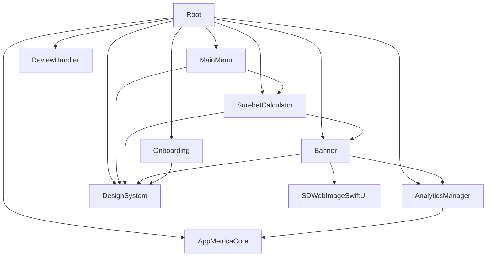

# Модули

## Граф зависимостей

## Сводка модулей

| Модуль | Зависимости | Назначение |
|---|---|---|
| `Root` | Все внутренние + AppMetricaCore | Entry point и координация |
| `MainMenu` | SurebetCalculator, DesignSystem | Экран меню и маршрутизация по разделам |
| `SurebetCalculator` | Banner, DesignSystem | Бизнес‑логика калькулятора |
| `Banner` | AnalyticsManager, SDWebImageSwiftUI, DesignSystem | Баннеры (сеть, кэш, UI) |
| `Onboarding` | DesignSystem | Онбординг пользователей |
| `ReviewHandler` | — | Запрос отзывов (SKStoreReviewController) |
| `AnalyticsManager` | AppMetricaCore | Типобезопасная аналитика |
| `DesignSystem` | — | Дизайн‑токены, адаптация под iPad, базовые компоненты |

## Root

**Публичный API:** `Root.view()`.

**Важно:**
- Создаёт `AnalyticsManager` и `ReviewHandler`, прокидывает адаптеры аналитики в модули Onboarding/Calculator.
- RootView всегда держит базовый экран в иерархии (`ZStack`), а онбординг — в overlay с transition.
- Экран меню вынесен в модуль `MainMenu` и подключается через `MainMenu.view(calculatorAnalytics:)`.
- Ключи `@AppStorage`:
  - `onboardingIsShown` — был ли показан онбординг.
  - `1.7.0` — был ли показан запрос отзыва для версии.
  - `numberOfOpenings` — счётчик запусков.
- Показ запроса отзыва (Release‑only): после задержки 1 секунда, если onboarding завершён, открытий ≥ 2, запрос ещё не показывали.
- Fullscreen‑баннер: показывается только если onboarding завершён, запрос отзыва уже был, и число открытий кратно 3, плюс `Banner.isBannerFullyCached == true`.
- Баннер запрашивается один раз за запуск (`Task` с защитой от повторов).

## MainMenu

**Публичный API:** `MainMenu.view(calculatorAnalytics:)`.

**Важно:**
- Отвечает за первый экран с пунктами меню и переходами на экран калькулятора и вспомогательные разделы.
- Использует дизайн‑токены из `DesignSystem`.

## SurebetCalculator

**Публичный API:** `SurebetCalculator.view(analytics:)`.

**Важно:**
- Количество исходов: 2…20 (`NumberOfRows`).
- Метод расчёта выбирается автоматически по `selection`:
  - `.total` — пересчёт всех строк из итоговой ставки.
  - `.row(id)` — пересчёт итоговой ставки и остальных строк.
  - `.none` + валидные ставки по строкам — пересчёт итоговой ставки из суммы.
- Невалидный ввод не трогает поля ввода, но сбрасывает производные (`income`, `profitPercentage`).
- Коэффициенты должны быть ≥ 1, иначе расчёт не выполняется.
- Аналитика расчёта дебаунсится на 1 секунду.

## Banner

**Публичный API:**
- `Banner.bannerView` — inline баннер.
- `Banner.fullscreenBannerView(isPresented:)` — fullscreen баннер.
- `Banner.fetchBanner()` и `Banner.isBannerFullyCached`.

**Важно:**
- Inline баннер: статические image URL по устройству, закрытие скрывает компонент, клики ведут на affiliate URL.
- Fullscreen баннер: данные и изображение берутся из кэша (`UserDefaults`).
- `Service` делает `GET /banner` по `BannerConstants.apiBaseURL`, кэширует JSON и изображение.
- Если `imageURL` пустой/изменился/данных нет — картинка скачивается заново.
- Любая ошибка или пустые данные очищают кэш полностью.
- После тапа по баннеру: открытие URL и закрытие с задержкой 500ms.
- `PresentationBinding` используется, чтобы VM не зависела от SwiftUI `Binding`.

## Onboarding

**Публичный API:** `Onboarding.view(onboardingIsShown:analytics:)`.

**Важно:**
- 3 страницы, изображения зависят от устройства (iPhone/iPad).
- События аналитики: start, page viewed, completed, skipped.
- `skip` и `dismiss` устанавливают `onboardingIsShown = true`.

## ReviewHandler

**Публичный API:** `ReviewHandler.requestReview()` (async).

**Важно:**
- Использует `SKStoreReviewController` и `Delay` для тестируемости.
- Перед показом — задержка 1 секунда.

## AnalyticsManager

**Публичный API:** `AnalyticsService`, `AnalyticsManager`, `AnalyticsEvent`.

**Важно:**
- Все события типобезопасны через `AnalyticsEvent` и `AnalyticsParameterValue`.
- Логирование включено только в Release (`#if !DEBUG`).

## Внешние зависимости

Единственный источник версий: `SurebetCalculatorPackage/Package.swift`.

- AppMetrica SDK — аналитика
- SDWebImageSwiftUI — загрузка изображений
- SwiftLint (Build Tool Plugin)

## Добавление нового модуля (кратко)
1. Добавить target в `Package.swift`, включая SwiftLint plugin.
2. Подключить модуль в зависимостях потребителя (например, `Root`).
3. Создать `Sources/NewModule/NewModule.swift` с public API.
