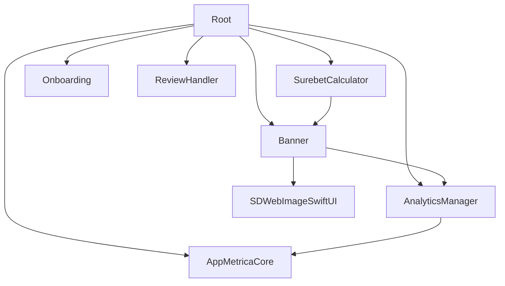

# Modules

## Dependency Graph



---

## Module Summary

| Модуль | Зависимости | Назначение |
|--------|-------------|------------|
| `Root` | Все внутренние + AppMetricaCore | Entry point, координация |
| `SurebetCalculator` | Banner | Бизнес-логика калькулятора |
| `Banner` | AnalyticsManager, SDWebImageSwiftUI | Баннеры (загрузка, кэш, UI) |
| `Onboarding` | — | Онбординг пользователей |
| `ReviewHandler` | — | Запрос отзывов (SKStoreReviewController) |
| `AnalyticsManager` | AppMetricaCore | Типобезопасная аналитика |

---

## Root

Entry point приложения. Координирует все модули.

```swift
public enum Root {
    @MainActor
    public static func view() -> some View
}

// Реэкспорт AppMetrica для App
public typealias AppMetrica = AppMetricaCore.AppMetrica
public typealias AppMetricaConfiguration = AppMetricaCore.AppMetricaConfiguration
```

**Структура:**
```
Root/
├── Root.swift          # Public API
├── RootView.swift      # Условный рендеринг
├── RootViewModel.swift # @AppStorage, условия показа
└── Resources/Localizable.xcstrings
```

---

## SurebetCalculator

Основная бизнес-логика калькулятора ставок.

```swift
public enum SurebetCalculator {
    @MainActor
    public static func view() -> some View
}
```

**Ключевые компоненты:**

| Файл | Назначение |
|------|------------|
| `SurebetCalculatorViewModel` | Состояние, ViewAction, calculate() |
| `CalculationService` | Протокол вычислений |
| `DefaultCalculationService` | Реализация → Calculator |
| `Calculator` | Алгоритмы расчёта ставок |

**Модели:** `Row`, `TotalRow`, `RowType`, `FocusableField`, `CalculationMethod`

---

## Banner

Система баннеров: загрузка, кэширование, отображение.

```swift
public enum Banner {
    // Views
    public static var bannerView: some View
    @MainActor
    public static func fullscreenBannerView(isPresented: Binding<Bool>) -> some View
    
    // Network
    public static func fetchBanner() async throws
    
    // Cache
    public static var isBannerFullyCached: Bool
}
```

**BannerService Protocol:**
```swift
protocol BannerService: Sendable {
    func fetchBannerAndImage() async throws
    func fetchBanner() async throws -> BannerModel
    func saveBannerToDefaults(_ banner: BannerModel)
    func getBannerFromDefaults() -> BannerModel?
    func getStoredBannerImageData() -> Data?
    func isBannerFullyCached() -> Bool
}
```

---

## Onboarding

Онбординг новых пользователей (3 страницы).

```swift
public enum Onboarding {
    @MainActor
    public static func view(onboardingIsShown: Binding<Bool>) -> some View
}
```

**OnboardingViewModel:**
```swift
enum ViewAction {
    case setCurrentPage(Int)
    case dismiss
}
```

---

## ReviewHandler

Запрос отзывов через SKStoreReviewController.

```swift
@MainActor
public final class ReviewHandler: ReviewService {
    public func requestReview() async
}

@MainActor
public protocol ReviewService: Sendable {
    func requestReview() async
}
```

---

## AnalyticsManager

Типобезопасная обёртка над AppMetrica с каталогом событий.

```swift
// Протокол сервиса аналитики
public protocol AnalyticsService: Sendable {
    /// Логирует типобезопасное событие
    func log(event: AnalyticsEvent)
    
    /// Логирует событие с параметрами (deprecated)
    func log(name: String, parameters: [String: AnalyticsParameterValue]?)
}

// Типобезопасный каталог событий
public enum AnalyticsEvent: Sendable, Equatable {
    case onboardingStarted
    case onboardingPageViewed(pageIndex: Int, pageTitle: String)
    case calculatorRowAdded(rowCount: Int)
    case bannerClicked(bannerId: String, bannerType: BannerType)
    // ... и другие события
}

// Типобезопасные значения параметров
public enum AnalyticsParameterValue: Sendable, Equatable {
    case string(String)
    case int(Int)
    case double(Double)
    case bool(Bool)
}

// Реализация
public struct AnalyticsManager: AnalyticsService, Sendable {
    public func log(event: AnalyticsEvent) {
        log(name: event.name, parameters: event.parameters)
    }
}
```

**Использование:**
```swift
// Рекомендуемый способ (типобезопасный)
analyticsService.log(event: .bannerClicked(bannerId: "123", bannerType: .fullscreen))

// Deprecated (для обратной совместимости)
analyticsService.log(name: "custom_event", parameters: ["key": .string("value")])
```

---

## External Dependencies

| Библиотека | Версия | Модуль | Назначение |
|------------|--------|--------|------------|
| AppMetrica SDK | 5.11.0+ | AnalyticsManager, Root | Аналитика |
| SDWebImageSwiftUI | 3.1.3+ | Banner | Загрузка изображений |
| SwiftLint | 0.59.1+ | Все | Линтер (Build Tool Plugin) |

---

## Adding New Module

```swift
// 1. Package.swift
.target(
    name: "NewModule",
    dependencies: ["Banner"],  // при необходимости
    resources: [.process("Resources")],
    plugins: [.plugin(name: "SwiftLintBuildToolPlugin", package: "SwiftLint")]
),

// 2. Добавить в Root dependencies
.target(name: "Root", dependencies: [..., "NewModule"])

// 3. Sources/NewModule/NewModule.swift
public enum NewModule {
    @MainActor
    public static func view() -> some View {
        NewModuleView()
    }
}
```

**Правила:**
- Один экспортируемый продукт — `Root`
- Public API через enum + `static func view()`
- Циклические зависимости запрещены (DAG)
