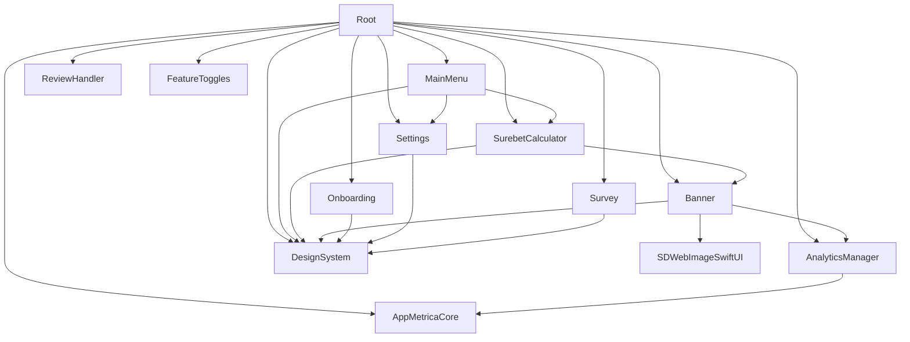

# DEPENDENCY GRAPH

Источник: `SurebetCalculatorPackage/Package.swift`.

## Внешние зависимости
- `appmetrica-sdk-ios` (`AppMetricaCore`)
- `SDWebImageSwiftUI`
- `SwiftLint` (`SwiftLintBuildToolPlugin`)

## Правила
- Любые изменения зависимостей сначала в `Package.swift`.
- Нельзя добавлять неиспользуемые пакетные зависимости.
- Для всех targets подключать SwiftLint plugin консистентно.

Последнее обновление: 2026-02-11
